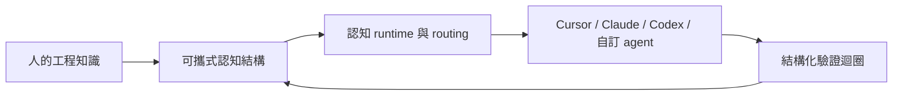

# AI-native Cognitive Execution System｜AI-native 認知執行系統

Build engineering knowledge that survives beyond any AI tool or model.
讓工程知識不被任何單一 AI 工具或模型綁住。

Accumulate reusable engineering cognition without vendor lock-in.
累積可重用、可版本化、可驗證、可跨 agent 執行的工程認知。

AI-native Cognitive Execution System 是一套用來累積工程知識、降低工具綁定風險的認知執行框架。它把人的工程經驗整理成可攜、可審查、可被不同 AI agent 重複執行的結構，而不是把知識鎖在單一模型、單一 IDE、單一 hosted memory 或單一 agent runtime 裡。

> 說明：本專案目前放在 `Ai-skill` GitHub repository。`Ai-skill` 是目前的 repo slug，不是正式公開系統名稱。

## Principles｜原則

完整中英版本見 [`PRINCIPLES.md`](PRINCIPLES.md)。

- Knowledge should outlive tools.｜知識應該比工具更長久。
- Engineering cognition should be portable.｜工程認知應該可以攜帶與轉移。
- AI workflows should remain vendor-independent.｜AI workflows 應該保持 vendor-independent，不被單一供應商綁定。
- Human experience should compound over time.｜人的經驗應該隨時間累積複利。
- Execution systems should be inspectable and versionable.｜執行系統應該可以被檢查、可以被版本化。

## 你可以拿它做什麼

- 把程式碼審查、除錯、架構審查、交付流程變成可重複執行的 agent 行為。
- 把團隊規則、工程判斷、失敗教訓和驗證流程留在 git repository，而不是單一 AI 產品的私有記憶裡。
- 讓不同 agent 使用同一套可信來源，並透過路由、runtime gates 和 validation loop 檢查它是否真的照做。
- 把一次 agent 犯錯沉澱成 failure pattern、validation scenario 或 runtime guard，讓下一次執行更穩。

## 實際長什麼樣

例如你要求 agent 做一次程式碼審查，這套系統不是只丟一段 prompt 給模型，而是讓任務流過可追蹤的認知路徑：

```text
使用者要求
  -> 認知路由
  -> 選擇 workflow / intelligence
  -> 進入執行階段
  -> 驗證迴圈
  -> 若 agent 漏判，進入失效學習
  -> 將可重用知識保存到版本化來源
```

落到 repository 時，知識會分散在不同責任層：

- `workflow/` 保存可執行流程。
- `analysis/` 保存觀察與拆解方法。
- `intelligence/` 保存可重用判斷智慧。
- `enforcement/` 保存 agent 必須遵守的共用規則。
- `runtime/` 保存機器可讀的 state、contracts 和 gates。
- `knowledge/` 保存 routing、summaries 和 graphs，讓 agent 先讀對的部分。

## 5 分鐘開始

1. 複製這個 repository。
2. 依你的 OS / CPU 選擇對應 binary，對既有專案執行初始化：

| OS | CPU | 初始化命令 |
| --- | --- | --- |
| macOS | Apple Silicon | `scripts/ai-skill-cli/bin/ai-skill-darwin-arm64 init-project --project /path/to/your/project` |
| macOS | Intel | `scripts/ai-skill-cli/bin/ai-skill-darwin-amd64 init-project --project /path/to/your/project` |
| Linux | x86_64 | `scripts/ai-skill-cli/bin/ai-skill-linux-amd64 init-project --project /path/to/your/project` |
| Linux | arm64 | `scripts/ai-skill-cli/bin/ai-skill-linux-arm64 init-project --project /path/to/your/project` |
| Windows | x86_64 | `scripts/ai-skill-cli/bin/ai-skill-windows-amd64.exe init-project --project C:\path\to\your\project` |

3. 用支援的 AI 工具打開該專案。
4. 請 agent 執行一個具體任務，例如：

```text
使用 Ai-skill 審查這次變更。請依相關 workflow 執行、驗證結果；如果發現可重用的 agent 失誤模式，請記錄成 failure lesson。
```

完整的新專案接入說明見 [`ai-tools/new-project-onboarding.md`](ai-tools/new-project-onboarding.md)。想理解目前世代架構，讀 [`architecture/ai-native-cognitive-execution-system.md`](architecture/ai-native-cognitive-execution-system.md)。

## 它是什麼 / 不是什麼

AI-native Cognitive Execution System 是：

- 可攜式工程認知。
- 不綁定單一 agent 的執行結構。
- AI-native 的知識累積方式。
- 長期工程記憶與治理系統。

它不是：

- 不是 chatbot，也不是 SaaS 產品。
- 不是 prompt collection；prompt 只是可執行知識的一種輸入形態。
- 不是 MCP replacement；MCP 解決工具與資料連接，本系統解決工程知識如何被 agent 穩定執行。
- 不是 LangGraph 或 agent framework replacement；它可以接到不同 runtime。
- 不是 hosted memory；可重用知識會留在可審查的 source repository。

## 支援的工具

目前此 repo 已有下列工具入口：

| 工具 | 入口 |
| --- | --- |
| Cursor | [`ai-tools/agent/cursor.md`](ai-tools/agent/cursor.md) |
| Claude Code | [`ai-tools/agent/claude.md`](ai-tools/agent/claude.md) |
| Gemini CLI | [`ai-tools/agent/gemini-cli.md`](ai-tools/agent/gemini-cli.md) |
| Codex / generic agents | [`AGENTS.md`](AGENTS.md) |
| Roo Code | [`ai-tools/agent/roo.md`](ai-tools/agent/roo.md) |
| 自訂 agent / runtime | 從 [`CORE_BOOTSTRAP.md`](CORE_BOOTSTRAP.md) 與 [`knowledge/runtime/routing-registry.yaml`](knowledge/runtime/routing-registry.yaml) 接入 |

尚未實際接入並累積使用經驗的工具，先視為未來 AI runtime，不列入已支援工具。

## 為什麼不同

一般 AI workflow 常把知識分散在聊天紀錄、prompt、工具設定和個人習慣裡。這套系統把它們整理成分層的可信來源：



## 給 AI Agent

如果你是 AI agent，請從 [`CORE_BOOTSTRAP.md`](CORE_BOOTSTRAP.md) 進入。Bootstrap 的機器可讀 obligations 由 [`runtime/core-bootstrap.yaml`](runtime/core-bootstrap.yaml) 投影到 `runtime/runtime.db`；本 README 只提供公開導覽，不複製 bootstrap contract。

## 目錄導覽

| 路徑 | 用途 |
| --- | --- |
| [`architecture/`](architecture/README.md) | 系統世代與架構導覽 |
| [`ai-tools/`](ai-tools/README.md) | 工具接入與新專案 onboarding |
| [`enforcement/`](enforcement/README.md) | Agent 必須遵守的共用規則 |
| [`workflow/`](workflow/README.md) | 可執行 workflow |
| [`analysis/`](analysis/README.md) | 分析方法與觀察流程 |
| [`intelligence/`](intelligence/README.md) | 可重用工程判斷 |
| [`runtime/`](runtime/README.md) | Runtime state、contracts、gates |
| [`knowledge/`](knowledge/README.md) | Routing registry、summaries、graphs |
| [`governance/`](governance/README.md) | 生命週期、驗證與貢獻治理 |
| [`PRINCIPLES.md`](PRINCIPLES.md) | 系統原則（中英版本） |
| [`LICENSE`](LICENSE) | Apache License 2.0 |

## 維護者入口

若你要修改這個 repository，從 [`governance/contributing.md`](governance/contributing.md) 開始。那裡連到 validation gates、runtime refresh、linked updates、diff review 和 close-loop 規則。

GitHub 慣例入口仍保留在 [`CONTRIBUTING.md`](CONTRIBUTING.md)。

## License｜授權

本 repository 以 Apache License 2.0 授權，詳見 [`LICENSE`](LICENSE)。
