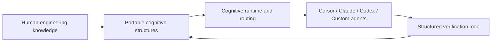

# AI-native Cognitive Execution System

AI-native cognitive execution framework for portable engineering knowledge.

可攜式工程知識的 AI-native 認知執行框架。

AI-native Cognitive Execution System 是一套用來累積工程知識、降低工具綁定風險的認知執行框架。它把人的工程經驗整理成可攜、可版本化、可驗證、可被不同 AI agent 重複執行的結構，而不是把知識鎖在單一模型、單一 IDE、單一 hosted memory 或單一 agent runtime 裡。

> Note: this project currently lives in the `Ai-skill` GitHub repository. `Ai-skill` is the current repo slug, not the formal public system name.

## 為什麼需要它

AI 工具變動很快，但工程判斷、團隊慣例、驗證流程和失敗教訓的生命週期比工具更長。只把這些知識寫在 prompt、聊天記憶、IDE 規則或某個 agent 的私有 runtime 裡，會讓知識難以遷移、難以審查，也難以知道 agent 是否真的照做。

AI-native Cognitive Execution System 的目標是讓團隊擁有自己的工程知識，並讓任何相容的 agent 都能讀取、執行和驗證它。

## 它讓你做到什麼

- **Knowledge Ownership**：把工程規則、workflow、判斷準則、失敗模式和驗證方式放在可版本化的 repository 中。
- **Agent Portability**：同一套知識可以被 Cursor、Claude Code、Codex、Roo Code 或自訂 agent 讀取，而不是綁死在單一工具。
- **Human Experience Compounding**：把一次次 review、debug、架構決策與 agent 失誤整理成可重複使用的 cognitive structure。
- **Executable Governance**：重要流程不只寫成說明，也能用 contract、runtime state、gates 和 validation loop 驗證。

## Works With

目前此 repo 已有下列工具入口與 adapter：

| 工具 | 入口 |
| --- | --- |
| Cursor | [`ai-tools/agent/cursor.md`](ai-tools/agent/cursor.md) |
| Claude Code | [`ai-tools/agent/claude.md`](ai-tools/agent/claude.md) |
| Gemini CLI | [`ai-tools/agent/gemini-cli.md`](ai-tools/agent/gemini-cli.md) |
| Codex / generic agents | [`AGENTS.md`](AGENTS.md) |
| Roo Code | [`ai-tools/agent/roo.md`](ai-tools/agent/roo.md) |
| 自訂 agent / runtime | 從 [`CORE_BOOTSTRAP.md`](CORE_BOOTSTRAP.md) 與 [`knowledge/runtime/routing-registry.yaml`](knowledge/runtime/routing-registry.yaml) 接入 |

尚未實際接入並累積使用經驗的工具，先視為 future AI runtimes，不列入已支援工具。

## 它不是什麼

- 不是 chatbot，也不是 SaaS 產品。
- 不是 prompt collection；prompt 只是可執行知識的一種輸入形態。
- 不是 MCP replacement；MCP 解決工具與資料連接，本系統解決工程知識如何被 agent 穩定執行。
- 不是 LangGraph 或 agent framework replacement；它可以接到不同 runtime，核心是知識 ownership、routing、governance 和 validation。
- 不是 hosted memory；它把長期可重用知識留在可審查的 source repository。

## 為什麼不同

一般 AI workflow 常把知識分散在聊天紀錄、prompt、工具設定和個人習慣裡。這套系統把它們整理成分層的 source-of-truth：

- `workflow/` 保存可執行流程。
- `analysis/` 保存觀察與拆解方法。
- `intelligence/` 保存可重用判斷智慧。
- `enforcement/` 保存 agent 必須遵守的共用規則。
- `runtime/` 保存 machine-readable state、contracts 和 gates。
- `knowledge/` 保存 routing、summaries 和 graphs，讓 agent 先讀對的部分。



## Quick Start

如果你想把這套系統接到一個新專案，從新專案初始化流程開始：

```bash
scripts/ai-skill-cli/bin/ai-skill-darwin-arm64 init-project --project /path/to/your/project
```

完整說明見 [`ai-tools/new-project-onboarding.md`](ai-tools/new-project-onboarding.md)。

想先理解整體概念與目前世代架構，讀 [`architecture/ai-native-cognitive-execution-system.md`](architecture/ai-native-cognitive-execution-system.md)。

## For Agents

如果你是 AI agent，請從 [`CORE_BOOTSTRAP.md`](CORE_BOOTSTRAP.md) 進入。Bootstrap 的 machine-readable obligations 由 [`runtime/core-bootstrap.yaml`](runtime/core-bootstrap.yaml) 投影到 `runtime/runtime.db`；本 README 只提供 public overview，不複製 bootstrap contract。

## Repository Map

| 路徑 | 用途 |
| --- | --- |
| [`architecture/`](architecture/README.md) | 系統世代與 canonical architecture navigation |
| [`ai-tools/`](ai-tools/README.md) | Tool adapters 與新專案 onboarding |
| [`enforcement/`](enforcement/README.md) | Agent 必須遵守的共用規則 |
| [`workflow/`](workflow/README.md) | 可執行 workflow |
| [`analysis/`](analysis/README.md) | 分析方法與觀察流程 |
| [`intelligence/`](intelligence/README.md) | 可重用工程判斷 |
| [`runtime/`](runtime/README.md) | Runtime state、contracts、gates |
| [`knowledge/`](knowledge/README.md) | Routing registry、summaries、graphs |
| [`governance/`](governance/README.md) | Lifecycle、validation、contribution governance |

## Maintainers

若你要修改這個 repository，從 [`governance/contributing.md`](governance/contributing.md) 開始。那裡連到 validation gates、runtime refresh、linked updates、diff review 和 close-loop 規則。

GitHub 慣例入口仍保留在 [`CONTRIBUTING.md`](CONTRIBUTING.md)。
