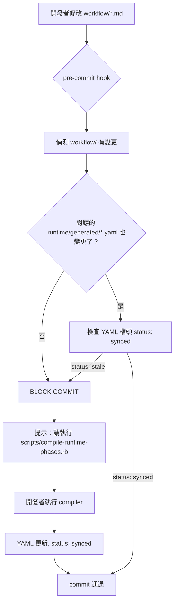

# AI-native Cognitive Execution System — 升級計畫比對分析

> **狀態**: draft
> **建立日期**: 2026-05-15
> **目的**: 比對使用者提出的「Execution-centric Cognitive Runtime」升級計畫與現有框架，找出衝突、缺口與可行路徑

---

## 一、現有框架摘要

目前系統是 **AI-native Knowledge Operating System**，核心架構：

```
User Goal
    ↓
CORE_BOOTSTRAP.md (3 rules, ~800 tokens)
    ↓
Runtime Router (activation-rules.yaml + activation-engine.rb)
    ↓
Knowledge Routing (routing-registry.yaml + summaries + graphs)
    ↓
Session Lifecycle (bootstrap → routing → execution → close-loop)
    ↓
Guards (circuit breaker, context pollution, token budget, health score)
    ↓
Close-loop (ai-skill-close-loop.sh → commit/push/readback)
```

### 已具備的 Runtime 元件

| 元件 | 位置 | 成熟度 |
|------|------|--------|
| Session Lifecycle | [`runtime/pipeline/session-lifecycle.yaml`](../runtime/pipeline/session-lifecycle.yaml) | candidate — 4 stages defined |
| Guard Chain | [`runtime/pipeline/guard-chain.yaml`](../runtime/pipeline/guard-chain.yaml) | candidate — 11 guards, 3 severity levels |
| Token Budget | [`runtime/budget/token-budget.yaml`](../runtime/budget/token-budget.yaml) | candidate — per-model, per-layer |
| Context Health | [`runtime/health/context-health-score.yaml`](../runtime/health/context-health-score.yaml) | candidate — 4 dimensions |
| Circuit Breaker | [`runtime/guards/circuit-breaker.yaml`](../runtime/guards/circuit-breaker.yaml) | candidate — 5 guards |
| Context Pollution | [`runtime/guards/context-pollution.yaml`](../runtime/guards/context-pollution.yaml) | candidate — 5 signals |
| Activation Engine | [`runtime/router/activation-engine.rb`](../runtime/router/activation-engine.rb) | validated — programmatic rule activation |
| Routing Registry | [`knowledge/runtime/routing-registry.yaml`](../knowledge/runtime/routing-registry.yaml) | validated — machine-readable routing |
| Close-loop Script | [`scripts/ai-skill-close-loop.sh`](../scripts/ai-skill-close-loop.sh) | validated — lock, group, commit, push |
| Conversation Goal Ledger | [`enforcement/conversation-goal-ledger.md`](../enforcement/conversation-goal-ledger.md) | core — project-local goal tracking |
| Writeback Transaction | [`enforcement/dependency-reading.md`](../enforcement/dependency-reading.md) | core — commit/push/readback gate |

---

## 二、升級計畫 vs 現有框架 — 逐項比對

### 2.1 核心命題：從 Knowledge-centric → Execution-centric

| 升級主張 | 現有狀態 | 衝突？ | 分析 |
|----------|----------|--------|------|
| 從 Knowledge-centric Agent 升級成 Execution-centric Cognitive Runtime | 目前是 Knowledge-centric，但已有 runtime pipeline 雛形 | ✅ **無衝突，方向一致** | 現有框架已建立 runtime/ 層，但確實偏重 knowledge routing 而非 execution state machine。升級方向是自然的演進。 |

### 2.2 Runtime State Machine

| 升級主張 | 現有狀態 | 衝突？ | 分析 |
|----------|----------|--------|------|
| Runtime State Machine → Execution Kernel → LLM Workers → Knowledge Routing | 現有是 Session Lifecycle (4 stages) + Guards | ✅ **無衝突，可疊加** | 現有 session-lifecycle.yaml 的 4 stages 可視為 state machine 的雛形。升級計畫提出的更細粒度 phase machine（CHECKPOINT → VALIDATION → COMMIT）可作為 execution stage 內部的子狀態機。 |

### 2.3 Runtime Projection Layer（最重要升級）

| 升級主張 | 現有狀態 | 衝突？ | 分析 |
|----------|----------|--------|------|
| 文件不再直接給 agent 執行，而是透過 Runtime Projection 轉換 | 目前 agent 直接讀 governance/、enforcement/、workflow/ 的原始 markdown | ⚠️ **部分衝突** | 現有框架的 reference-first 設計仰賴 agent 直接讀原始文件。Runtime Projection 需要建立 compiler 層，將 markdown 轉換為 machine-readable YAML。這不衝突 reference-first，但需要新增一層 generated surface。 |

**具體衝突點**：
- 現有 `enforcement/README.md` 的 Runtime Activation Model 假設 agent 直接讀 markdown 規則
- 升級後需要 `runtime/generated/*.yaml` 作為 compiled projection
- 解決方案：generated 層可視為另一種 summary/cache，不取代 canonical source

### 2.4 Runtime State Surfaces

| 升級主張 | 現有狀態 | 衝突？ | 分析 |
|----------|----------|--------|------|
| current_phase、allowed_actions、forbidden_actions、open_obligations、blocking_gates | 無對應概念 | ✅ **無衝突，全新缺口** | 這是現有框架完全沒有的概念。現有框架只有 conversation-goal-ledger 追蹤 user goals，沒有 phase-level state surface。這是最大的功能缺口。 |

### 2.5 Transaction Runtime

| 升級主張 | 現有狀態 | 衝突？ | 分析 |
|----------|----------|--------|------|
| transaction: { commit_done, push_done, readback_done } + deny_finalize_if_missing | 現有 writeback transaction（dependency-reading.md）有類似概念但以 prose 描述 | ✅ **無衝突，可強化** | 現有框架的 writeback transaction 是 procedural（7 步驟清單），升級計畫提出的是 declarative state machine。兩者可共存：procedural 作為 enforcement rule，declarative 作為 runtime surface。 |

### 2.6 Runtime Compiler

| 升級主張 | 現有狀態 | 衝突？ | 分析 |
|----------|----------|--------|------|
| 將 governance/workflow/enforcement 轉換為 runtime/generated/*.yaml | 無對應概念 | ✅ **無衝突，全新缺口** | 現有框架有 generated surfaces（SQLite index、runtime report），但沒有從 governance/enforcement/workflow 到 runtime 的 compiler。這是全新元件。 |

### 2.7 工具去中心化

| 升級主張 | 現有狀態 | 衝突？ | 分析 |
|----------|----------|--------|------|
| Runtime = authority, Cursor = executor | 現有已將核心 workflow 從 Cursor MDC 移出 | ✅ **無衝突，方向一致** | 現有框架已建立 tool-neutral documentation 原則（enforcement/tool-neutral-documentation.md），且 ai-tools/ 已作為 adapter 層。升級計畫的「工具只保留 Adapter」與現有方向完全一致。 |

### 2.8 Agent VM

| 升級主張 | 現有狀態 | 衝突？ | 分析 |
|----------|----------|--------|------|
| LLM 不是 execution authority，Runtime 才是 | 現有 LLM 是 execution authority | ⚠️ **部分衝突** | 這是最大的架構轉變。現有框架中，LLM（agent）直接讀規則、做判斷、執行。Agent VM 概念需要 runtime 介入 phase control、state machine、obligation tracking。這不是立即衝突，而是長期方向。 |

### 2.9 Knowledge 與 Runtime 分離

| 升級主張 | 現有狀態 | 衝突？ | 分析 |
|----------|----------|--------|------|
| Knowledge 保留 heuristics/anti-patterns/judgment；Runtime 控制 phase/state/obligations/gates | 現有已部分分離（knowledge/ vs runtime/） | ✅ **無衝突，方向一致** | 現有框架已建立 knowledge/ 和 runtime/ 的責任邊界。升級計畫的分離主張與現有設計一致。 |

### 2.10 Intelligence Routing Runtime

| 升級主張 | 現有狀態 | 衝突？ | 分析 |
|----------|----------|--------|------|
| runtime 不直接載入全部知識，而是 required_intelligence 清單 | 現有 activation-rules.yaml 已有類似概念 | ✅ **無衝突，可強化** | 現有 activation rules 決定哪些 enforcement rules 要載入，但沒有 intelligence-level routing。升級計畫的 required_intelligence 是 activation rules 的自然延伸。 |

---

## 三、衝突矩陣

| 升級項目 | 與現有框架衝突程度 | 說明 |
|----------|-------------------|------|
| Runtime State Machine | 🟢 低 | 可疊加在現有 session-lifecycle 之上 |
| Runtime Projection Layer | 🟡 中 | 需要新增 compiler，不破壞 reference-first |
| Runtime State Surfaces | 🟢 低 | 全新概念，無既有設計衝突 |
| Transaction Runtime | 🟢 低 | 可強化現有 writeback transaction |
| Runtime Compiler | 🟢 低 | 全新元件，無既有設計衝突 |
| 工具去中心化 | 🟢 低 | 與現有方向一致 |
| Agent VM | 🟡 中 | 長期方向，需要逐步遷移 execution authority |
| Knowledge/Runtime 分離 | 🟢 低 | 與現有設計一致 |
| Intelligence Routing | 🟢 低 | 可延伸現有 activation rules |
| Prompt-based → State-based | 🟡 中 | 需要改變 enforcement rules 的撰寫方式 |

---

## 四、現有框架已覆蓋 vs 未覆蓋

### ✅ 已覆蓋（可直接沿用或小幅強化）

| 升級項目 | 現有對應 |
|----------|----------|
| Knowledge lifecycle | `governance/lifecycle/` |
| Metadata routing | `metadata/rules/` + `knowledge/runtime/routing-registry.yaml` |
| Feedback loop | `feedback/pipeline/` + `enforcement/failure-learning-system.md` |
| Promotion | `feedback/pipeline/promotion-engine.yaml` |
| Reusable knowledge | `intelligence/` + `enforcement/reusable-guidance-boundary.md` |
| Token minimization | `runtime/budget/token-budget.yaml` + `tools/compression/` |
| Dynamic loading | `runtime/router/activation-rules.yaml` + `knowledge/summaries/` |
| Tool adapters | `ai-tools/` + `enforcement/tool-neutral-documentation.md` |
| Close-loop | `scripts/ai-skill-close-loop.sh` + `enforcement/dependency-reading.md` |

### ❌ 未覆蓋（全新缺口）

| 升級項目 | 缺口說明 | 優先級 |
|----------|----------|--------|
| **Phase State Machine** | 無 current_phase、allowed_actions、forbidden_actions 概念 | P0 |
| **Obligation Ledger** | 無 open_obligations 追蹤機制（commit/push/readback 狀態） | P0 |
| **Blocking Gates** | 無 blocking_gates 概念（validation_missing 等） | P0 |
| **Transaction Runtime** | 無 declarative transaction state（commit_done/push_done/readback_done） | P1 |
| **Runtime Compiler** | 無從 governance/enforcement/workflow 到 runtime YAML 的 compiler | P1 |
| **State-based Phase Control** | 現有 enforcement rules 是 prompt-based（「請記得驗證」），非 state-based | P1 |
| **Intelligence Routing** | 無 required_intelligence 清單機制 | P2 |
| **Agent VM** | 無 phase control、state machine、obligation tracking 的 VM 概念 | P3 |

---

## 五、建議升級路徑

### Phase 1：Phase Runtime（P0 — 立即）

建立最核心的 phase state machine，解決 phase drift 和 obligation forgetting。

**新增檔案**：
```
runtime/phases/
├── README.md                    # Phase Runtime 概覽
├── phase-machine.yaml           # 核心 phase state machine 定義
├── phase-states.yaml            # 各 phase 的 current_phase/allowed_actions/forbidden_actions
└── phase-transitions.yaml       # phase transition rules
```

**核心設計**：
```yaml
# phase-machine.yaml
phases:
  - id: CHECKPOINT
    allowed_actions: [validate, diff_review, update_knowledge]
    forbidden_actions: [finalize, commit, push]
    blocking_gates: []
    
  - id: VALIDATION
    allowed_actions: [validate, diff_review, update_knowledge]
    forbidden_actions: [finalize]
    blocking_gates: [validation_missing]
    
  - id: COMMIT
    allowed_actions: [commit, update_knowledge]
    forbidden_actions: [push, finalize]
    blocking_gates: [commit_pending]
    
  - id: PUSH
    allowed_actions: [push, update_knowledge]
    forbidden_actions: [finalize]
    blocking_gates: [push_pending]
    
  - id: READBACK
    allowed_actions: [readback, verify]
    forbidden_actions: [finalize]
    blocking_gates: [readback_pending]
    
  - id: FINALIZE
    allowed_actions: [finalize, next_task]
    forbidden_actions: []
    blocking_gates: []
```

### Phase 2：Obligation Ledger（P0 — 立即）

建立 obligation 追蹤機制，解決 commit/push 遺漏和 close-loop 不穩。

**新增檔案**：
```
runtime/obligations/
├── README.md                    # Obligation Ledger 概覽
├── obligation-ledger.yaml       # 核心 obligation 定義
└── obligation-templates.yaml    # 各 phase 的 obligation 模板
```

### Phase 3：Blocking Gates（P0 — 立即）

建立 blocking gates 機制，防止 validation skip 和 close-loop 不穩。

**新增檔案**：
```
runtime/gates/
├── README.md                    # Blocking Gates 概覽
├── blocking-gates.yaml          # 核心 gate 定義
└── gate-resolvers.yaml          # gate 解決策略
```

### Phase 4：Transaction Runtime（P1 — 短期）

將現有 writeback transaction（procedural）升級為 declarative transaction state machine。

**新增檔案**：
```
runtime/transactions/
├── README.md                    # Transaction Runtime 概覽
├── transaction-machine.yaml     # 交易狀態機
└── transaction-templates.yaml   # 交易模板
```

### Phase 5：Runtime Compiler（P1 — 中期）

建立 compiler，將 governance/enforcement/workflow 轉換為 runtime/generated/*.yaml。

**新增檔案**：
```
runtime/compiler/
├── README.md                    # Runtime Compiler 概覽
├── compiler-rules.yaml          # 編譯規則
└── compiler-engine.rb           # 編譯引擎
runtime/generated/
├── README.md                    # Generated surfaces 概覽
└── .gitkeep
```

### Phase 6：State-based Enforcement（P1 — 中期）

將現有 prompt-based enforcement rules 逐步改寫為 state-based。

**受影響檔案**：
- `enforcement/dependency-reading.md` — writeback transaction 章節改為 state-based
- `enforcement/goal-action-validation.md` — validation gate 改為 state-based
- `enforcement/failure-learning-system.md` — close-loop 檢查改為 state-based

### Phase 7：Intelligence Routing（P2 — 長期）

延伸 activation rules 到 intelligence 層。

**新增檔案**：
```
runtime/intelligence/
├── README.md                    # Intelligence Routing 概覽
└── intelligence-routing.yaml    # required_intelligence 清單
```

### Phase 8：Agent VM（P3 — 遠期）

建立 Agent VM 概念，將 execution authority 從 LLM 轉移到 runtime。

**新增檔案**：
```
runtime/vm/
├── README.md                    # Agent VM 概覽
├── vm-spec.yaml                 # VM 規格
├── phase-controller.yaml        # Phase control
├── execution-stack.yaml         # Execution stack
├── interrupt-handler.yaml       # Interrupt handling
└── tool-sandbox.yaml            # Tool sandbox
```

---

## 六、與現有框架的整合策略

### 6.1 不破壞 reference-first

所有新增的 runtime/generated/ 檔案都是 **generated cache**，不取代 canonical source。類似現有 `knowledge/runtime/sqlite/` 的設計哲學。

### 6.2 不破壞 activation model

Phase Runtime 不是取代 activation-rules.yaml，而是 **疊加在 activation 之上**。Activation 決定「載入什麼知識」，Phase Runtime 決定「目前能執行什麼動作」。

### 6.3 不破壞 close-loop script

Transaction Runtime 不是取代 `scripts/ai-skill-close-loop.sh`，而是為它提供 **declarative state surface**。Close-loop script 可讀取 transaction state 來決定是否允許 commit/push。

### 6.4 不破壞 conversation-goal-ledger

Obligation Ledger 與 Conversation Goal Ledger 是不同層級：
- Goal Ledger：追蹤 user-facing goals（「完成 APK 分析」）
- Obligation Ledger：追蹤 system-facing obligations（「commit 尚未完成」）

兩者互補，不衝突。

### 6.5 不破壞 enforcement rules

State-based enforcement 不是取代現有 enforcement rules，而是為它們提供 **runtime surface**。例如 `dependency-reading.md` 的 writeback transaction 步驟可同時反映在 transaction runtime 的 state machine 中。

---

## 七、風險與注意事項

| 風險 | 影響 | 緩解策略 |
|------|------|----------|
| Phase Runtime 增加 agent 啟動成本 | 每個 phase 轉換需要檢查 state | 將 phase state 保持在 working memory，不每次重新讀取 |
| Runtime Compiler 增加維護成本 | 需要同步 canonical source 和 generated surface | 沿用現有 refresh-policy.yaml 模式，generated 可一鍵重建 |
| State-based enforcement 需要改寫大量規則 | 短期內需要雙軌並行 | 先建立 phase runtime，再逐步遷移 enforcement rules |
| Agent VM 概念太超前 | 可能過度工程化 | 列為 P3，等 phase runtime 穩定後再評估 |
| 與現有 close-loop script 重疊 | Transaction runtime 和 close-loop script 功能重疊 | Transaction runtime 提供 state，close-loop script 執行 action，兩者分工 |

---

## 八、結論

### 與現有框架的相容性

- **無重大衝突**：升級計畫的核心方向（Execution-centric Runtime）與現有框架（Knowledge Operating System）是自然的演進關係
- **最大缺口**：Phase State Machine、Obligation Ledger、Blocking Gates 是現有框架完全沒有的概念
- **最大機會**：Runtime Compiler 可解決「agent 直接讀 markdown 規則」導致的 phase drift 問題

### 建議優先順序

```
Phase 1: Phase Runtime      ← 立即解決 phase drift
Phase 2: Obligation Ledger  ← 立即解決 obligation forgetting
Phase 3: Blocking Gates     ← 立即解決 validation skip
Phase 4: Transaction Runtime ← 短期強化 close-loop
Phase 5: Runtime Compiler   ← 中期建立 projection layer
Phase 6: State-based Rules  ← 中期改寫 enforcement
Phase 7: Intelligence Routing ← 長期延伸
Phase 8: Agent VM           ← 遠期目標
```

### 與使用者升級計畫的差異

使用者提出的 16 個升級重點中，本分析建議：
- **立即執行**（P0）：Phase Runtime、Obligation Ledger、Blocking Gates
- **短期執行**（P1）：Transaction Runtime、Runtime Compiler、State-based Enforcement
- **長期規劃**（P2-P3）：Intelligence Routing、Agent VM

不建議一次全部實作，而是先建立最核心的 phase state machine，解決目前最痛的 phase drift 和 obligation forgetting 問題。

---

## 九、Prose → YAML 轉換盤點

> **核心概念**：將目前以 prose（markdown）描述的執行流程、產出規範、治理規則、強制規則，轉換為 machine-readable YAML，讓 Runtime Compiler 能編譯為 `runtime/generated/*.yaml`，供 Agent VM 執行。

### 9.1 轉換類型定義

| 類型 | 說明 | YAML 目標 |
|------|------|-----------|
| **A — Phase Machine** | 執行階段定義（current_phase、allowed_actions、forbidden_actions） | `runtime/phases/phase-machine.yaml` |
| **B — Transition Rules** | 階段轉換條件與觸發規則 | `runtime/phases/phase-transitions.yaml` |
| **C — Obligation Templates** | 各 phase 的 obligation 模板（commit/push/readback 狀態） | `runtime/obligations/obligation-templates.yaml` |
| **D — Gate Definitions** | Blocking gates 定義與解析策略 | `runtime/gates/blocking-gates.yaml` |
| **E — Transaction State Machine** | 交易狀態機（commit_done/push_done/readback_done） | `runtime/transactions/transaction-machine.yaml` |
| **F — Intelligence Routing** | required_intelligence 清單與 routing 規則 | `runtime/intelligence/intelligence-routing.yaml` |
| **G — Keep as prose** | 保留為 prose（參考/摘要/說明用途），不轉換 | 維持 markdown |

### 9.2 Workflow 層轉換盤點

#### 9.2.1 `workflow/apk-analysis/`

| 檔案 | 行數 | 內容摘要 | 轉換類型 | 說明 |
|------|------|----------|----------|------|
| [`execution-flow.md`](../workflow/apk-analysis/execution-flow.md) | 201 | 8 個執行階段：開始前確認、Quick Start、分析結束定義、Output Style、Safety、Feedback Loop、文件分層、回填規則 | **A (Phase Machine)** + **B (Transition Rules)** | 每個階段可對應 phase state machine 的 state。Quick Start 的 11 步驟可轉為 transition rules。分析結束定義的 10 項條件可轉為 blocking gates。 |
| [`artifact-gates.md`](../workflow/apk-analysis/artifact-gates.md) | 565 | 15 個產出規範：UI Architecture Map、API Catalog、Domain/Runtime Baseline、Feature Handoff、SDK Audit、Sanitization 等 | **D (Gate Definitions)** + **G (Keep as prose)** | Gate 定義（completion gate、finish gate、development readiness gate）可轉為 blocking gates。Template 和範例保留為 prose。 |
| [`README.md`](../workflow/apk-analysis/README.md) | 57 | Scope、Source References、Reference-First Workflow Shape | **G (Keep as prose)** | 純參考/說明用途，不轉換。 |

#### 9.2.2 `workflow/software-delivery/`

| 檔案 | 行數 | 內容摘要 | 轉換類型 | 說明 |
|------|------|----------|----------|------|
| [`execution-flow.md`](../workflow/software-delivery/execution-flow.md) | 159 | 8 個執行階段：Start From Evidence、Change Intake、BDD Closure、SDK Defect Closure、Same-Session Closure、Performance Gate、Backfill、Validate、Feedback | **A (Phase Machine)** + **B (Transition Rules)** | 每個階段可對應 phase state machine。Change Intake → BDD → Code → Test → Validate → Close 的流程可轉為 phase transitions。 |
| [`development-process.md`](../workflow/software-delivery/development-process.md) | 325 | 完整開發流程：Default Flow、Required Contracts、Product Brief Gate、Change Intake Gate、Contract Governance Gate、Traceability Gate、BDD Closure、Test Strategy Gate、Embedded Flow、Missing Info Gate、Backfill、Contract-First Rules、Definition of Ready/Done | **D (Gate Definitions)** + **E (Transaction State Machine)** | 6 個 gate（Product Brief、Change Intake、Contract Governance、Traceability、BDD Closure、Test Strategy）可轉為 blocking gates。Definition of Ready/Done 可轉為 transaction state machine 的完成條件。 |
| [`artifact-gates.md`](../workflow/software-delivery/artifact-gates.md) | 105 | 6 個產出規範：Reusable Note Structure、Content Classification、Guidance Boundary、Linked Update Statement、Good Guidance Criteria、Avoid | **G (Keep as prose)** | 主要是撰寫指引和分類表，不涉及執行流程。 |
| [`review-checklist.md`](../workflow/software-delivery/review-checklist.md) | 189 | 6 種審查 checklist：Change Intake、Test Strategy、Performance Test、Product to Contract、Backfill、Contract Governance | **D (Gate Definitions)** | Checklist 項目可轉為 gate resolvers 的驗證條件。 |
| [`README.md`](../workflow/software-delivery/README.md) | 108 | Scope、核心原則、Review Flows、遷移狀態 | **G (Keep as prose)** | 純參考/說明用途。 |

#### 9.2.3 `workflow/travel-planning/`

| 檔案 | 行數 | 內容摘要 | 轉換類型 | 說明 |
|------|------|----------|----------|------|
| [`execution-flow.md`](../workflow/travel-planning/execution-flow.md) | 292 | 17 個執行步驟：Intake、Source Triage、Agency Benchmark、Location Verification、Stop Planning、Weather、Transport、Lodging、Route Shape、Country Checks、Feasibility、Schedule、Calendar Output、車中泊、Recommendation Pass、Final Verification | **A (Phase Machine)** + **B (Transition Rules)** | 17 步驟可對應 phase state machine 的 states。每個步驟有明確的完成條件和 transition 規則。 |
| [`artifact-gates.md`](../workflow/travel-planning/artifact-gates.md) | 104 | 19 個產出必備項目、4 個品質門檻（地點精確度、來源驗證、可行性檢查、備案要求）、產出格式範例 | **D (Gate Definitions)** + **G (Keep as prose)** | 品質門檻可轉為 blocking gates。產出格式範例保留為 prose。 |
| [`README.md`](../workflow/travel-planning/README.md) | 103 | Scope、核心原則、Workflow Flows、產出格式 | **G (Keep as prose)** | 純參考/說明用途。 |

#### 9.2.4 `workflow/documentation/`

| 檔案 | 行數 | 內容摘要 | 轉換類型 | 說明 |
|------|------|----------|----------|------|
| [`execution-flow.md`](../workflow/documentation/execution-flow.md) | 67 | 5 個步驟：釐清讀者與生命週期、分類維度、選目錄與檔名、檔案形狀、驗證與連動 | **A (Phase Machine)** | 步驟較少，可濃縮為一個 phase 或數個 states。 |
| [`README.md`](../workflow/documentation/README.md) | 46 | Scope、核心原則、與其他層的關係 | **G (Keep as prose)** | 純參考/說明用途。 |

#### 9.2.5 `workflow/repo-analysis/`

| 檔案 | 行數 | 內容摘要 | 轉換類型 | 說明 |
|------|------|----------|----------|------|
| [`README.md`](../workflow/repo-analysis/README.md) | 110 | Scope、核心原則、5 種 Workflow Flows（New Repo Onboarding、Deep Codebase Analysis、Migration Impact、Documentation Backfill） | **A (Phase Machine)** + **G (Keep as prose)** | 5 種 flow 可各自對應 phase machine，但內容較輕量，可先保留 prose。 |

### 9.3 Enforcement 層轉換盤點

| 檔案 | 行數 | 內容摘要 | 轉換類型 | 說明 |
|------|------|----------|----------|------|
| [`dependency-reading.md`](../enforcement/dependency-reading.md) | 215 | 核心規則、Dependency Read Ledger、Writeback Transaction Guard（7 步驟）、Commit/Push Readback Gate | **E (Transaction State Machine)** + **D (Gate Definitions)** | Writeback Transaction Guard 的 7 步驟可直接轉為 transaction state machine。Commit/Push Readback Gate 可轉為 blocking gate。 |
| [`conversation-goal-ledger.md`](../enforcement/conversation-goal-ledger.md) | 314 | Goal 層級邊界、Goal file 範本、Priority 規則、Decomposition、Owner/Lock、Multi-agent Safety、完成與刪除 | **C (Obligation Templates)** + **G (Keep as prose)** | Goal 範本和 priority 規則可轉為 obligation templates。其餘規則保留 prose。 |
| [`goal-action-validation.md`](../enforcement/goal-action-validation.md) | 83 | 核心規則、使用時機、建議輸出形狀、驗證方式範例、防呆規則 | **D (Gate Definitions)** | Validation gate 定義可轉為 blocking gates。 |
| [`linked-updates.md`](../enforcement/linked-updates.md) | 81 | Agent 必須做的事、常見連動關係、閉環不完整時的強制補救 | **B (Transition Rules)** + **G (Keep as prose)** | 連動關係可轉為 transition rules（修改 X 必須同步更新 Y）。 |
| [`failure-learning-system.md`](../enforcement/failure-learning-system.md) | 148 | 核心規則、Failure Taxonomy、Storage Rules、Failure Pattern Record、Promotion Decision、Validation Scenario | **D (Gate Definitions)** + **G (Keep as prose)** | Failure taxonomy 和 promotion decision 可轉為 gate definitions。 |
| [`feedback-lessons.md`](../enforcement/feedback-lessons.md) | — | Feedback lesson 撰寫規則 | **G (Keep as prose)** | 主要是撰寫指引。 |
| [`sanitization.md`](../enforcement/sanitization.md) | — | 去敏規則 | **G (Keep as prose)** | 純規則描述。 |
| [`content-layering.md`](../enforcement/content-layering.md) | — | 內容分層原則 | **G (Keep as prose)** | 純規則描述。 |
| [`tool-neutral-documentation.md`](../enforcement/tool-neutral-documentation.md) | — | 工具中立文件原則 | **G (Keep as prose)** | 純規則描述。 |
| [`reusable-guidance-boundary.md`](../enforcement/reusable-guidance-boundary.md) | — | 可重用指引邊界 | **G (Keep as prose)** | 純規則描述。 |
| [`rule-weight.md`](../enforcement/rule-weight.md) | — | 規則權重 | **G (Keep as prose)** | 純規則描述。 |
| [`decision-efficiency.md`](../enforcement/decision-efficiency.md) | — | 決策效率規則 | **G (Keep as prose)** | 純規則描述。 |
| [`neutral-language.md`](../enforcement/neutral-language.md) | — | 中性語言規則 | **G (Keep as prose)** | 純規則描述。 |
| [`cross-skill-references.md`](../enforcement/cross-skill-references.md) | — | 跨 skill 引用規則 | **G (Keep as prose)** | 純規則描述。 |
| [`authorization-scope.md`](../enforcement/authorization-scope.md) | — | 授權範圍規則 | **G (Keep as prose)** | 純規則描述。 |
| [`document-todo-list.md`](../enforcement/document-todo-list.md) | — | Document TODO list 規則 | **G (Keep as prose)** | 純規則描述。 |
| [`README.md`](../enforcement/README.md) | 125 | Runtime Activation Model、Core Bootstrap、Lazy-load Rules 索引 | **F (Intelligence Routing)** + **G (Keep as prose)** | Activation model 的規則索引可轉為 intelligence routing。 |

#### Enforcement Failure Patterns

| 檔案 | 內容摘要 | 轉換類型 | 說明 |
|------|----------|----------|------|
| [`commit-before-validation-skip.md`](../enforcement/failure-patterns/commit-before-validation-skip.md) | Commit 前跳過 validation 的 failure pattern | **D (Gate Definitions)** | 可轉為 blocking gate（validation_missing 阻止 commit） |
| [`correction-loop-bypass.md`](../enforcement/failure-patterns/correction-loop-bypass.md) | 修正迴圈繞過 | **D (Gate Definitions)** | 可轉為 blocking gate |
| [`entrypoint-positioning-drift.md`](../enforcement/failure-patterns/entrypoint-positioning-drift.md) | Entrypoint 定位漂移 | **D (Gate Definitions)** | 可轉為 blocking gate |
| [`failure-to-validator-closure.md`](../enforcement/failure-patterns/failure-to-validator-closure.md) | Failure 未轉為 validator | **D (Gate Definitions)** | 可轉為 blocking gate |
| [`language-preference-drift.md`](../enforcement/failure-patterns/language-preference-drift.md) | 語言偏好漂移 | **G (Keep as prose)** | 純 failure 描述 |
| [`shared-rules-architecture-drift.md`](../enforcement/failure-patterns/shared-rules-architecture-drift.md) | Enforcement 架構漂移 | **G (Keep as prose)** | 純 failure 描述 |
| [`skill-classification-boundary-confusion.md`](../enforcement/failure-patterns/skill-classification-boundary-confusion.md) | Skill 分類邊界混淆 | **G (Keep as prose)** | 純 failure 描述 |
| [`skill-local-feedback-bypass.md`](../enforcement/failure-patterns/skill-local-feedback-bypass.md) | Skill local feedback 繞過 | **D (Gate Definitions)** | 可轉為 blocking gate |
| [`source-mirror-write-drift.md`](../enforcement/failure-patterns/source-mirror-write-drift.md) | Source-mirror write 漂移 | **D (Gate Definitions)** | 可轉為 blocking gate |
| [`tool-config-design-without-rule-check.md`](../enforcement/failure-patterns/tool-config-design-without-rule-check.md) | Tool config 設計未檢查規則 | **D (Gate Definitions)** | 可轉為 blocking gate |

### 9.4 Governance 層轉換盤點

| 檔案 | 行數 | 內容摘要 | 轉換類型 | 說明 |
|------|------|----------|----------|------|
| [`lifecycle/knowledge-update-flow.md`](../governance/lifecycle/knowledge-update-flow.md) | 353 | 11 步驟知識更新流程（觸發檢查 → 分類 → Promotion Target → 寫入 → 更新 → Extraction → Failure Learning → Linked Updates → Runtime Surfaces → 驗證 → Commit/Push/Readback） | **A (Phase Machine)** + **E (Transaction State Machine)** | 11 步驟本身就是完整的 phase state machine。每個步驟的條件和產出可轉為 phase transitions 和 transaction states。 |
| [`lifecycle/intelligence-extraction-pipeline.md`](../governance/lifecycle/intelligence-extraction-pipeline.md) | 509 | 7 步驟 Intelligence Extraction Pipeline（Content Audit → Type Classification → Decomposition → Format Transformation → Source Annotation → Validation → Index Update） | **A (Phase Machine)** | Pipeline 步驟可轉為 phase machine。 |
| [`lifecycle/directory-structure-governance.md`](../governance/lifecycle/directory-structure-governance.md) | 180 | 5 步驟目錄結構治理 Checkpoint（名稱衝突 → 邊界清晰度 → 慣性命名 → 路徑深度 → 全域引用影響） | **A (Phase Machine)** + **G (Keep as prose)** | Checkpoint 步驟可轉為 phase machine，但內容較輕量。 |
| [`validation/README.md`](../governance/validation/README.md) | 109 | Knowledge Validation Gates、Migration Validation Checklist、Generated Refresh Checklist | **D (Gate Definitions)** | Validation gates 可轉為 blocking gates。 |
| [`contributing.md`](../governance/contributing.md) | — | 貢獻規則 | **G (Keep as prose)** | 純規則描述。 |
| [`document-sizing.md`](../governance/document-sizing.md) | — | 文件大小規則 | **G (Keep as prose)** | 純規則描述。 |
| [`cleanup/README.md`](../governance/cleanup/README.md) | — | 清理規則 | **G (Keep as prose)** | 純規則描述。 |
| [`dependency/README.md`](../governance/dependency/README.md) | — | 依賴規則 | **G (Keep as prose)** | 純規則描述。 |
| [`lifecycle/README.md`](../governance/lifecycle/README.md) | — | Lifecycle 概覽 | **G (Keep as prose)** | 純參考/說明用途。 |

### 9.5 Analysis 層轉換盤點

| 檔案 | 內容摘要 | 轉換類型 | 說明 |
|------|----------|----------|------|
| [`apk/workflows/frida-hook-flow.md`](../analysis/apk/workflows/frida-hook-flow.md) | Frida hook 操作流程 | **G (Keep as prose)** | 技術操作流程，不涉及執行階段管理。 |
| [`apk/workflows/http-api-documentation-flow.md`](../analysis/apk/workflows/http-api-documentation-flow.md) | HTTP API 文件化流程 | **G (Keep as prose)** | 技術操作流程。 |
| [`apk/workflows/local-proxy-hook-flow.md`](../analysis/apk/workflows/local-proxy-hook-flow.md) | Local proxy hook 流程 | **G (Keep as prose)** | 技術操作流程。 |
| [`apk/workflows/media-hls-analysis-flow.md`](../analysis/apk/workflows/media-hls-analysis-flow.md) | Media HLS 分析流程 | **G (Keep as prose)** | 技術操作流程。 |
| [`apk/traffic-triage.md`](../analysis/apk/traffic-triage.md) | 流量分類方法 | **G (Keep as prose)** | 技術方法。 |
| [`apk/tools-and-failures.md`](../analysis/apk/tools-and-failures.md) | 工具與失敗判讀 | **G (Keep as prose)** | 技術參考。 |
| [`development-guidance/risk-translation.md`](../analysis/development-guidance/risk-translation.md) | 風險轉譯表 | **G (Keep as prose)** | 技術參考。 |
| [`repo/documentation-backfill.md`](../analysis/repo/documentation-backfill.md) | 文件回填方法 | **G (Keep as prose)** | 技術方法。 |
| [`repo/traceability-gate.md`](../analysis/repo/traceability-gate.md) | 可追溯性方法 | **G (Keep as prose)** | 技術方法。 |
| [`repo/contract-governance.md`](../analysis/repo/contract-governance.md) | 合約治理方法 | **G (Keep as prose)** | 技術方法。 |
| [`travel/sources-and-tools.md`](../analysis/travel/sources-and-tools.md) | 旅遊來源與工具 | **G (Keep as prose)** | 技術參考。 |

### 9.6 Validation 層轉換盤點

| 檔案 | 內容摘要 | 轉換類型 | 說明 |
|------|----------|----------|------|
| [`scenarios/apk-analysis/early-hook-prevention-v1.yaml`](../validation/scenarios/apk-analysis/early-hook-prevention-v1.yaml) | 早期 hook 預防 scenario | **G (Keep as YAML)** | 已是 YAML，不需轉換。 |
| [`scenarios/apk-analysis/flutter-aot-hooking-v1.yaml`](../validation/scenarios/apk-analysis/flutter-aot-hooking-v1.yaml) | Flutter AOT hooking scenario | **G (Keep as YAML)** | 已是 YAML。 |
| [`scenarios/apk-analysis/local-proxy-vs-pinning-v1.yaml`](../validation/scenarios/apk-analysis/local-proxy-vs-pinning-v1.yaml) | Local proxy vs pinning scenario | **G (Keep as YAML)** | 已是 YAML。 |
| [`scenarios/cross-domain/directory-naming-governance-v1.yaml`](../validation/scenarios/cross-domain/directory-naming-governance-v1.yaml) | 目錄命名治理 scenario | **G (Keep as YAML)** | 已是 YAML。 |
| [`scenarios/cross-domain/new-category-registration-v1.yaml`](../validation/scenarios/cross-domain/new-category-registration-v1.yaml) | 新分類註冊 scenario | **G (Keep as YAML)** | 已是 YAML。 |
| [`scenarios/failure-derived/*.yaml`](../validation/scenarios/failure-derived/) | 從 failure pattern 衍生的 validation scenarios | **G (Keep as YAML)** | 已是 YAML。 |
| [`rules/heuristics/*.yaml`](../validation/rules/heuristics/) | Heuristic validation rules | **G (Keep as YAML)** | 已是 YAML。 |

### 9.7 Feedback 層轉換盤點

| 目錄 | 內容摘要 | 轉換類型 | 說明 |
|------|----------|----------|------|
| [`feedback/history/apk-analysis/`](../feedback/history/apk-analysis/) | APK 分析的 feedback lessons（~80 個檔案） | **G (Keep as prose)** | Feedback lessons 是歷史記錄，不轉換。 |
| [`feedback/history/development-guidance/`](../feedback/history/development-guidance/) | 開發指引的 feedback lessons（~20 個檔案） | **G (Keep as prose)** | 歷史記錄。 |
| [`feedback/history/travel-planning/`](../feedback/history/travel-planning/) | 旅遊規劃的 feedback lessons | **G (Keep as prose)** | 歷史記錄。 |
| [`feedback/extraction/apk-analysis-index.md`](../feedback/extraction/apk-analysis-index.md) | APK 分析 extraction 索引 | **G (Keep as prose)** | 索引文件。 |
| [`feedback/extraction/development-guidance-index.md`](../feedback/extraction/development-guidance-index.md) | 開發指引 extraction 索引 | **G (Keep as prose)** | 索引文件。 |
| [`feedback/pipeline/promotion-engine.yaml`](../feedback/pipeline/promotion-engine.yaml) | Promotion engine 定義 | **G (Keep as YAML)** | 已是 YAML。 |
| [`feedback/pipeline/promotion-workflow.yaml`](../feedback/pipeline/promotion-workflow.yaml) | Promotion workflow 定義 | **G (Keep as YAML)** | 已是 YAML。 |
| [`feedback/pipeline/lifecycle-automation.yaml`](../feedback/pipeline/lifecycle-automation.yaml) | Lifecycle automation 定義 | **G (Keep as YAML)** | 已是 YAML。 |

### 9.8 轉換總計

| 轉換類型 | 檔案數量 | 優先級 |
|----------|----------|--------|
| **A — Phase Machine** | 7 個檔案（workflow 5 個 execution-flow + governance 2 個 lifecycle） | P0 |
| **B — Transition Rules** | 4 個檔案（workflow 3 個 execution-flow + enforcement 1 個 linked-updates） | P0 |
| **C — Obligation Templates** | 1 個檔案（enforcement/conversation-goal-ledger.md） | P0 |
| **D — Gate Definitions** | 12 個檔案（workflow 4 個 gates + enforcement 5 個 + governance 1 個 + failure-patterns 6 個） | P1 |
| **E — Transaction State Machine** | 3 個檔案（enforcement/dependency-reading.md + governance/knowledge-update-flow.md + workflow/development-process.md） | P1 |
| **F — Intelligence Routing** | 1 個檔案（enforcement/README.md） | P2 |
| **G — Keep as prose** | ~50+ 個檔案（analysis/、feedback/、validation/、純規則 enforcement/、README 等） | 不轉換 |

### 9.9 轉換優先順序建議

```

---

## 十、ai-tools 控制流程遷移分析（ai-tools → Runtime Entry Point）

> **使用者要求**：ai-tools 應只作為入口點（entry point），所有控制流程由 runtime 管理。

### 10.1 現狀：ai-tools 中嵌入的控制流程

目前三個 agent 工具文件（[`ai-tools/agent/roo.md`](../ai-tools/agent/roo.md)、[`ai-tools/agent/cursor.md`](../ai-tools/agent/cursor.md)、[`ai-tools/agent/claude.md`](../ai-tools/agent/claude.md)）各自包含大量**控制流程邏輯**，違反「薄配置層」設計原則。

#### 10.1.1 控制流程分類

| 控制流程類型 | roo.md (394行) | cursor.md (207行) | claude.md (182行) | 應遷移至 |
|-------------|---------------|------------------|------------------|---------|
| **Core Bootstrap 啟動流程** | ✅ 嵌入 customInstructions | ✅ 嵌入 .cursor/rules/*.mdc | ✅ 嵌入 CLAUDE.md | `runtime/bootstrap/` |
| **Goal Ledger 操作** | ✅ 7 步驟操作流程（行 296-323） | ✅ 7 步驟操作流程（行 118-144） | ✅ 7 步驟操作流程（行 61-87） | `runtime/obligations/obligation-ledger.yaml` |
| **知識更新流程 Checkpoint** | ✅ 完整 11 步驟（行 333-351） | ✅ 完整 11 步驟（行 155-172） | ✅ 完整 11 步驟（行 97-115） | `runtime/phases/phase-machine.yaml` |
| **語言偏好設定** | ✅ 雙層設定策略（行 234-281） | ✅ 全域/專案策略（行 60-93） | ✅ CLAUDE.md 策略（行 136-170） | `runtime/config/language-preference.yaml` |
| **Modes 設定** | ✅ 完整 modes 定義（行 161-233） | N/A | N/A | `runtime/config/modes-config.yaml` |
| **SQLite 全域狀態修改** | ✅ 完整操作流程（行 46-128） | N/A | N/A | `runtime/config/vscode-global-state.yaml` |
| **Hooks 機制** | N/A | ✅ hooks.json 範本（行 174-207） | N/A | `runtime/hooks/` |
| **Tool Adapter 機制** | N/A | N/A | ✅ skill-specific adapter（行 126-135） | `runtime/adapters/` |
| **驗證流程** | N/A | N/A | ✅ 驗證要求（行 172-181） | `runtime/gates/blocking-gates.yaml` |

#### 10.1.2 重複的控制流程（3 份拷貝）

以下控制流程在三個工具文件中**完全重複**，每個工具都有一份幾乎相同的拷貝：

| 重複內容 | roo.md | cursor.md | claude.md |
|---------|--------|-----------|-----------|
| Goal ledger 7 步驟操作 | 行 296-323 (28行) | 行 118-144 (27行) | 行 61-87 (27行) |
| 知識更新流程 11 步驟 | 行 333-351 (19行) | 行 155-172 (18行) | 行 97-115 (19行) |
| 語言一致性強制規則 | 行 36-38 | 行 69-76 | 行 147-154 |

**問題**：修改任何控制流程都需要同步更新 3 個檔案，違反 DRY 原則，且容易遺漏。

### 10.2 遷移目標：ai-tools 只保留 Entry Point

#### 10.2.1 遷移後架構

```
┌─────────────────────────────────────────────────┐
│                  ai-tools/                        │
│  ┌─────────────┐  ┌─────────────┐  ┌──────────┐ │
│  │  roo.md     │  │  cursor.md  │  │ claude.md│ │
│  │  (entry)    │  │  (entry)    │  │ (entry)  │ │
│  └──────┬──────┘  └──────┬──────┘  └─────┬────┘ │
│         │                │               │       │
│         └────────────────┴───────────────┘       │
│                         │                         │
│                 只保留：工具特有差異                │
│                 - 入口檔位置                       │
│                 - 配置檔路徑                       │
│                 - 工具特定操作注意                  │
└─────────────────────────┬─────────────────────────┘
                          │
                          ▼
┌─────────────────────────────────────────────────┐
│                  runtime/                         │
│  ┌──────────┐ ┌──────────┐ ┌──────────────────┐ │
│  │ phases/  │ │obliga-   │ │ gates/           │ │
│  │          │ │tions/    │ │                  │ │
│  │ phase-   │ │obligation│ │ blocking-        │ │
│  │ machine  │ │-ledger   │ │ gates.yaml       │ │
│  │ .yaml    │ │.yaml     │ │                  │ │
│  └──────────┘ └──────────┘ └──────────────────┘ │
│  ┌──────────┐ ┌──────────┐ ┌──────────────────┐ │
│  │ config/  │ │ hooks/   │ │ adapters/        │ │
│  │          │ │          │ │                  │ │
│  │ language │ │ hook-    │ │ tool-adapter     │ │
│  │ -pref    │ │ specs    │ │ -spec.yaml       │ │
│  │ erence   │ │ .yaml    │ │                  │ │
│  │ .yaml    │ │          │ │                  │ │
│  └──────────┘ └──────────┘ └──────────────────┘ │
└─────────────────────────────────────────────────┘
```

#### 10.2.2 各工具文件應保留的內容

| 工具 | 應保留（Entry Point Only） | 應移除（移至 Runtime） |
|------|---------------------------|----------------------|
| **roo.md** | Custom Instructions 設定位置（全域 vs .roomodes）、SQLite 資料庫路徑、Modes 定義的**工具特定注意**、與其他工具的差異表 | Goal ledger 7 步驟操作流程、知識更新流程 11 步驟、語言偏好設定策略、語言一致性強制規則全文 |
| **cursor.md** | .cursor/rules/*.mdc 設定位置、hooks.json 設定位置、全域 vs 專案設定策略、與其他工具的差異表 | Goal ledger 7 步驟操作流程、知識更新流程 11 步驟、語言偏好設定策略、hooks 範本 |
| **claude.md** | CLAUDE.md 設定位置、.claude/settings.json 設定位置、tool adapter 機制說明、與其他工具的差異表 | Goal ledger 7 步驟操作流程、知識更新流程 11 步驟、語言偏好設定策略、驗證流程 |

### 10.3 新增 Runtime 元件

#### 10.3.1 `runtime/config/` — 工具配置統一管理

```
runtime/config/
├── README.md                    # Runtime Config 概覽
├── language-preference.yaml     # 語言偏好設定（所有工具共用）
├── modes-config.yaml            # Modes 定義（Roo Code 專用）
└── vscode-global-state.yaml     # VS Code 全域狀態操作規範
```

#### 10.3.2 `runtime/hooks/` — Hooks 規格統一管理

```
runtime/hooks/
├── README.md                    # Hooks Runtime 概覽
├── hook-specs.yaml              # 所有 hooks 的規格定義
└── hook-templates/              # Hook 腳本範本
    └── knowledge-update-reminder.sh
```

#### 10.3.3 `runtime/adapters/` — Tool Adapter 規格

```
runtime/adapters/
├── README.md                    # Tool Adapter Runtime 概覽
└── tool-adapter-spec.yaml       # Tool adapter 規格定義
```

#### 10.3.4 `runtime/bootstrap/` — Bootstrap 流程統一管理

```
runtime/bootstrap/
├── README.md                    # Bootstrap Runtime 概覽
└── bootstrap-flow.yaml          # 啟動流程定義（取代各工具中的 bootstrap 描述）
```

### 10.4 遷移步驟

#### Phase 1：建立 Runtime 統一元件（P0）

| 步驟 | 內容 | 受影響檔案 |
|------|------|-----------|
| 1.1 | 建立 `runtime/config/language-preference.yaml`，定義語言偏好設定規則 | 新增 |
| 1.2 | 建立 `runtime/config/modes-config.yaml`，定義 modes 設定規則 | 新增 |
| 1.3 | 建立 `runtime/config/vscode-global-state.yaml`，定義 VS Code 全域狀態操作規範 | 新增 |
| 1.4 | 建立 `runtime/hooks/hook-specs.yaml`，定義 hooks 規格 | 新增 |
| 1.5 | 建立 `runtime/adapters/tool-adapter-spec.yaml`，定義 tool adapter 規格 | 新增 |
| 1.6 | 建立 `runtime/bootstrap/bootstrap-flow.yaml`，定義啟動流程 | 新增 |

#### Phase 2：精簡 ai-tools 文件（P1）

| 步驟 | 內容 | 受影響檔案 |
|------|------|-----------|
| 2.1 | 從 `roo.md` 移除 goal ledger 7 步驟操作流程，改為指向 `runtime/obligations/obligation-ledger.yaml` | `ai-tools/agent/roo.md` |
| 2.2 | 從 `roo.md` 移除知識更新流程 11 步驟，改為指向 `runtime/phases/phase-machine.yaml` | `ai-tools/agent/roo.md` |
| 2.3 | 從 `roo.md` 移除語言偏好設定策略全文，改為指向 `runtime/config/language-preference.yaml` | `ai-tools/agent/roo.md` |
| 2.4 | 從 `cursor.md` 移除 goal ledger 7 步驟操作流程，改為指向 `runtime/obligations/obligation-ledger.yaml` | `ai-tools/agent/cursor.md` |
| 2.5 | 從 `cursor.md` 移除知識更新流程 11 步驟，改為指向 `runtime/phases/phase-machine.yaml` | `ai-tools/agent/cursor.md` |
| 2.6 | 從 `cursor.md` 移除語言偏好設定策略全文，改為指向 `runtime/config/language-preference.yaml` | `ai-tools/agent/cursor.md` |
| 2.7 | 從 `cursor.md` 移除 hooks 範本，改為指向 `runtime/hooks/hook-specs.yaml` | `ai-tools/agent/cursor.md` |
| 2.8 | 從 `claude.md` 移除 goal ledger 7 步驟操作流程，改為指向 `runtime/obligations/obligation-ledger.yaml` | `ai-tools/agent/claude.md` |
| 2.9 | 從 `claude.md` 移除知識更新流程 11 步驟，改為指向 `runtime/phases/phase-machine.yaml` | `ai-tools/agent/claude.md` |
| 2.10 | 從 `claude.md` 移除語言偏好設定策略全文，改為指向 `runtime/config/language-preference.yaml` | `ai-tools/agent/claude.md` |
| 2.11 | 從 `claude.md` 移除驗證流程，改為指向 `runtime/gates/blocking-gates.yaml` | `ai-tools/agent/claude.md` |

#### Phase 3：更新入口檔（P1）

| 步驟 | 內容 | 受影響檔案 |
|------|------|-----------|
| 3.1 | 更新 `CLAUDE.md`，移除控制流程內容，改為指向 runtime 元件 | `CLAUDE.md` |
| 3.2 | 更新 `.cursor/rules/dependency-reading.mdc`，移除控制流程內容，改為指向 runtime 元件 | `.cursor/rules/dependency-reading.mdc` |
| 3.3 | 更新 `.roomodes`，移除控制流程內容，改為指向 runtime 元件 | `.roomodes` |

#### Phase 4：更新 ai-tools/README.md 強化邊界（P1）

| 步驟 | 內容 | 受影響檔案 |
|------|------|-----------|
| 4.1 | 在「工具文件不得重複中央庫內容」表格中新增控制流程項目 | `ai-tools/README.md` |
| 4.2 | 新增「工具文件只保留 Entry Point」原則說明 | `ai-tools/README.md` |

### 10.5 遷移前後對比

#### 遷移前：控制流程分散在 3 個工具檔案

```
ai-tools/agent/roo.md (394 行)
  ├── 工具特有差異 (~50 行)
  ├── Goal ledger 操作流程 (~30 行) ← 重複
  ├── 知識更新流程 (~20 行) ← 重複
  ├── 語言偏好設定 (~50 行) ← 重複
  ├── Modes 設定 (~70 行) ← 工具特有但可統一
  └── SQLite 操作 (~80 行) ← 工具特有但可統一

ai-tools/agent/cursor.md (207 行)
  ├── 工具特有差異 (~40 行)
  ├── Goal ledger 操作流程 (~30 行) ← 重複
  ├── 知識更新流程 (~20 行) ← 重複
  ├── 語言偏好設定 (~35 行) ← 重複
  └── Hooks 範本 (~35 行) ← 工具特有但可統一

ai-tools/agent/claude.md (182 行)
  ├── 工具特有差異 (~40 行)
  ├── Goal ledger 操作流程 (~30 行) ← 重複
  ├── 知識更新流程 (~20 行) ← 重複
  ├── 語言偏好設定 (~35 行) ← 重複
  └── Tool adapter (~10 行) ← 工具特有但可統一
```

#### 遷移後：控制流程集中在 runtime，工具只保留 Entry Point

```
ai-tools/agent/roo.md (~80 行)
  └── 工具特有差異（入口檔位置、配置檔路徑、操作注意）

ai-tools/agent/cursor.md (~60 行)
  └── 工具特有差異（入口檔位置、配置檔路徑、操作注意）

ai-tools/agent/claude.md (~60 行)
  └── 工具特有差異（入口檔位置、配置檔路徑、操作注意）

runtime/config/language-preference.yaml
  └── 語言偏好設定規則（所有工具共用）

runtime/config/modes-config.yaml
  └── Modes 定義（Roo Code 專用）

runtime/config/vscode-global-state.yaml
  └── VS Code 全域狀態操作規範

runtime/hooks/hook-specs.yaml
  └── Hooks 規格定義

runtime/adapters/tool-adapter-spec.yaml
  └── Tool adapter 規格定義

runtime/bootstrap/bootstrap-flow.yaml
  └── 啟動流程定義

runtime/obligations/obligation-ledger.yaml
  └── Goal ledger 操作流程（所有工具共用）

runtime/phases/phase-machine.yaml
  └── 知識更新流程（所有工具共用）

runtime/gates/blocking-gates.yaml
  └── 驗證流程（所有工具共用）
```

### 10.6 遷移原則

1. **不破壞現有功能**：遷移過程中，ai-tools 文件中的控制流程內容先保留註解，等 runtime 元件建立完成後再移除
2. **向後相容**：舊的 ai-tools 文件仍可正常使用，只是內容變薄
3. **單一真相來源**：所有控制流程的真相來源從 ai-tools 轉移到 runtime/
4. **工具中立**：runtime 元件不應包含任何工具特定邏輯（如 Roo Code 的 SQLite 操作）
5. **工具特定邏輯留在工具文件**：如 Roo Code 的 SQLite 資料庫路徑、Cursor 的 hooks.json 位置、Claude Code 的 CLAUDE.md 路徑

### 10.7 與其他章節的關係

| 章節 | 關係 |
|------|------|
| [五、建議升級路徑](#五建議升級路徑) | Phase 1-3（Phase Runtime、Obligation Ledger、Blocking Gates）是 ai-tools 遷移的前置條件 |
| [九、Prose → YAML 轉換盤點](#九prose--yaml-轉換盤點) | ai-tools 遷移後的 runtime 元件（config/、hooks/、adapters/、bootstrap/）也需要定義為 YAML |
| [六、與現有框架的整合策略](#六與現有框架的整合策略) | ai-tools 遷移不破壞 reference-first、activation model、close-loop script、goal ledger、enforcement rules |

---

## 十一、Knowledge / Runtime 邊界決策（擴充版）

> **核心決策**：workflow/analysis/intelligence 的流程知識**留在原處**（prose），runtime 只放 `runtime/generated/*.yaml`（compiled phase machine）。
>
> **進入點決策**：agent 啟動後**直接讀取 runtime/generated/phase-machine.yaml**，不繞路。
>
> **同步決策**：prose 與 YAML 之間建立三層同步架構，用 pre-commit hook 強制保證一致性。

### 11.1 問題

workflow/analysis/intelligence 中有大量流程知識（execution steps、judgment conditions、heuristics），這些內容**可能包含流程控制邏輯**。問題是：

1. **邊界問題**：流程知識應該搬到 runtime，還是留在原處？
2. **進入點問題**：agent 啟動後，第一站應該讀哪裡？
3. **同步問題**：如果 prose 改了，YAML 怎麼保證也更新？

### 11.2 三種方案比較

| 方案 | 說明 | 優點 | 缺點 | 結論 |
|------|------|------|------|------|
| **A：全部搬到 runtime** | 將 workflow/analysis/intelligence 的所有流程知識轉為 YAML 放到 runtime/ | 單一入口、所有流程都在 runtime | runtime 膨脹、失去 prose 的 judgment 表達能力、維護成本高 | ❌ 不建議 |
| **B：留在原處，runtime 只放 generated YAML** | workflow/analysis/intelligence 保留 prose，Runtime Compiler 產生 phase machine YAML 到 `runtime/generated/` | 分層清晰、各自專注、prose 保留 judgment 能力 | 需要 compiler 同步 canonical source 和 generated surface | ✅ **採用** |
| **C：Hybrid — workflow 轉 YAML，analysis/intelligence 全留 prose** | 只將 workflow/execution-flow.md 轉為 phase machine YAML，analysis/intelligence 完全不動 | 最輕量、最快見效 | workflow 的 prose 和 YAML 需要同步 | ⏸️ 可作為 Phase 1 過渡 |

### 11.3 為什麼選方案 B

#### 理由 1：內容性質不同

```
runtime/ 的內容（what）：                    workflow/analysis/intelligence 的內容（why & how）：
- current_phase: CHECKPOINT                  - 「開始前先確認 capture window 是否開啟」
- allowed_actions: [validate]                - 「如果 proxy 沒抓到流量，先檢查證書綁定」
- blocking_gates: [validation_missing]       - 「API catalog 至少要包含 endpoint、method、headers」
- obligation: commit_pending                 - 「回填規則：已實作的專案才需要回填」
```

**runtime 是「什麼」**（what），**workflow/analysis/intelligence 是「為什麼和怎麼做」**（why & how）。兩者不能互相取代。

#### 理由 2：Runtime 不該包含領域知識

如果 runtime 包含了 APK 分析的技術細節、旅遊規劃的來源分類、開發指引的風險翻譯，runtime 就會變成一個巨大的、難以維護的知識庫。這違反 **Knowledge 與 Runtime 分離** 的原則。

#### 理由 3：流程知識需要 prose 才能表達 judgment

很多流程判斷不是簡單的 state machine 能表達的：

> 「如果 proxy 沒抓到流量，先檢查是否有 certificate pinning，再檢查是否用了 WebSocket」

這種 conditional judgment 適合 prose，不適合 YAML state machine。

---

### 11.4 三層同步架構（新增）

這是方案 B 的核心實作細節：**Canonical Source → Runtime Compiler → Generated Surface**。

```
┌─────────────────────────────────────────────────┐
│              Canonical Source (prose)            │
│  workflow/*/execution-flow.md                   │
│  enforcement/*.md                                │
│  governance/lifecycle/*.md                       │
│  ↑ 這是真相來源，開發者直接修改這裡               │
└──────────────┬──────────────────────────────────┘
               │ ① 開發者修改 prose
               ▼
┌─────────────────────────────────────────────────┐
│             Runtime Compiler                     │
│  scripts/compile-runtime-phases.rb               │
│  功能：從 prose 提取 phase/action/gate/obligation │
│  輸出：runtime/generated/*.yaml                  │
│  觸發：手動執行 或 pre-commit 自動偵測變更        │
└──────────────┬──────────────────────────────────┘
               │ ② 編譯產生
               ▼
┌─────────────────────────────────────────────────┐
│            Generated Surface (唯讀 YAML)          │
│  runtime/generated/phase-machine.yaml            │
│  runtime/generated/workflow-*-phases.yaml        │
│  runtime/generated/enforcement-*-gates.yaml      │
│  runtime/generated/governance-*-phases.yaml      │
│  ↑ agent 直接讀取這裡，不讀 prose 做流程判斷      │
└──────────────┬──────────────────────────────────┘
               │ ③ agent 讀取
               ▼
┌─────────────────────────────────────────────────┐
│                   Agent                          │
│  強制讀取：runtime/generated/*.yaml              │
│    → 知道 current_phase、allowed、forbidden      │
│  選擇性讀取：workflow/*/execution-flow.md        │
│    → 知道具體做法、judgment 條件                 │
└─────────────────────────────────────────────────┘
```

#### 11.4.1 各層職責

| 層 | 內容 | 誰修改 | agent 讀取方式 |
|----|------|--------|--------------|
| **Canonical Source** | workflow/enforcement/governance 的 prose 文件 | 開發者手動編輯 | 選擇性（參考 judgment） |
| **Runtime Compiler** | 從 prose 提取結構化資料的 script | 開發者執行或 pre-commit 自動觸發 | 不直接讀取 |
| **Generated Surface** | `runtime/generated/*.yaml` | 唯讀（由 compiler 產生） | **強制讀取**（執行合約） |

#### 11.4.2 Generated YAML 檔頭格式

每個 `runtime/generated/*.yaml` 必須在檔頭標註來源，確保可追溯：

```yaml
# runtime/generated/workflow-apk-analysis-phases.yaml
generated_from: workflow/apk-analysis/execution-flow.md
generated_at: 2026-05-15
compiler_version: compile-runtime-phases-v1
status: synced  # synced | stale | orphan
---
phases:
  - id: phase.checkpoint
    description: "開始前確認 capture window 是否開啟"
    allowed_actions: [validate, diff_review, update_knowledge]
    forbidden_actions: [finalize, commit, push]
    blocking_gates: [capture_window_open, baseline_established]
    next_phase: phase.validation
```

#### 11.4.3 同步狀態標籤

| 狀態 | 意義 | agent 行為 |
|------|------|-----------|
| `synced` | YAML 與 prose 一致 | 正常執行 |
| `stale` | prose 已修改但 YAML 未更新 | **block execution**，提示執行 compiler |
| `orphan` | YAML 存在但對應 prose 已刪除 | 警告，建議清理 |

---

### 11.5 進入點設計（新增）

#### 11.5.1 目前路徑（要改）

```
CORE_BOOTSTRAP.md
    ↓
routing-registry.yaml（繞路）
    ↓
workflow/*/execution-flow.md（直接讀 prose 做流程判斷）
```

問題：agent 啟動後先讀 routing registry，再讀 prose，從 prose 中自己推導出「現在該做什麼」。這等於**讓每個 agent 自己實作一次流程解析**，沒有統一執行層。

#### 11.5.2 目標路徑

```
CORE_BOOTSTRAP.md
    ↓
runtime/generated/phase-machine.yaml ← 直接讀取，不繞路
    ↓
（可選）workflow/*/execution-flow.md ← 需要 judgment 時才讀
```

**具體修改**：
- `CORE_BOOTSTRAP.md` 的啟動流程中，加入「讀取 `runtime/generated/phase-machine.yaml`」作為啟動後第一站
- `runtime/generated/phase-machine.yaml` 作為全域 phase machine，包含所有 workflow 的 phase 定義
- agent 從 phase machine 知道「現在在哪個 phase、能做什麼、不能做什麼」
- 需要 judgment 時才去讀對應的 prose

#### 11.5.3 進入點流程圖

```
CORE_BOOTSTRAP.md 啟動
    │
    ▼
① 讀取 runtime/generated/phase-machine.yaml
   ├── current_phase: BOOTSTRAP
   ├── allowed: [read_runtime, read_bootstrap, check_git_status]
   └── forbidden: [execute_workflow, commit, push]
    │
    ▼
② 根據 current_phase 決定下一步
   ├── 如果是 BOOTSTRAP → 完成啟動，transition 到 CHECKPOINT
   ├── 如果是 CHECKPOINT → 讀取對應 workflow prose 做 judgment
   └── 如果是 VALIDATION → 執行 validation gates
    │
    ▼
③ 執行 allowed action
    │
    ▼
④ phase transition（由 phase machine 定義 next_phase）
    │
    ▼
⑤ 回到步驟 ①（重新讀取 phase-machine.yaml，確認新 phase）
```

---

### 11.6 同步保證機制（新增）

這是整個架構能否運作的關鍵：**prose 改了，YAML 必須跟著改**。

#### 11.6.1 Pre-commit Hook 強制同步



#### 11.6.2 三層同步規則

| 情境 | 規則 | 後果 |
|------|------|------|
| 修改 prose，沒改 YAML | **pre-commit hook block** | 無法 commit，需執行 compiler |
| 修改 prose，也執行 compiler 更新 YAML | 正常通過 | 兩者一致 |
| 直接修改 YAML（不建議） | pre-commit hook 警告「generated file 不應手動編輯」 | 允許但記錄警告 |
| 刪除 prose | 對應 YAML 標註 `status: orphan`，下次 compiler 執行時清理 | 自動清理 |

#### 11.6.3 Compiler Script 規格

```yaml
# scripts/compile-runtime-phases.rb（待建立）
功能:
  - 掃描 workflow/*/execution-flow.md 提取 phase 定義
  - 掃描 enforcement/*.md 提取 gate 定義
  - 掃描 governance/lifecycle/*.md 提取 lifecycle phase 定義
  - 產生 runtime/generated/*.yaml
  - 每個 YAML 檔頭寫入 generated_from、generated_at、status: synced

觸發時機:
  - 手動：ruby scripts/compile-runtime-phases.rb
  - 自動：pre-commit hook 偵測到 workflow/enforcement/governance 變更時提示執行

驗證:
  - ruby scripts/validate-knowledge-runtime.rb 檢查所有 generated YAML 的 status
  - 若發現 stale 或 orphan，輸出警告並提示執行 compiler
```

#### 11.6.4 Validation Gate 擴充

現有的 `validate-knowledge-runtime.rb` 需要擴充以下檢查：

| 檢查項目 | 說明 |
|---------|------|
| **generated YAML 存在性** | 每個 workflow/enforcement/governance 的 prose 是否有對應的 generated YAML？ |
| **generated_from 正確性** | YAML 檔頭的 `generated_from` 指向的檔案是否存在？ |
| **status 檢查** | 是否有 `status: stale` 或 `status: orphan` 的 YAML？ |
| **prose 修改時間比對** | prose 的 mtime 是否晚於 YAML 的 `generated_at`？若是，標註 stale |

---

### 11.7 Agent 讀取策略（新增）

#### 11.7.1 強制讀取 vs 選擇性讀取

| 檔案 | 讀取方式 | 原因 |
|------|---------|------|
| `runtime/generated/phase-machine.yaml` | **強制**（每次 action 前都讀） | 決定當前 phase 和 allowed/forbidden actions |
| `runtime/generated/workflow-*-phases.yaml` | **依 phase 強制** | 當前 phase 對應的 workflow phase 定義 |
| `runtime/generated/enforcement-*-gates.yaml` | **依 phase 強制** | 當前 phase 需要通過的 validation gates |
| `workflow/*/execution-flow.md` | **選擇性** | 需要 judgment 時才讀 |
| `workflow/*/artifact-gates.md` | **選擇性** | 需要檢查產出規範時才讀 |
| `analysis/*/README.md` | **選擇性** | 需要領域知識時才讀 |
| `intelligence/*/README.md` | **選擇性** | 需要 heuristics 時才讀 |

#### 11.7.2 Agent 執行循環

```
loop:
  ① 讀取 runtime/generated/phase-machine.yaml
     → current_phase, allowed_actions, forbidden_actions
  ② 若需要 judgment → 讀取對應 workflow prose
  ③ 執行 allowed action
  ④ 檢查 blocking gates（讀 enforcement gates YAML）
  ⑤ phase transition（寫入新 phase）
  ⑥ goto ①
```

---

### 11.8 受影響的檔案

| 層 | 保留 prose（不搬） | 產生 YAML 到 runtime/generated/ |
|---|-------------------|-------------------------------|
| **workflow/** | 所有 execution-flow.md、artifact-gates.md、README.md | `runtime/generated/workflow-*-phases.yaml` |
| **analysis/** | 所有技術流程、工具使用、失敗判讀 | 不產生（無 phase machine 需求） |
| **intelligence/** | 所有 heuristics、anti-patterns、tradeoffs | 不產生（無 phase machine 需求） |
| **enforcement/** | 所有規則描述、failure patterns | `runtime/generated/enforcement-*-gates.yaml` |
| **governance/** | 所有 lifecycle 說明 | `runtime/generated/governance-*-phases.yaml` |
| **CORE_BOOTSTRAP.md** | 啟動流程（需修改加入 runtime 入口） | 不產生 |
| **scripts/** | 新增 `compile-runtime-phases.rb` | 不產生 |
| **pre-commit hook** | 擴充 `validate-knowledge-runtime.rb` | 不產生 |

### 11.9 與其他章節的關係

| 章節 | 關係 |
|------|------|
| [九、Prose → YAML 轉換盤點](#九prose--yaml-轉換盤點) | 方案 B 的具體轉換清單已在 9.2-9.4 中定義 |
| [五、Phase 5：Runtime Compiler](#phase-5runtime-compilerp1--中期) | Runtime Compiler 負責將 canonical source 編譯為 `runtime/generated/*.yaml` |
| [六、6.1 不破壞 reference-first](#61-不破壞-reference-first) | `runtime/generated/` 是 generated cache，不取代 canonical source |
| [十、ai-tools 控制流程遷移](#十ai-tools-控制流程遷移) | ai-tools 的入口點也應指向 `runtime/generated/`，而非直接指向 prose |

---

## 十二、總結：完整升級路徑

### 優先順序總表（經外部審查調整）

```
P0 — 立即（Phase 1-3）
  ├── Phase Runtime（phase-machine.yaml）
  ├── Obligation Ledger（obligation-ledger.yaml）
  └── Blocking Gates（blocking-gates.yaml）

P1 — 短期（Phase 4-6）
  ├── State Repair System（runtime/recovery/）
  │   ├── recovery-strategies.yaml
  │   ├── state-repair.yaml
  │   ├── obligation-rebuild.yaml
  │   └── phase-reconciliation.yaml
  ├── Execution Scheduler（runtime/scheduler/）
  │   ├── priority-scheduler.yaml
  │   └── execution-queue.yaml
  └── Transaction Runtime（transaction-machine.yaml）

P2 — 中期（Phase 7-9）
  ├── Runtime Compiler（compiler-rules.yaml）
  ├── State-based Enforcement
  ├── Intelligence Routing（intelligence-routing.yaml）
  ├── 精簡 ai-tools 文件
  ├── 更新入口檔（CLAUDE.md、.cursor/rules/、.roomodes）
  └── 更新 ai-tools/README.md

P3 — 長期（Phase 10）
  ├── Distributed Runtime
  └── Multi-agent Consistency

P4 — 遠期（Phase 11）
  └── Agent VM（vm-spec.yaml）
```

### 核心原則

1. **ai-tools 只保留 Entry Point**：所有控制流程由 runtime 管理
2. **Prose → YAML（限 deterministic）**：只 compile execution-critical state（current_phase、allowed_actions、forbidden_actions、blocking_gates、required_artifacts、open_obligations、transaction_state）；heuristics、debugging judgment、troubleshooting strategy、architectural tradeoffs、domain intelligence、anti-pattern reasoning 永遠留 prose
3. **Runtime Compiler**：建立從 canonical source 到 generated surface 的編譯層
4. **Knowledge/Runtime 分離**：workflow/analysis/intelligence 的 prose 留在原處，runtime 只放 `runtime/generated/*.yaml`（compiled phase machine）
5. **進入點直連 runtime**：`CORE_BOOTSTRAP.md` 直接指向 `runtime/generated/phase-machine.yaml`，不繞路
6. **三層同步架構**：Canonical Source → Runtime Compiler → Generated Surface，pre-commit hook 強制 prose 與 YAML 一致
7. **Generated YAML 唯讀**：`runtime/generated/*.yaml` 由 compiler 產生，不應手動編輯；檔頭標註 `generated_from`、`generated_at`、`status`
8. **Runtime Repair 優先於 Runtime Abstraction**：先做 state repair system，再做 Agent VM
9. **Execution Scheduler**：priority、deadline、blocking_dependencies、resource_cost、token_cost、context_weight、retry_policy 來解決注意力漂移
10. **不破壞現有框架**：reference-first、activation model、close-loop script、goal ledger、enforcement rules 保持不變
11. **逐步遷移**：P0 → P1 → P2 → P3 → P4，不一次全部實作

---

## 十三、外部審查風險分析

> 以下內容來自外部資深架構師對本計畫的審查 feedback，記錄為正式風險評估，供後續 Phase 實作時參考。

### 13.1 風險 1：過度 VM 化

#### 問題

計畫中出現了大量 runtime 元件：

```
runtime
compiler
state machine
generated surfaces
routing
guards
activation
transaction runtime
agent vm
interrupt handling
execution stack
```

這已經開始接近「自己做一個 AI orchestration OS」。但目前的 bottleneck 還不是 VM，而是 **state consistency**：

- runtime state 是否可信？
- obligation 是否完整？
- phase transition 是否正確？
- generated yaml 是否同步？
- compiler 是否漏轉換？
- prose 與 runtime 是否 drift？

#### 建議

先做 **Runtime Correctness**，再做 Runtime Abstraction。具體來說：

| 優先 | 項目 | 原因 |
|------|------|------|
| ✅ 先做 | State Repair System | 確保 state 可信後，才有基礎做 abstraction |
| ✅ 先做 | Execution Scheduler | 解決注意力漂移比抽象化更重要 |
| ⏸️ 延後 | Agent VM | 等 state model、compiler、obligations、phase transitions 都穩了再做 |

#### 對計畫的影響

- Agent VM（原 Phase 8）從 P3 移至 **P4**
- 新增 State Repair System 和 Execution Scheduler 到 **P1**

---

### 13.2 風險 2：Runtime Compiler 變成維護地獄

#### 問題

計畫中的三層同步架構（Canonical Source → Runtime Compiler → Generated Surface）理論漂亮，但實務上 prose 是高度模糊的：

```
如果 proxy 沒抓到流量，
先檢查 certificate pinning，
再檢查 websocket
```

這種東西不是 state machine。它是：

- heuristic reasoning
- diagnosis tree
- probabilistic troubleshooting

如果硬 compile，最後一定會：

- rule explosion
- YAML 巨大化
- compiler ambiguity
- maintenance nightmare

#### 建議

**只 compile execution-critical state**，其餘永遠留 prose。

| 適合 compile（deterministic） | 不適合 compile（留 prose） |
|------------------------------|---------------------------|
| `current_phase` | heuristics |
| `allowed_actions` | debugging judgment |
| `forbidden_actions` | troubleshooting strategy |
| `blocking_gates` | architectural tradeoffs |
| `required_artifacts` | domain intelligence |
| `open_obligations` | anti-pattern reasoning |
| `transaction_state` | |

#### 對計畫的影響

- 核心原則 2 從「Prose → YAML」改為「**Prose → YAML（限 deterministic）**」
- Section 11 的三層同步架構中，compiler 的 scope 限縮為只處理 execution-critical state
- Section 9 的 Prose → YAML 轉換盤點需要加上「是否 deterministic」的過濾條件

---

### 13.3 風險 3：缺少 Runtime Repair System

#### 問題

目前有：

- gates
- guards
- blocking
- validation

但缺少 **self-repair loop**。LLM 永遠會：

- phase drift
- hallucinate state
- partial completion
- stale obligations
- inconsistent transaction

所以 runtime 不只要 **detect invalid state**，還要 **repair invalid state**。

#### 建議

新增 `runtime/recovery/` 目錄：

| 檔案 | 用途 |
|------|------|
| `runtime/recovery/recovery-strategies.yaml` | 定義各種 state inconsistency 的修復策略 |
| `runtime/recovery/state-repair.yaml` | state 不一致時的修復流程 |
| `runtime/recovery/obligation-rebuild.yaml` | obligation 遺失或過期時的重建流程 |
| `runtime/recovery/phase-reconciliation.yaml` | phase 不一致時的調解流程 |

#### 對計畫的影響

- 新增 **P1 項目：State Repair System**
- 對應的 pre-commit hook 和 validation gate 也需要擴充 repair 檢查

---

### 13.4 風險 4：同步式 Runtime 遇到 Async 問題

#### 問題

目前大多是：

- 單 agent
- 單 session
- 同步流程

但未來如果進入：

- multi-agent
- background jobs
- async tasks
- delegated execution
- tool pipelines

會碰到 **distributed state consistency**：

| 情境 | 問題 |
|------|------|
| Agent A 更新 phase，Agent B 還在舊 phase | phase inconsistency |
| obligation 已完成但 ledger 沒同步 | obligation drift |
| runtime/generated 還沒 rebuild，agent 已開始執行 | generated surface stale |

#### 建議

在進入 multi-agent 階段前，先確保：

1. **Transaction Runtime** 支援 distributed transaction（P1）
2. **Phase Reconciliation** 機制（P1，屬於 State Repair System）
3. **Generated Surface 的版本控制**（P2，compiler 產出要有 version）

#### 對計畫的影響

- Distributed Runtime 和 Multi-agent Consistency 移至 **P3**
- 但在 P1 的 Transaction Runtime 中預留 distributed transaction 的擴充點

---

### 13.5 風險 5：缺少 Priority Scheduler

#### 問題

目前有：

- goals
- obligations
- gates

但沒有 **execution prioritization engine**。LLM 最大問題之一是注意力漂移，scheduler 可以解決：

- 一次處理太多問題
- context overload
- long chain collapse
- recursive drift

#### 建議

新增 `runtime/scheduler/` 目錄：

```yaml
# runtime/scheduler/priority-scheduler.yaml（待建立）
execution_queue:
  - id: task-001
    priority: P0
    deadline: 2026-05-15T12:00:00
    blocking_dependencies: [obligation-003]
    resource_cost:
      estimated_tokens: 2000
      context_weight: 0.3
    retry_policy:
      max_retries: 3
      backoff: exponential
```

| 元件 | 用途 |
|------|------|
| `runtime/scheduler/priority-scheduler.yaml` | 定義 priority、deadline、blocking_dependencies |
| `runtime/scheduler/execution-queue.yaml` | 管理待執行的 task queue |

#### 對計畫的影響

- 新增 **P1 項目：Execution Scheduler**
- 與 Obligation Ledger 搭配：obligation 決定「該做什麼」，scheduler 決定「先做哪個」

---

### 13.6 風險 6：Agent VM 太早

#### 問題

目前：

- state model 還沒穩
- compiler 還沒穩
- obligations 還沒穩
- phase transitions 還沒穩

這時做 VM，很容易變 **architecture-first overengineering**。

#### 建議

現在真正該做的是 **execution reliability**，不是 execution abstraction。

| 階段 | 目標 |
|------|------|
| 現在 ~ P2 | Execution Reliability（state consistency、repair、scheduler） |
| P3 | Distributed Reliability（multi-agent、async） |
| P4 | Execution Abstraction（Agent VM） |

#### 對計畫的影響

- Agent VM 從 P3 移至 **P4**
- 核心原則 8 新增：「Runtime Repair 優先於 Runtime Abstraction」

---

### 13.7 整體優先順序調整對照

| 原優先順序 | 調整後優先順序 |
|-----------|--------------|
| P0: Phase Runtime / Obligation Ledger / Blocking Gates | **P0: 不變** |
| P1: Transaction Runtime / Runtime Compiler / State-based Enforcement | **P1: State Repair System / Execution Scheduler / Transaction Runtime**（compiler 往後移） |
| P2: Intelligence Routing | **P2: Runtime Compiler / State-based Enforcement / Intelligence Routing** |
| P3: Agent VM | **P3: Distributed Runtime / Multi-agent Consistency** |
| — | **P4: Agent VM**（最晚） |

### 13.8 最有價值的概念：Runtime Projection Layer

審查者特別指出，整個計畫中最有價值的概念不是 VM，而是 **Runtime Projection Layer**：

```
Human Knowledge
    ↓
Compiled Operational Surface
    ↓
LLM Runtime
```

這本質上是 **cognitive compression**——不是單純的 YAML 化，而是將人類知識壓縮為 LLM 可執行的 operational surface。這個方向應該作為整個計畫的指導原則。

### 13.9 與其他章節的關係

| 章節 | 關係 |
|------|------|
| [十一、Knowledge / Runtime 邊界決策](#十一knowledge--runtime-邊界決策) | 風險 2 直接影響 compiler scope，需限縮為只 compile deterministic state |
| [九、Prose → YAML 轉換盤點](#九prose--yaml-轉換盤點) | 需加上「是否 deterministic」過濾條件 |
| [五、建議升級路徑](#五建議升級路徑) | 優先順序已重新調整 |
| [十、ai-tools 控制流程遷移](#十ai-tools-控制流程遷移) | 不受影響，維持原計畫 |

## 十四、Output Governance（新增 — 使用者要求）

### 14.1 問題

目前語言偏好與文件輸出規則分散在多處 prose 檔案中，沒有 machine-readable 的統一控制：

| 位置 | 內容 | 格式 |
|------|------|------|
| `.roomodes` | 每個 mode 的語言強制規則 | JSON 字串（prose） |
| `ai-tools/agent/roo.md` | Roo Code 語言設定說明 | Markdown |
| `ai-tools/agent/claude.md` | Claude Code 語言設定說明 | Markdown |
| `ai-tools/agent/cursor.md` | Cursor 語言設定說明 | Markdown |
| `enforcement/neutral-language.md` | 文件用語規則 | Markdown |
| `enforcement/sanitization.md` | 去敏規則 | Markdown |
| `enforcement/tool-neutral-documentation.md` | 工具中立性規則 | Markdown |

這些規則目前只能靠 agent 讀取 prose 後自行判斷，無法被 runtime 直接檢查或強制執行。

### 14.2 目標

建立 `runtime/output-governance/` 元件，將語言與文件輸出規則升級為 declarative YAML，讓 runtime 可以：

1. **統一控制語言行為**：定義語言強制規則（跟隨使用者語言、防漂移機制、各工具的語言設定方式）
2. **統一控制文件輸出**：定義文件輸出規則（格式要求、內容邊界、去敏規則、工具中立性）
3. **Phase-aware 輸出檢查**：在 `validation` phase 自動檢查輸出是否符合語言/格式/去敏規則
4. **Compiler 整合**：compiler 在編譯 generated YAML 時同時檢查輸出規則

### 14.3 建議檔案結構

```
runtime/output-governance/
├── README.md                          # 設計原則與使用說明
├── language-policy.yaml               # 語言強制規則
│   ├── core_rules:                     # 核心原則（跟隨使用者語言、無預設語言）
│   ├── anti_drift:                     # 防漂移機制
│   ├── tool_overrides:                 # 各工具語言設定方式（roo/claude/cursor）
│   └── validation:                     # 語言一致性驗證 gate
│
├── output-rules.yaml                  # 文件輸出規則
│   ├── format_rules:                   # 格式要求（markdown link、table、code block）
│   ├── content_boundary:              # 內容邊界（工具中立性、可重用邊界）
│   ├── sanitization:                  # 去敏規則（路徑占位符、secret 過濾）
│   └── validation:                    # 輸出品質驗證 gate
│
└── governance-gates.yaml              # Output governance blocking gates
    ├── gate.output.language_consistency
    ├── gate.output.sanitization_check
    ├── gate.output.tool_neutrality
    └── gate.output.format_compliance
```

### 14.4 與既有層的關係

| 元件 | 關係 |
|------|------|
| `runtime/phases/phase-machine.yaml` | Output governance gates 應掛在 `validation` 與 `finalize` phase |
| `runtime/gates/blocking-gates.yaml` | Governance gates 為 blocking gates 的子集 |
| `runtime/compiler/compiler-rules.yaml` | Compiler 在編譯時應檢查 output rules |
| `runtime/intelligence/intelligence-routing.yaml` | Intelligence 知識的輸出也受 governance 規範 |
| `enforcement/neutral-language.md` | 語言規則的 prose source，governance YAML 為 compiled version |
| `enforcement/sanitization.md` | 去敏規則的 prose source |
| `enforcement/tool-neutral-documentation.md` | 工具中立性規則的 prose source |
| `ai-tools/agent/*.md` | 各工具的語言設定方式應 reference governance YAML |

### 14.5 優先順序

| Phase | 內容 | 依賴 |
|-------|------|------|
| P2.5 | `runtime/output-governance/README.md` + `language-policy.yaml` | 無 |
| P2.5 | `runtime/output-governance/output-rules.yaml` | 無 |
| P2.5 | `runtime/output-governance/governance-gates.yaml` | `runtime/gates/blocking-gates.yaml` |
| P3 | Compiler 整合 output governance check | `runtime/compiler/compiler-rules.yaml` |
| P3 | Validation phase 自動檢查 output governance | `runtime/phases/phase-machine.yaml` |
