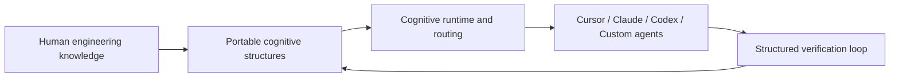

# AI-native Cognitive Execution System Landing Page Refresh

**Status**: `draft`
**世代**：Gen 3 communication layer refresh
**建立日期**：2026-05-26
**最後更新**：2026-05-26

> 本 plan 回應外部反饋：目前根 `README.md` 比較像 framework internal brain dump，對第一次進入的 outsider cognitive load 太高。目標是把第一屏改成 public-facing landing page，先說清楚 **AI-native Cognitive Execution System** 是什麼、為什麼存在、和一般 prompt / agent framework 有什麼不同，再把 runtime、bootstrap、治理與維護細節分流到既有 canonical 文件。`Ai-skill` 目前只視為尚未改名的 GitHub repo slug / bootstrap repo 名稱，不作為正式 public system name。

---

## Decision Rationale

### Problem & Why Now

目前根 `README.md` 不是內容不足，而是入口角色混在一起：

1. **第一屏直接進 internal bootstrap**
   - 目前開頭是 `AI-native Cognitive Execution System`、Quickstart、OS Layout。
   - 對已經知道本 repo 的 agent 有用，但 outsider 還不知道「這到底是什麼」。

2. **定位語言不夠 public-facing**
   - 現有文件強調 runtime state machine、routing、obligation、gates、generated surfaces。
   - 這些是系統能力，但不是第一個 GitHub reader 需要先理解的 mental entry point。

3. **核心價值尚未被壓縮**
   - AI-native Cognitive Execution System 的強點不是「又一個 agent 工具」。
   - 更接近：把人的工程經驗轉成可攜、可版本化、可驗證、可被不同 AI agent 重複執行的 cognitive structure。

4. **工具變動速度高於知識生命週期**
   - Claude、Cursor、Codex、自訂 agent 與未來 runtime 都可能變。
   - 工程知識不應被鎖在特定模型、特定 agent、特定 hosted memory 或單一 vendor runtime。
   - 尚未實際接入並累積使用經驗的工具（例如 Gemini CLI）不列入 `Works With`；先歸在 future AI runtimes。

### Decision

將根 `README.md` 改成 public-facing landing page，第一屏先回答：

- What: AI-native Cognitive Execution System 是什麼。
- Naming: 正式名稱是 `AI-native Cognitive Execution System`；`Ai-skill` 只是目前 repo slug，直到 GitHub repo rename 完成。
- Why: 為什麼現代 AI workflow 需要它。
- Why Different: 它和 prompt collection、MCP、LangGraph、agent framework、hosted memory 的差異。

核心定位：

```text
AI-native Cognitive Execution System is a framework for accumulating engineering knowledge without vendor lock-in.
```

中文定位：

```text
AI-native Cognitive Execution System 是一套 AI-native 認知執行框架，用可攜、可版本化、可演化的結構累積工程知識，而不被單一 Agent、模型或工具綁架。
```

第一屏採中英雙標語：

```text
AI-native cognitive execution framework for portable engineering knowledge.
可攜式工程知識的 AI-native 認知執行框架。
```

備選標語：

- `Own your engineering knowledge. Run it with any agent.`
- `掌握自己的工程知識，讓任何 Agent 都能執行。`
- `One knowledge OS, many AI tools.`
- `一套知識 OS，接上所有 AI 工具。`
- `Human-readable knowledge, machine-enforced agent behavior.`
- `人類可讀的知識，機器可驗證的 Agent 行為。`

### Alternatives Considered

- **A. 維持現狀**：reject。現有 README 對 agent bootstrap 有效率，但對 public reader 的 first impression 負擔過高。
- **B. 只在 README 加一段 tagline**：reject。問題不是缺一句話，而是資訊架構順序錯置；需要把 What / Why / Why Different 放到 bootstrap 與 OS layout 之前。
- **C. 根 README 改 landing page，細節連到 overview / architecture / onboarding**：accept。保留 existing canonical docs，不複製 runtime contract，也讓 outsider 有清楚入口。
- **D. 建完整 marketing site**：defer。目前 repo 內 README + `docs/overview.md` 足夠；不先引入網站框架或部署 surface。

### Why Not an ADR Yet

這是 communication layer 與 public entrypoint 改版，不改變 runtime contract、workflow semantics、source-of-truth 或 architectural invariant。

若未來決定「AI-native Cognitive Execution System 的正式產品定位、命名、public taxonomy」成為 cross-project、long-lived、expensive-to-reverse 的架構決策，再評估是否 promotion 到 ADR 或 constitution-level decision。GitHub repo slug 從 `Ai-skill` 改名可作為後續 repo migration task，不在本 plan 直接處理。

### ADR Promotion Criteria（completed 時驗證）

- [ ] 改版後的 public positioning 被後續 README、overview、architecture docs 穩定引用。
- [ ] 中英標語與核心定位不再頻繁變動。
- [ ] 定位決策影響 tool onboarding、documentation workflow 或 external integration language。
- [ ] 沒有更輕的 promotion target 適用。

### Consequences（預期）

#### 正面

- 新讀者先理解「AI-native Cognitive Execution System 是什麼」，再進入 runtime 細節。
- README 第一屏降低 cognitive load。
- Knowledge Ownership、Agent Portability、Human Experience Compounding 三個核心差異更明確。
- 內部 bootstrap / runtime 細節仍保留在 `CORE_BOOTSTRAP.md` companion、`runtime/core-bootstrap.yaml` 與 `runtime/runtime.db`，不造成 source-of-truth duplication。

#### 負面

- 根 README 會從 agent-oriented entrypoint 轉成 human/public-oriented entrypoint，agent bootstrap 需要依賴 `CORE_BOOTSTRAP.md` 連結與既有工具規則。
- 新增 `docs/overview.md` 會增加一個 public explanation surface，需要避免和 architecture doc 重複。

#### 風險

- **Marketing 過度抽象**：只講願景、不講實際怎麼用。Mitigation：Quick Start 仍連到 `ai-tools/new-project-onboarding.md`。
- **重複 canonical runtime 定義**：overview 若複製 runtime tables 會漂移。Mitigation：overview 只講概念，細節連到 `architecture/`、`runtime/`、`CORE_BOOTSTRAP.md`。
- **Bootstrap contract 重複**：README 若保留 agent workflow / obligations / receipt details，會和 `runtime/core-bootstrap.yaml` 及 bootstrap YAML migration plan 衝突。Mitigation：README 只放 `For agents` 最短入口，細節連回 canonical source。
- **中英混雜造成文件不一致**：Mitigation：正文以繁體中文為主，hero/tagline/專有名詞保留英文。

---

## Runtime Execution Path

| 欄位 | 內容 |
|---|---|
| Runtime owner | 不接入 runtime；本次是 communication layer / documentation rewrite。 |
| Trigger flow | Human reader / GitHub outsider → root `README.md` → public positioning → Quick Start / overview / architecture / maintainer routes；agent reader → `For agents` short route → `CORE_BOOTSTRAP.md` companion + `runtime/core-bootstrap.yaml` / `runtime.db` canonical contract。 |
| Trigger location | `README.md` first screen + `docs/overview.md`。 |
| Activation contract | Not applicable；不新增 executable YAML contract。 |
| Generated surface | Not applicable；不修改 `runtime/runtime.db`、routing registry 或 generated surfaces。 |
| Validation scenarios | Not required；以 documentation review、link check、diff review、linked-update check 驗證。 |
| Test passing evidence | README first-screen review + Markdown links + document sizing + linked updates。 |

---

## Open Questions

| # | Question | Status |
|---|---|---|
| 1 | 主標語採 `Own your engineering knowledge. Run it with any agent.` 還是更 framework-oriented 的 `AI-native cognitive execution framework for portable engineering knowledge.`？ | Resolved：採 `AI-native cognitive execution framework for portable engineering knowledge.` / `可攜式工程知識的 AI-native 認知執行框架。` |
| 2 | `docs/overview.md` 是否在本次一起新增，或先只改 README？ | Resolved：納入本次計畫，放在 Phase 2 實作。 |
| 3 | README 第一屏正文以繁中為主、英文 tagline 為輔，或改成英文為主、繁中補充？ | Resolved：中文為主、英文為輔；英文保留 tagline、必要專有名詞與 public ecosystem term。 |
| 4 | 是否需要放「Not」區塊：不是 chatbot / SaaS / prompt collection / MCP replacement？ | Resolved：加入 `Not` 區塊，降低定位誤解。 |
| 5 | 是否要在 README 放簡圖，或先用文字版 architecture map？ | Resolved：加入簡圖，以輕量 architecture map 呈現知識 ownership → agent/runtime execution → validation loop。 |

---

## 完成條件

- [ ] 根 `README.md` 第一屏能在 30 秒內回答 What / Why / Why Different。
- [ ] README 保留或連到 `CORE_BOOTSTRAP.md`、`architecture/ai-native-cognitive-execution-system.md`、`ai-tools/new-project-onboarding.md`、`governance/contributing.md`。
- [ ] 若新增 `docs/overview.md`，同時新增 `docs/README.md` 作為 router。
- [ ] 不複製 `runtime/core-bootstrap.yaml` 的 required reads、obligations、receipt format、per-turn rules、runtime gates、SQLite table semantics 或 cognitive mode enum 詳細規則。
- [ ] 符合 `governance/document-sizing.md`：README 不再成為混合多主題 dump。
- [ ] 完成 link check / diff review / linked-updates 檢查。

---

## Phase 0 Pre-Build Interrogation

### 目的

確認這是 documentation / communication 改版，不是 runtime、workflow 或 architecture semantics 改版；先鎖定讀者、非目標與 source-of-truth 邊界。

### Scope

In scope:

- 根 `README.md` public landing page 重構。
- 中英 tagline 與 positioning。
- 新增 `docs/README.md` + `docs/overview.md`。
- 更新 `plans/README.md` 狀態索引。

Out of scope:

- runtime contract / SQLite schema / generated surfaces。
- `CORE_BOOTSTRAP.md` obligation 內容。
- cognitive contract v2 active plan。
- CLI、hook、tool adapter behavior。

### Candidate Sources

| Source | 用途 |
|---|---|
| `README.md` | 主要 rewrite target。 |
| `architecture/ai-native-cognitive-execution-system.md` | 現有系統定位與 canonical navigation。 |
| `ai-tools/new-project-onboarding.md` | Quick Start / tool onboarding link。 |
| `governance/contributing.md` | Maintainer / contributor entrypoint。 |
| `workflow/documentation/README.md` + `execution-flow.md` | Documentation shape and validation guidance。 |
| `governance/document-sizing.md` | README 不膨脹、必要時拆 overview。 |
| `enforcement/linked-updates.md` | root README 改動的連動更新檢查。 |
| `enforcement/neutral-language.md` | 本庫可重用文件語言一致性。 |
| `plans/active/2026-05-25-2200-bootstrap-contract-yaml-migration.md` | 確認 README 不和 bootstrap YAML migration 的 source-of-truth 邊界衝突。 |
| `runtime/core-bootstrap.yaml` | Bootstrap obligations canonical contract；README / overview 不複製其內容。 |

### Phase 0 完成條件

- [x] User 確認 tagline 方向。
- [x] User 確認新增 `docs/overview.md`，並放入 Phase 2。
- [x] User 確認 README 語言主軸：中文為主、英文為輔。
- [ ] Candidate files 仍存在且 responsibility 清楚。

---

## Phase 1 README Landing Page Rewrite

### 目標結構

1. Hero: `AI-native Cognitive Execution System` + 中英 tagline。
2. One paragraph positioning。
3. The Problem。
4. The Goal。
5. What The System Enables。
6. Works With。
7. What It Is Not。
8. Why Different。
9. Quick Start。
10. Architecture Overview + 簡圖。
11. For Agents：最短 bootstrap route。
12. Maintainers / Contributing。

### Draft Hero Copy

```markdown
# AI-native Cognitive Execution System

AI-native cognitive execution framework for portable engineering knowledge.

可攜式工程知識的 AI-native 認知執行框架。

AI-native Cognitive Execution System is a framework for accumulating engineering knowledge without vendor lock-in.

Instead of locking knowledge inside a specific AI tool, model, hosted memory, or agent runtime, it stores engineering experience as portable, versionable, reusable cognitive structures.

Note: this project currently lives in the `Ai-skill` GitHub repository. The repository name has not been renamed yet.
```

### README 簡圖草案



### For Agents 最短入口草案

```markdown
## For Agents

如果你是 AI agent，請從 [`CORE_BOOTSTRAP.md`](CORE_BOOTSTRAP.md) 進入。Bootstrap 的 machine-readable obligations 由 [`runtime/core-bootstrap.yaml`](runtime/core-bootstrap.yaml) 投影到 `runtime/runtime.db`；本 README 只提供 public overview，不複製 bootstrap contract。
```

### Phase 1 完成條件

- [ ] README 第一屏完成。
- [ ] README 以中文正文為主，英文保留 tagline、工具名、專有名詞與 public ecosystem term。
- [ ] README 含 `What It Is Not` 區塊。
- [ ] README 含輕量 architecture map 簡圖。
- [ ] bootstrap / OS layout 下移並縮成 `For Agents` 最短入口，不保留完整 agent workflow。
- [ ] Quick Start 連到 `ai-tools/new-project-onboarding.md`。
- [ ] Maintainer path 連到 `governance/contributing.md`。

---

## Phase 2 Public Overview

### 目的

把 README 不適合承載的長篇 explanation 放到 overview，避免 root README 再次膨脹。

本 phase 納入本次計畫，不延後到未來 follow-up。

### Candidate Files

- `docs/README.md`
- `docs/overview.md`

### `docs/overview.md` 建議章節

1. AI-native Cognitive Execution System 是什麼。
2. 解決什麼問題。
3. 核心價值：Knowledge Ownership / Agent Portability / Human Experience Compounding。
4. 與 prompt engineering 的差異。
5. 與 MCP / hosted memory 的差異。
6. 與 LangGraph / agent framework 的差異。
7. 與一般 workflow automation 的差異。
8. 下一步：Quick Start / Architecture / Contributing。

### Phase 2 完成條件

- [ ] `docs/README.md` 是 router，不放長篇內容。
- [ ] `docs/overview.md` 不複製 runtime tables 或 executable contract details。
- [ ] `docs/overview.md` 不描述 bootstrap obligations、Receipt format、per-turn obligations 或 entry-file thinness rules；只連回 `CORE_BOOTSTRAP.md` / `runtime/core-bootstrap.yaml`。
- [ ] README 正確連到 overview。

---

## Phase 3 Validation And Linked Updates

### Tasks

- [ ] Diff review：確認沒有改動 runtime semantics。
- [ ] Link check：README / docs links 可解析。
- [ ] Document sizing：README 與 overview 各自目的單一。
- [ ] Neutral language：正文語言一致，英文只保留 tagline、固定術語、工具名。
- [ ] Linked updates：檢查 `architecture/README.md`、`governance/contributing.md`、`ai-tools/new-project-onboarding.md` 是否需要同步；若無需更新，記錄理由。
- [ ] Bootstrap boundary：確認 README / overview 沒有複製 `runtime/core-bootstrap.yaml` 的 required reads、obligations、Receipt format 或 per-turn rules。
- [ ] 若只改 Markdown 且不碰 runtime / knowledge / validation，不執行 runtime refresh；若連動更新涉及 routing 或 validation，再補跑。

### Phase 3 完成條件

- [ ] 所有 validation items 有 evidence。
- [ ] Plan status 可從 `draft` 更新為 `completed` 或保留 `in-progress` 等下一輪。
- [ ] 依 `plans/README.md` Plan Completion Closure 決定是否 archived。

---

## Stakeholder 同意項目

- [x] User confirms primary tagline：`AI-native cognitive execution framework for portable engineering knowledge.` / `可攜式工程知識的 AI-native 認知執行框架。`
- [x] User confirms README 語言比例：中文為主、英文為輔。
- [x] User confirms whether to add `docs/overview.md` in the first implementation batch：納入 Phase 2。
- [x] User confirms `Not a chatbot / SaaS / prompt collection / MCP replacement` 是否放 README 第一屏附近：加入 `Not` 區塊。
- [x] User confirms visual architecture map 是否本次做：加入簡圖。

---

## 與其他 plans 的關係

| Plan | 關係 |
|---|---|
| `plans/active/2026-05-25-2100-runtime-cognitive-contract-v2.md` | Independent；該 plan 改 runtime cognitive contract，本 plan 只改 public communication layer。 |
| `plans/active/2026-05-25-1000-context-language-glossary-system.md` | Related but independent；glossary 可能後續支援 public terminology consistency，但本 plan 不建立 glossary source-of-truth。 |
| `architecture/ai-native-cognitive-execution-system.md` | Source-backed positioning input；README 應連到它，不複製其 runtime navigation detail。 |
