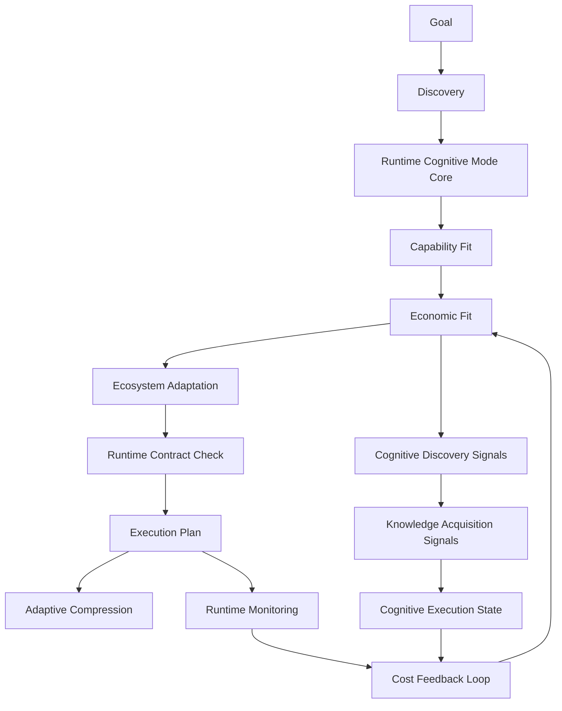

# Tool Runtime Signal & Economics Integration

## Status

draft

**目前執行入口（next）**：Reduction **Round 1 complete**（D1/D2/D3，見 §Reduction Decisions）。
下一步**不是繼續切 boundary**，而是進入 **evidence-accumulation period（`next_mode:
observation_only`）**：暫停新增抽象層，讓 D1/D3 既有決策承受真實使用壓力。**第二刀只在 §Round 1
結案 + Evidence-Accumulation Gate 列出的 trigger（A owner ambiguity / B state-can't-describe-
failure / C phase-order rework）真實出現時才開**；在那之前不主動切 Phase 3 / Finding 4 / Finding 5。
Finding 2 維持 defer。**任何 economics / ecosystem / generated_state 的實際 contract / YAML /
surface / code 仍須另開範圍並與 maintainer 對齊**；reduction phase 不寫實作。

## Summary

把 `tools/` 從 document / routing index layer 升級為 runtime-readable signal source，並補上 execution economics layer，讓 runtime 能機械使用 tool cost、risk、activation、compression、recursion、latency、retry 與 context expansion signals。

核心原則：

- `tools/` 提供 tool catalog / usage-pattern docs，不直接決定 runtime。
- `runtime/economics/` 或等效 executable contract 層負責「值不值得這樣思考 / 這樣執行」。
- Runtime Cognitive State / Cognitive Execution State 成為 runtime introspection surface：不只是 status report，而是可推導、可驗證的 state snapshot。
- Cognitive Mode 不直接依賴 tool catalog，只消費 economics / tool-derived signals，並回報可推導、可驗證、可影響 runtime 的 state。
- Cognitive Mode core 仍由 `runtime/cognitive-modes*.yaml` 管理。
- Runtime Cognitive Mode core 是 deterministic control plane：定義 mode contract、allowed depth、validation requirement、discovery policy、escalation policy；不得整個搬到 ecosystem。
- Ecosystem cognition layer 承載 adaptation / economics / pressure / telemetry：決定「什麼情況值得選 DEEP / SOURCE_BACKED / STRICT / compression / escalation」。
- 需要引入 ecosystem interaction layer 的概念：`models/`、`tools/`、`memory/`、`workflow/` 保留 source-of-truth；新層只處理 cross-layer resource interaction、pressure、economics、adaptation、feedback。
- Knowledge acquisition 必須進入後續設計：Runtime Cognitive State 不只描述 mode，也要說明是否引入新知識、哪些 analysis / workflow / intelligence 被啟用、成本與必要性是否合理。

## Decision Rationale

### Problem & Why Now

目前 `tools/README.md`、`tools/metadata/README.md`、`tools/routing/README.md` 已描述 tool cost、activation、compression、explosion detection，但它們主要是人讀文件。

`knowledge/runtime/routing-registry.yaml` 透過 `route.tools.metadata-routing` 以 `index-only` 方式索引 `tools/README.md`，代表 runtime 目前只知道入口，不具備 executable contract 可用來做 tool routing、compression、tool explosion 或 economic fit 判斷。

原本的 plan 只把 `tools/` 升級成 tool-routing signal，仍缺一層更核心的 decision layer：

```text
Economic Decision Layer
```

也就是在 goal → discovery → execution 之間，正式判斷：

- 值不值得展開更多 context？
- 值不值得用高成本 tool？
- 何時該壓縮、停止、降級、升級、recover？
- 目前 reasoning depth / tool recursion / retry 是否超出合理成本？

這些問題本質上不是 workflow 問題，而是 runtime economics 問題。

同時，現有 Cognitive Mode 報告已經具備 runtime introspection 的雛形：

- `execution_mode`
- `context_mode`
- `governance_mode`
- `memory_mode`
- `validation_mode`
- `cognitive_cost`

這組欄位已接近 Runtime Cognitive State Vector，但目前仍偏 status report，尚未完整接上 runtime economics、discovery、execution contracts 與 feedback loop。

更大的缺口是 cross-layer runtime phenomena 尚未正式建模。現在已經出現：

- model capability fit + context window + reasoning depth
- tool side-effect risk + token amplification + recursion risk
- memory recall depth + staleness risk + retrieval overhead
- workflow execution depth + validation burden + governance pressure

這些交互形成 actual cognitive cost，不屬於單一 layer。它們需要一個 ecosystem interaction layer 或 runtime ecology layer 來承載。

同時必須避免把兩種責任混在一起：

- 系統規則：例如 `STRICT` 必須啟動 validation / gate set。這是 runtime control plane。
- 系統判斷：例如這次值不值得 `STRICT`、為什麼不 `DEEP`、為什麼用 compression。這是 ecosystem adaptation / economics。

若不拆開，`runtime/cognitive-modes.yaml` 會同時承載 orchestration、adaptation、economics、observability、reasoning policy，最後變得難測試、難維護、難演進。

此外，現有 Cognitive Mode 報告的下一版 Runtime Cognitive State 仍缺一個關鍵閉環：knowledge acquisition。Agent 不只要回報「用了什麼 mode」，還要能回答：

- 有沒有發現新 domain / 新 architecture / 新 heuristic？
- 有沒有觸發新 workflow、analysis、intelligence？
- 有沒有造成 context expansion 或 token economics 改變？
- 這次 knowledge loading 是否必要？
- 是否需要 promotion 到 `analysis/`、`workflow/`、`intelligence/`、`memory/` 或 governance/enforcement？

這是 `governance/lifecycle/knowledge-update-flow.md` 目前的 Step 1-8 所在方向，但尚未和 Cognitive State / economics layer 形成同一個 runtime signal。

### Decision

把原 plan 從 `Tool Runtime Integration` 升級成：

```text
Tool Runtime Signal & Economics Integration
```

分三層處理：

1. Source-of-truth layers：`models/`、`tools/`、`memory/`、`workflow/` 保持各自 canonical responsibilities。
2. Runtime control plane：`runtime/cognitive-modes*.yaml` 保留 deterministic mode contracts、gate activation、validation、recovery、phase integration。
3. Ecosystem interaction layer：建模 resource interaction、economic pressure、cross-layer behavior、adaptation、feedback。
4. Runtime orchestration layer：負責 discovery、activation、validation、recovery、execution。
5. Cognitive Mode discovery：只消費 derived signals，不直接擁有 tool catalog、model catalog、memory semantics 或 economics model。
6. Cognitive Mode report：拆成 runtime state + ecosystem state + adaptation rationale，避免把 economics 塞回 runtime core。
7. Knowledge acquisition layer：在 ecosystem / cognitive state 中回報 knowledge_mode、discovery_mode、intelligence_mode，以及 activated / deferred knowledge。

第一版不做完整 telemetry database，但要設計 feedback loop 的 contract boundary，讓未來可從 static heuristics 升級到 evidence-adaptive runtime。

本 plan 不直接實作 Optimization Memory / Fitness Engine。完成 runtime trigger audit 後，本 plan 可提供 economics / telemetry / pressure primitive；後續由 [`2026-05-28-1636-gen4-fitness-optimization-memory-interface-reservation.md`](2026-05-28-1636-gen4-fitness-optimization-memory-interface-reservation.md) 預留 positive optimization memory、rejected optimization memory 與 activation fitness schema。此 sequencing 避免把 Gen4 autonomous evolution 提前塞進 Gen3 economics contract。

### Alternatives Considered

- A. 維持原 plan，只做 `runtime/tool-routing.yaml`：reject。可以解決 routing，但無法建模 execution economics。
- B. 把 economics 直接塞進 Cognitive Mode core：reject。會讓 Cognitive Mode 變成 tool preset / cost table，而不是 cognitive strategy。
- C. 建立獨立 `economics/` top-level layer：defer。概念清楚，但會新增一個 repo owner layer；先評估 runtime ownership 是否足夠。
- D. 建立 `runtime/economics/` 或等效 runtime executable contracts：accept as draft direction。它最接近 runtime decision layer，但 Phase 0 必須檢查目前 `runtime/README.md` 對 runtime YAML source 的限制。
- E. 只保留現有 Cognitive Mode 報告：reject。會讓 report 成為 ritualized verbosity，無法支撐 runtime economics 或 scenario validation。
- F. 把 Cognitive Mode 報告升級為 Runtime Cognitive State / Cognitive Execution State：accept。保留現有 6 維 state vector，同時增加 economics / runtime / adaptation surfaces。
- G. 新增 top-level `ecosystem/`：defer but keep as candidate。概念最準，適合承載 interaction ecology，但可能過早新增 owner layer；Phase 0 需先判斷是否比 `runtime/economics/` 更合適。
- H. 把 Cognitive Mode core 整個搬到 ecosystem：reject。runtime phase machine、execution orchestration、validation gates、recovery flow 仍依賴 deterministic mode contract。
- I. 拆成 runtime Cognitive Mode Core + ecosystem Cognitive Adaptation/Economics：accept。runtime 管「可以做什麼」，ecosystem 管「什麼情況值得這樣做」。
- J. 把 knowledge acquisition 當成 knowledge-update-flow 的人工 checkpoint：reject as insufficient。它需要保留在 governance flow，但 Cognitive State 也應提供 runtime signal。
- K. 將 knowledge acquisition 作為 ecosystem/cognitive-state 的後續維度：accept。它回報新知識必要性、activation、成本、promotion target 與 deferred knowledge。

### Why Not an ADR Yet

此決策會影響 runtime layer boundary、Cognitive Mode signal source、tool routing、compression、token budget 與 future telemetry。Schema、owner path、projection strategy 尚未驗證，先保持 plan，不升級 ADR。

### ADR Promotion Criteria

- [ ] economics contract 真實投影到 `runtime.db generated_surfaces`
- [ ] tool-derived / economics-derived signals 被 Cognitive Mode discovery 使用
- [ ] **每個 generated_surface key 都有 named consumer**（discovery signal / commit-msg validator / hook / scenario），且 consumer 已 wire（per §Generated surfaces consumer 表）
- [ ] runtime validate / scenario tests 能驗證 contract
- [ ] hook 或 CLI validator 真實使用該 contract
- [ ] feedback loop 有最小 evidence path，而非只停在 static docs
- [ ] Runtime Cognitive State 可映射到 economics tuple / split costs / adaptation rationale
- [ ] Cognitive state output 可被 scenario 測試，不只是漂亮 log
- [ ] **Phase 7 graduation acceptance signal 通過**（15 個 discovery signals 在 `runtime/cognitive-modes-discovery.yaml` 並通過 parser）
- [ ] **Phase 12 graduation acceptance signal 通過**（全部 11 個 generated_surfaces 投影 + named consumer 真實 wire + scenarios 通過）
- [ ] Open Questions 全部解決

### Consequences

#### 正面

- 把「思考成本」正式當成 architecture，而不是口頭約束
- tool routing、compression、token budget、recursion guard 可共用同一 economics layer
- Runtime Cognitive State 可反映 tool usage / context expansion / retry pressure，但核心 contract 維持乾淨
- Runtime Cognitive State 從 status report 升級成 runtime introspection / self-governance evidence
- `runtime/cognitive-modes.yaml` 不會因 adaptation / telemetry / economics 持續膨脹
- models / tools / memory / workflow 的交互成本有地方承載，不再散落在各 layer 說明文件
- Knowledge loading / acquisition / promotion 與 Cognitive State 形成閉環，減少「讀了很多但不知道為什麼」的假 observability
- 為 adaptive runtime cognition system 打基礎

#### 負面

- 新增 economics abstraction，維護成本提高
- runtime layer boundary 需要更嚴格定義
- 若太早接 telemetry，scope 會迅速變大

#### 風險

- `runtime/economics/` 若沒有 source-of-truth 規則，可能違反 `runtime/README.md` 的 runtime YAML boundary
- `ecosystem/` 若太早建立，可能變成第二個 runtime 或 dumping ground
- 若 runtime control plane 與 ecosystem adaptation 邊界不清，Cognitive Mode core 仍會肥大化
- economics schema 若過細，會變成 premature execution VM
- 若只做 static YAML，仍然只是 contract system，不會形成 feedback loop
- 若 Runtime Cognitive State 不可推導、不可驗證、不可影響 runtime，會變成 fake observability
- 若 knowledge acquisition signals 未接入 governance/enforcement，agent 可能只回報「有新知識」但不執行 promotion / linked updates / validation closure

## Runtime Execution Path

### Doc-only Trial 聲明 + Runtime Graduation（2026-05-28 retro-add per strengthened governance）

**目前狀態（2026-05-28）**：Plan 為 **draft**，Phase 0–12 全部 `[ ]`，**de facto doc-only**。在 Phase 7 完成前，本檔列出的 generated_surfaces / discovery signals / cognitive state fields **不構成 runtime integration**，僅為 design proposal。

**Graduation 階梯**：

| Graduation Phase | 達成後生效的 contract 範圍 | Acceptance signal |
| --- | --- | --- |
| **Phase 7 完成** | 15 個 economics/ecosystem discovery signals wired 進 `runtime/cognitive-modes-discovery.yaml`；signals 開始被 routing system 自動拉起 | `runtime/cognitive-modes-discovery.yaml` parser 可讀新 signals；scenario `economics-derived-cognitive-signal-valid-v1` 通過 |
| **Phase 12 完成** | 全部 11 個 generated_surfaces 投影完成、validators 真實使用、validation scenarios 通過、Plan Completion Closure 跑完 | ADR Promotion Criteria 全綠；本 plan 可進入 `plans/archived/`；ADR 升格評估啟動 |

**Drift prevention during trial**：

- Plan 中 framework / cognitive / ecosystem 詞彙統一引用 [`knowledge/glossary/ai-skill.md`](../../knowledge/glossary/ai-skill.md)（已 candidate entries：`cognitive_cost` / `thinking_cost` / `context_cost` / `execution_cost` / `knowledge_cost` / `knowledge_mode` / `discovery_mode` / `intelligence_mode` / `ecosystem` / `pressure_model`）。Plan 不得 inline redefine 任何 glossary owner term。
- Generated surface key 命名穩定後不變；變更需走 [`governance/lifecycle/system-upgrade-governance.md`](../../governance/lifecycle/system-upgrade-governance.md) §3 規則 8。
- 本 plan 在 Phase 7 / Phase 12 graduation 之前**不能宣稱完成 runtime integration**；任何「已實作」claim 必須 cite 對應 phase 完成 evidence。

**明文承認**：本 plan 當前未 enter runtime。在 Phase 7 graduation 前，referencing 本 plan 的 generated_surfaces / discovery signals 等同 reference plan-vocabulary，不等同 referencing runtime contract。本承認符合 [`governance/lifecycle/system-upgrade-governance.yaml`](../../governance/lifecycle/system-upgrade-governance.yaml) §`define_runtime_trigger_flow` `doc_only_trial_requires` 的 `graduation_deadline_or_signal_no_indefinite_trial` 與 `explicit_acknowledgement_doc_only_trial_does_not_count_as_runtime_integration`。

### Runtime owner

Draft owner candidates:

- Runtime control plane remains in `runtime/cognitive-modes*.yaml`.
- Preferred: `runtime/economics/*.yaml` for executable economics contracts, if Phase 0 confirms runtime owner-layer rule allows subdirectory contracts.
- Fallback: `runtime/tool-routing.yaml` + `runtime/economics-feedback.yaml` at runtime root, following existing B-class executable YAML pattern.
- Alternative: top-level `economics/` owner layer with `runtime_projection.enabled: true`, if `runtime/` ownership should stay narrow.
- Alternative: top-level `ecosystem/` owner layer with `runtime_projection.enabled: true`, if interaction ecology should be separate from runtime orchestration.

### Trigger flow

1. Agent receives goal or task intent.
2. Runtime control plane exposes allowed modes / validation / escalation contracts.
3. Runtime discovery identifies capability fit.
4. Ecosystem / economics layer evaluates economic fit:
   - token burn estimate
   - model capability / latency / context-window fit
   - tool cost / side-effect risk
   - memory loading / staleness / retrieval overhead
   - workflow depth / validation burden / governance pressure
   - reasoning depth
   - recursion risk
   - retry pressure
   - compression pressure
   - latency / output amplification
5. Ecosystem adaptation recommends mode / context / compression / escalation.
6. Runtime validates recommendation against deterministic mode contract.
7. Runtime creates execution hints:
   - shallow discovery
   - source-backed expansion
   - compression required
   - validation checkpoint required
   - recovery / escalation
8. Cognitive Mode discovery consumes economics-derived signals.
9. Knowledge acquisition layer evaluates whether new knowledge was discovered, which sources/routes were activated, and whether promotion / linked updates are required.
10. Runtime Cognitive State / Cognitive Execution State report separates runtime state, ecosystem state, knowledge acquisition state, and adaptation rationale.
11. Runtime scenarios can compare expected vs actual cognitive state to detect governance drift, reasoning drift, execution mismatch, economic overrun, or knowledge acquisition mismatch.

### Proposed flow



### Generated surfaces

每個 candidate key 必須宣告 **named consumer**（per `governance/lifecycle/system-upgrade-governance.yaml` §`define_runtime_trigger_flow` forbidden `sqlite_projection_without_routable_or_validator_consumer`）。沒有 named consumer 的 surface 不得 promote 為 runtime contract。

| Generated surface key | Named consumer(s) | Consumer 類型 |
| --- | --- | --- |
| `runtime.tool_routing.contract` | `runtime/cognitive-modes-discovery.yaml` Phase 7 signals + `validateToolRoutingProjection` (Phase 12 hook) + scenario `tool-routing-contract-projected-v1` | discovery signal + commit-msg validator + validation scenario |
| `ecosystem.economics.token_costs` | `runtime/cognitive-modes-discovery.yaml` `economic_pressure_high` signal + scenario `economics-contract-projected-v1` | discovery signal + validation scenario |
| `ecosystem.economics.tool_cost_model` | `runtime/cognitive-modes-discovery.yaml` `tool_usage_high_risk_mutation` + `tool_output_large` + `tool_loop_detected` signals + scenario `economics-contract-projected-v1` | discovery signals + validation scenario |
| `ecosystem.economics.cognitive_budget_policy` | Cognitive Mode 報告 cost class derivation（commit-msg `cognitiveCost` validator） + scenario `cognitive-state-economics-fields-valid-v1` | commit-msg validator + scenario |
| `ecosystem.economics.execution_feedback` | Phase 10 feedback contract + scenario `execution-feedback-loop-static-contract-v1` | static contract + scenario |
| `runtime.cognitive_state.telemetry_contract` | Cognitive Mode 報告 emit（commit-msg `cognitiveModeBlock` validator）+ scenario `cognitive-state-adaptation-rationale-valid-v1` | commit-msg validator + scenario |
| `ecosystem.resource_interactions.contract` | Cognitive Mode discovery `memory_amplification_high` + `governance_overhead_high` signals + scenario `ecosystem-resource-interaction-contract-v1` | discovery signals + scenario |
| `ecosystem.pressure_models.contract` | Cognitive Mode discovery `context_expansion_rate_high` + `compression_pressure_high` signals + scenario `ecosystem-pressure-models-contract-v1` | discovery signals + scenario |
| `ecosystem.adaptation.contract` | Cognitive Mode discovery `ecosystem_recommends_deep` + `ecosystem_recommends_shallow_discovery` signals + scenario `cognitive-adaptation-ecosystem-boundary-v1` | discovery signals + scenario |
| `ecosystem.cognitive_adaptation.contract` | Cognitive Mode 報告 adaptation rationale fields（commit-msg validator）+ scenario `cognitive-adaptation-ecosystem-boundary-v1` | commit-msg validator + scenario |
| `ecosystem.knowledge_acquisition.contract` | `governance/lifecycle/knowledge-update-flow.md` writeback + scenarios `knowledge-acquisition-*-v1` (3 條) | governance flow + scenarios |

任一 surface 完成 projection 但對應 consumer 尚未 wire 時，**不得宣稱該 surface 已 enter runtime**。

**Invariant（§Reduction Decisions D3 成文）**：**No generated surface may depend on another
generated surface** — 只允許 `Source → Surface`，禁止 `Surface → Surface`。上表每個 consumer 必須
自己對 **source** join，不得 join 另一個 generated surface（杜絕 `ecosystem.economics.* →
ecosystem.* → runtime.cognitive_state.*` 這類 hidden dependency graph）。

### Validation scenarios

- `tool-routing-contract-projected-v1`
- `economics-contract-projected-v1`
- `tool-derived-cognitive-signal-valid-v1`
- `economics-derived-cognitive-signal-valid-v1`
- `execution-feedback-loop-static-contract-v1`
- `cognitive-state-economics-fields-valid-v1`
- `cognitive-state-adaptation-rationale-valid-v1`
- `ecosystem-resource-interaction-contract-v1`
- `ecosystem-pressure-models-contract-v1`
- `cognitive-core-control-plane-boundary-v1`
- `cognitive-adaptation-ecosystem-boundary-v1`
- `knowledge-acquisition-cognitive-state-fields-v1`
- `knowledge-acquisition-promotion-target-valid-v1`
- `knowledge-acquisition-linked-updates-required-v1`

## Target Architecture

### Source-of-truth layers

These layers keep ownership of their own truths:

```text
models/    -> model capability, latency, context window, reasoning depth, compression tolerance
tools/     -> tool metadata, side-effect risk, token amplification, recursion risk, activation cost
memory/    -> memory semantics, recall depth, staleness risk, retrieval overhead
workflow/  -> execution depth, validation burden, governance pressure
```

The ecosystem / economics layer must not duplicate these truths. It models their interactions.

### Cognitive Mode Core（runtime control plane）

`runtime/cognitive-modes.yaml` and related integration contracts remain in runtime. They define deterministic execution control:

```yaml
modes:
  execution_mode:
    values: [FAST, NORMAL, DEEP, FORENSIC, RECOVERY]
  context_mode:
    values: [INDEX_ONLY, SUMMARY_FIRST, CHECKLIST_FIRST, SOURCE_BACKED, GRAPH_ASSISTED]
  governance_mode:
    values: [LIGHT, STANDARD, STRICT, LOCKDOWN]
  memory_mode:
    values: [NONE, EPISODIC, DECISION_REPLAY, FAILURE_REPLAY, PROJECT_CONTEXT]

contracts:
  allowed_depth: runtime-owned
  validation_requirement: runtime-owned
  discovery_policy: runtime-owned
  escalation_policy: runtime-owned
  gate_activation: runtime-owned
```

Runtime answers:

```text
What is allowed?
What gates activate?
What validation is required?
What recovery/escalation contract applies?
```

### Cognitive Economics / Adaptation（ecosystem candidate）

Ecosystem answers:

```text
When is DEEP worth it?
When is SOURCE_BACKED worth it?
When should compression be aggressive?
When should discovery stay shallow?
When should governance escalate?
```

Candidate structure:

```text
ecosystem/
  cognition/
    economics.yaml
    adaptation.yaml
    pressure-models.yaml
    telemetry.yaml
```

This layer may recommend a mode, but runtime validates that recommendation against `runtime/cognitive-modes*.yaml`.

### Knowledge Acquisition（ecosystem / governance bridge）

Knowledge acquisition is the bridge between Cognitive State and knowledge-update governance. It answers:

```text
Did this task introduce new knowledge?
Did it activate analysis / workflow / intelligence?
Was the knowledge load necessary?
What was deferred?
Does it require promotion, memory, validation, governance, or enforcement updates?
```

Candidate modes:

```yaml
knowledge_mode:
  values:
    - REUSE_ONLY
    - SOURCE_REFRESH
    - DISCOVERY_REQUIRED
    - CROSS_DOMAIN_SYNTHESIS
    - FAILURE_LEARNING
    - MEMORY_PROMOTION

discovery_mode:
  values:
    - STATIC_ROUTE
    - HEURISTIC_DISCOVERY
    - ARCHAEOLOGY
    - DOMAIN_MAPPING
    - TOOL_CAPABILITY_DISCOVERY
    - KNOWLEDGE_GAP_DETECTION

intelligence_mode:
  values:
    - ATOM_ONLY
    - WORKFLOW_GUIDED
    - HEURISTIC_ENFORCED
    - CROSS_INTELLIGENCE
    - FAILURE_AUGMENTED
    - DOMAIN_REASONING
```

This layer does not own knowledge content. It records activation and acquisition signals, then delegates writeback to `governance/lifecycle/knowledge-update-flow.md`.

### Ecosystem interaction layer

Candidate structure if Phase 0 accepts a new owner layer:

```text
ecosystem/
  economics/
  cognitive-state/
  pressure-models/
  adaptation/
  telemetry/
  ecology-rules/
  feedback/
```

This layer handles cross-layer behavior:

- resource interaction
- adaptive economics
- runtime pressure
- feedback
- cross-layer amplification

It is not the source of truth for models, tools, memory, or workflow.

### Runtime economics layer

Candidate structure:

```text
runtime/
  economics/
    token-costs.yaml
    reasoning-depth.yaml
    compression-thresholds.yaml
    recursion-budget.yaml
    tool-cost-model.yaml
    escalation-costs.yaml
    cognitive-budget-policy.yaml
    execution-feedback.yaml
```

Phase 0 must validate whether this structure is allowed. If not, use runtime-root executable YAML files or create top-level `economics/` as owner layer.

If `ecosystem/` is accepted as the owner layer, `runtime/economics/` should stay orchestration-facing or be skipped to avoid duplicate ownership.

### Tools layer

Candidate structure:

```text
tools/
  catalog/
  docs/
  metadata/
  usage-patterns/
```

`tools/` should describe what tools are and how they behave. Runtime economics decides whether their use is worthwhile.

### Tool behavioral patterns

Static metadata is not enough. Add behavioral patterns as runtime heuristics:

```yaml
tool_patterns:
  recursive_search:
    recursion_risk: high
    compression_pressure: high
    recommended_context:
      - source-backed
      - shallow-discovery

  code_mutation:
    side_effect_risk: critical
    require:
      - validation
      - rollback
      - evidence_checkpoint
```

These patterns are not tool presets. They are runtime cognition heuristics.

### Ecosystem pressure models

Examples of cross-layer pressure this plan should model:

```yaml
pressure_models:
  context_explosion:
    inputs:
      - small_model
      - source_backed_context
      - deep_workflow
    pressure: high
    adaptation:
      compression: aggressive
      discovery: shallow
      memory: summary_only

  memory_amplification:
    inputs:
      - recursive_tool_discovery
      - decision_replay
    pressure: high
    adaptation:
      memory: summary_only
      tool_search: bounded

  governance_overhead:
    inputs:
      - strict_governance
      - deep_validation
    latency: very_high
    adaptation:
      validation: checkpointed
      reporting: compact_until_final
```

These are interaction rules. The source facts remain in `models/`, `tools/`, `memory/`, and `workflow/`.

### Architecture stack

```text
Source-of-Truth Layers
  -> Runtime Resource Layers
  -> Ecosystem Interaction Layer
  -> Runtime Orchestration Layer
  -> Cognitive Execution State
```

This stack prevents `ecosystem/` from becoming a dumping ground while still giving cross-layer phenomena a home.

### Runtime Cognitive State surface

The existing Cognitive Mode 報告 should become Runtime Cognitive State / Cognitive Execution State, a structured introspection surface:

```yaml
runtime_state:
  execution_mode: NORMAL
  validation_mode: CHECKLIST
  governance_contract: STANDARD

ecosystem_state:
  selected_context_mode: SOURCE_BACKED
  selected_memory_mode: PROJECT_CONTEXT
  knowledge_mode: DISCOVERY_REQUIRED
  discovery_mode: ARCHAEOLOGY
  intelligence_mode: CROSS_INTELLIGENCE
  context_pressure: MEDIUM
  governance_pressure: HIGH
  token_budget_pressure: LOW
  recursion_risk: LOW

economics:
  thinking_cost: MEDIUM
  context_cost: HIGH
  execution_cost: LOW
  estimated_token_cost: MEDIUM
  estimated_latency: LOW
  recursion_risk: LOW
  compression_pressure: MEDIUM
  evidence_depth: SOURCE_BACKED

runtime:
  triggered_by:
    - file_diff_runtime_schema
  discovery_signals:
    - tool_usage_high_risk_mutation
  activated_routes:
    - route.runtime.cognitive-modes
  deferred_routes:
    - route.tools.metadata-routing
  blocked_routes: []

knowledge:
  knowledge_signals:
    - architecture_mismatch_detected
    - bounded_context_unclear
    - workflow_gap_detected
  activated_intelligence:
    - architecture-fit-analysis
    - backend-archaeology
  activated_workflows:
    - route.workflow.repo-analysis
  activated_analysis:
    - repo-structure-analysis
  deferred_knowledge:
    - full-security-audit
  promotion_target: intelligence
  linked_updates_required:
    - governance/lifecycle/knowledge-update-flow.md
    - enforcement/linked-updates.md

adaptation:
  selected_context_mode: SOURCE_BACKED
  why_not_deeper:
    - task bounded
    - no architecture mutation
  why_not_shallower:
    - source-backed answer required
  why_not_parallel:
    - single-source plan update
  escalation_reason: null
```

This is not meant to make every chat response verbose. The output can remain compact, but the runtime contract should make the state derivable and testable.

### Split cost model

`cognitive_cost` currently compresses multiple costs into one class. Economics integration should split it internally:

- `thinking_cost`: reasoning depth, recursive analysis, validation chain
- `context_cost`: source-backed reads, graph traversal, memory loading, routing lookup
- `execution_cost`: tool calls, mutation, validation, runtime refresh, tests
- `knowledge_cost`: discovery, source refresh, cross-domain synthesis, intelligence activation, memory promotion

The existing `cognitive_cost` can remain as a public summary / compatibility field, derived from split costs.

## Architecture Review & Reduction Agenda（2026-06-15, maintainer）

> **定位**：把第一刀當成 **architecture reduction phase（不是 implementation）**。最大風險已
> 不是「缺東西」，而是「開始長出兩套 runtime」。**First cut = Phase 1（owner path）→ Phase 2
> （control/adaptation boundary）**，目標是解 Economics ↔ Ecosystem ownership 重疊；任何
> surface/code 變更前先停下來對齊範圍。以下 5 條是 reduction 的 agenda（maintainer direction，
> 由 reduction phase 對齊現行架構後落實，不是已套用的改動）。

**Finding 1 — Decision Stack duplication（最大風險 / 真正 blocker）**
- 目前 5 層（Source-of-truth → Runtime Economics → Ecosystem Interaction → Runtime Orchestration → Cognitive State）中，**Runtime Economics 與 Ecosystem Interaction 重疊**：兩者都在做 cost evaluation / pressure / adaptation / recommendation / feedback → 雙 economics engine 風險（runtime 算一次、ecosystem 再算一次）。
- **Reduction：收斂成 4 層** — Source Truth（`models/` `tools/` `memory/` `workflow/`）→ Interaction/derived（`ecosystem/{pressure,economics,adaptation}`）→ Runtime/execution（`runtime/{orchestration,cognitive-modes}`）→ State/observable（`generated_state/`）。
- **砍掉 `runtime/economics/`**：Runtime 不擁有 economics，只執行；economics 歸 Interaction(derived) 層。直接回答 Phase 0 的 owner-path 問題。

**Finding 2 — Knowledge Acquisition 是 lifecycle event，不是 economics/state**
- 不要先定義 `knowledge_mode` / `discovery_mode` / `intelligence_mode`（state-like）。先定義 `knowledge_event`（discovered / reused / promoted / rejected）+ `knowledge_source` + `knowledge_decision` + `promotion_target`，**再衍生 mode**。
- 流程：`execution → observation → knowledge_event → governance → writeback`。避免「mode 無 writeback = fake observability」（呼應 plan 自己提的 fake observability 警告）。

**Finding 3 — Projection Inflation（11 surfaces / 15 signals 已近治理臨界）**
- 加一條 invariant：**No generated surface may depend on another generated surface**。只允許 `Source → Surface`，**禁止 `Surface → Surface`**。每個 consumer 自己 join，避免 hidden dependency graph（如 `runtime.economics.* → ecosystem.* → runtime.cognitive_state.*`）。

**Finding 4 — Cognitive State 缺 Confidence 維度**
- 加 `confidence: { evidence_quality, source_count, assumption_level, contract_confidence }`。否則 `economics.thinking_cost: HIGH` 沒有可信度 → 「高成本 + 低信心」不可見。

**Finding 5 — Phase reorder（State 先於 Signals 先於 Knowledge）**
- 改為：P4 Tool Contract → P5 Economics → P6 Pressure → **P7 State → P8 Signals** → P9 Feedback → **P10 Knowledge**。理由：State 要先存在，Signal 才知 emit 到哪；**Knowledge 是 consumer，不是 producer**，排最後。

**Overall**：架構方向強、邊界意識成熟、可治理性高；**過度建模風險中高**；真正 blocker = owner 重疊；下一個該解 = Economics ↔ Ecosystem ownership。reduction phase 的 acceptance ≈「4 層 owner path 拍板 + `runtime/economics/` 砍除決策 + Surface→Surface 禁令成文」，**不寫 economics 實作**。

## Reduction Decisions（第一刀拍板, 2026-06-15）

> 本節是 reduction phase（第一刀）的 boundary decision record。對齊現行架構後拍板下列三項：
> `runtime/economics/`、`ecosystem/`、`economics/`、`generated_state/` 目前**皆尚未建立**（純決策，
> 無 code/surface 變更）；`runtime/README.md` §Owner-Layer Executable Contracts 第 3 行明定
> 「`runtime/` 不接收 governance、enforcement 或 workflow source ownership…YAML contract 留在原
> owner layer」。**本節不含 economics 實作 / surface / code**；Phase 4+ 的 contract 實作仍需另開
> 範圍並與 maintainer 對齊。

### D1 — Owner path：4 層收斂，砍掉 `runtime/economics/`

- **拍板**：採 Finding 1 的 **4 層 owner path**，取代 §Architecture stack 原本的 5 層：
  1. **Source Truth** — `models/` `tools/` `memory/` `workflow/`（各自 canonical，維持不變）
  2. **Interaction / derived** — `ecosystem/{pressure,economics,adaptation}`（economics 歸此層）
  3. **Runtime / execution** — `runtime/{orchestration,cognitive-modes}`（只執行，不擁有 economics）
  4. **State / observable** — `generated_state/`（runtime introspection surface）
- **`runtime/economics/` 砍除**：Alternative D（`runtime/economics/`）→ **reject**；Alternative G
  （top-level `ecosystem/`）→ **accept as owner path**。
  - 依據：`runtime/README.md` §Owner-Layer Executable Contracts —「`runtime/` 不接收…source
    ownership」。Economics 是 derived/interaction 內容，既非 runtime internal mechanism config
    （A 類，canonical-in-DB），亦非 runtime-mechanism-facing executable contract（B 類
    cognitive-modes / core-bootstrap），故 **不得由 `runtime/` 擁有**。
  - economics contract 仍透過 `runtime_projection.enabled: true` 投影到 `runtime.db
    generated_surfaces`（沿用 B 類 source→projection 模式），但 **source 的 owner layer 是
    `ecosystem/`，不是 `runtime/`**。
- **解 Phase 0 owner-path 問題**：Phase 0「Confirm source-of-truth: `runtime/economics/`,
  runtime-root YAML, top-level `economics/`, or top-level `ecosystem/`」→ 答 **top-level
  `ecosystem/`**。
- **避免雙 economics engine**（Finding 1 真正 blocker）：cost evaluation / pressure / adaptation /
  recommendation / feedback 只在 Interaction(derived) 層算**一次**；Runtime/execution 層不得重算，
  只消費 derived signal 並對 deterministic mode contract 做 validation。
- **Guard — owner-path 決策 ≠ layer 已存在**：D1 拍板的是 owner **path**。`ecosystem/` 目前**尚未
  建立**；其正式建立（含 §Phase 3「Decide whether `ecosystem/` is created now or deferred」與
  「Define generated surface naming」）仍為 **Phase 3，未勾選**。本刀不得被解讀為 Phase 3 已完成或
  ecosystem owner 已存在。

### D1 推論 — generated-surface key namespace = owner layer

- **既有慣例（查 `runtime.db generated_surfaces.target_key` 實證）**：key prefix == **source owner
  layer**（例 `enforcement.dependency_reading.contract`、`governance.knowledge_update_flow.contract`、
  `ai_tools.agent_claude.contract`），**不是** projection target（所有 surface 都投影進 `runtime.db`）。
- **推論**：D1 把 economics owner 移到 `ecosystem/` 後，§Generated surfaces 表原 `runtime.economics.*`
  4 個 key 屬 **mis-namespaced orphan**，已改名為 **`ecosystem.economics.*`**（token_costs /
  tool_cost_model / cognitive_budget_policy / execution_feedback）。scenario id（`economics-contract-projected-v1`
  等）非 surface key，維持不變。
- **未由 D1/D2 唯一裁決、暫不改名（flag → Phase 3/4）**：
  - `runtime.tool_routing.contract` — tool **routing/orchestration**（runtime）vs tool **cost**
    （ecosystem economics）尚未拆分；owner 待 Phase 4 拍板。
  - `runtime.cognitive_state.telemetry_contract` — 依 D2 report split，`runtime_state` 留 runtime、
    `telemetry`/adaptation 歸 ecosystem；此 key 可能需拆分，owner 待 Phase 3/8 拍板。
  - 上述 2 key **本刀不改名**，避免在 owner 未定下擅自決定 surface 命名（屬 implementation scope）。

### D2 — Control plane vs Adaptation boundary（Phase 2）

- **Runtime control plane（留在 `runtime/cognitive-modes*.yaml`）— deterministic「可以做什麼」**：
  mode contracts、`allowed_depth`、`validation_requirement`、`discovery_policy`、`escalation_policy`、
  `gate_activation`。
- **Ecosystem adaptation（移到 `ecosystem/`）—「什麼情況值得這樣做」**：
  economics、pressure、telemetry、`why_not_deeper` / `why_not_shallower` / `why_not_parallel` /
  escalation rationale。
- **Report split**：Runtime Cognitive State 報告拆成 `runtime_state` / `ecosystem_state` /
  `adaptation` 三段，economics **不回塞** runtime core。
- **Cognitive Mode core 不整搬**：Alternative H（整個搬到 ecosystem）→ reject；Alternative I
  （runtime core + ecosystem adaptation 拆分）→ accept。runtime phase machine / execution
  orchestration / validation gates / recovery flow 仍依賴 deterministic mode contract。

### D3 — Surface→Surface 禁令（成文 invariant）

- **Invariant（採 Finding 3）**：**No generated surface may depend on another generated surface.**
  只允許 `Source → Surface`，**禁止 `Surface → Surface`**。
- 每個 consumer（discovery signal / commit-msg validator / hook / scenario / governance flow）
  自己對 **source** join，不得 join 另一個 generated surface。
- 禁止 hidden dependency graph（例：`ecosystem.economics.* → ecosystem.* →
  runtime.cognitive_state.*`）。
- 約束 §Generated surfaces 表的 11 個 candidate key：promote 為 runtime contract 前，consumer
  必須直接消費 source，不得跨 surface 依賴。

### 第一刀 acceptance（對應 §Architecture Review acceptance）

- [x] 4 層 owner path 拍板（D1）
- [x] `runtime/economics/` 砍除決策（D1）
- [x] Surface→Surface 禁令成文（D3）
- [x] control / adaptation boundary 拍板（D2）

### 未納入第一刀（deferred，避免 scope creep）

- Finding 2（先定義 `knowledge_event` lifecycle 再衍生 mode）、Finding 4（Cognitive State 補
  `confidence` 維度）、Finding 5（phase reorder：P7 State → P8 Signals → P10 Knowledge）屬後續
  reduction / 實作範圍，本刀**不拍板**，僅記為 next。
- 任何 economics / ecosystem / generated_state 的實際 contract / YAML / surface / code 一律
  **deferred**，需另開範圍對齊 maintainer。

### Round 1 結案 + Evidence-Accumulation Gate（2026-06-16, maintainer）

> **判準已被 D1/D3 改變**：economics ownership（D1）與 surface→surface 投影（D3）兩個原始問題已有
> 明確決策。此時若繼續切（Finding 4 / Finding 5 / Finding 2），執行順序會從「證據 → 決策」**倒轉**成
> 「先定結論 → 再找場景證明」。因此 Round 1 **結案**，進入 **observation-only**：不是停工，而是暫停
> 新增抽象層，讓既有薄切片承受真實使用壓力，再由證據決定（或否決）第二刀。

```yaml
status:
  reduction: complete_round_1      # D1 owner-path / D2 control-adaptation / D3 surface-ban
next_mode:
  observation_only                 # 暫停新增抽象層，不主動切 boundary
trigger:                           # 出現任一才開第二刀（對應下表 reopen target）
  - contradiction
  - ownership_ambiguity
  - validator_friction
  - scenario_duplication
```

**三類證據 → reopen target**（只在訊號真實出現時才開對應切口）：

| 證據 | 觀察訊號 | reopen target |
| --- | --- | --- |
| **A — owner ambiguity（優先）** | 新 plan / scenario / validator 開始不知道該放 `runtime/` 還 `ecosystem/`（例 `compression_policy`、`memory_pressure`、`routing_feedback` 放哪都不順） | **Phase 3**（ecosystem interaction boundary）+ 第一刀 flag 的 2 個 ambiguous key（`runtime.tool_routing.contract`、`runtime.cognitive_state.telemetry_contract`） |
| **B — State 無法描述失敗** | 報告出現 `thinking_cost: HIGH` + `execution_cost: HIGH` + `decision: accepted`，但無法回答「這判斷可信嗎」 | **Finding 4**（Cognitive State `confidence` 維度） |
| **C — Phase 順序造成返工** | 「先定 signal、後面 state 裝不下」或「knowledge phase 重寫前面 phase」 | **Finding 5**（phase reorder：P7 State → P8 Signals → P10 Knowledge） |

**Null-result 也是訊號**：若一段觀察期後三類證據皆未出現，代表 reduction 可能已切到足夠薄、**不需要
第二刀**。是否因此推進 closure 是**人工判斷**——不設固定截止日、不自動觸發（threshold / deadline /
reopen automation 先不寫，理由見 §Evidence Log）。

**Finding 2** 仍 defer：其 reopen 需 Evidence A 先穩定（先解 owner ambiguity，否則 knowledge_event
lifecycle 會重開 ownership）。

### Evidence Log（observation only）

純被動載體，**不是 gate engine**。存在的唯一理由：沒有累積載體，observation-only 跨 session 等於失憶。
出現一筆寫一筆，靠它數，不靠回憶。

| date | class | artifact | observation | strength | decision_blocked |
| --- | --- | --- | --- | --- | --- |
| _(尚無實例；出現時新增一列，不要在此寫結論)_ | | | | | |

**欄位**：`class` ∈ A / B / C（見上方「三類證據」表）；`artifact` 必須指向**真實物件**（plan /
scenario / validator / report / diff / commit / issue）；`strength` ∈ `hard` / `soft`；
`decision_blocked` ∈ `yes` / `no`（當下是否卡到做不下去）。

**規則（只有三條）**：

1. **只記實例，不記結論** —— 寫「看到什麼」，不寫「應該開第二刀」。
2. **一筆證據必須指向真實 artifact**，不收抽象感想。
3. **Evidence Log 不自動觸發 reopen** —— reopen 永遠是人工 decision。

**為什麼有 `decision_blocked`**：`ownership_ambiguity ×2 / decision_blocked=no` 不一定值得 reopen；
但 `×1 / decision_blocked=yes`（不決定就做不下去）可能當下就要開刀。strength + decision_blocked
一起看，比純計數準。

**現在刻意不寫**：threshold（≥N = reopen）、closure 截止日、reopen automation。理由：還不知道 A
是否高頻 / B 是否根本不發生 / C 是否一筆就夠；現在寫死會滑回 governance、變「為收集而收集」。等真的
累積 **3–5 筆**，再回頭評估要不要升級成 gate。

## Phase 0: Pre-Build Interrogation

- [ ] Confirm scope: static economics contracts + signal wiring first; no full telemetry DB in v1.
- [ ] Confirm source-of-truth: `runtime/economics/`, runtime-root YAML, top-level `economics/`, or top-level `ecosystem/`.
- [ ] Confirm whether models/tools/memory/workflow should remain source-of-truth layers while ecosystem only owns interaction.
- [ ] Confirm Cognitive Mode Core remains in runtime as deterministic control plane.
- [ ] Confirm Cognitive Adaptation / Economics / Telemetry belongs in ecosystem or equivalent interaction layer.
- [ ] Confirm compatibility with `runtime/README.md` B-class executable YAML rules.
- [ ] Confirm whether `runtime/**/*.yaml` under subdirectories is allowed by compiler / validators.
- [ ] Confirm linked updates: `models/README.md`, `tools/README.md`, `memory/README.md`, `workflow/`, `runtime/README.md`, routing registry / generated reports if needed.
- [ ] Confirm validation targets: runtime refresh/validate, generated surface query, scenario tests.
- [ ] Confirm non-goal: do not rewrite Cognitive Mode core or implement full telemetry DB in v1.
- [ ] Confirm Cognitive Mode report naming: keep public name or introduce `Runtime Cognitive State` / `Cognitive Execution State` as internal contract.
- [ ] Confirm anti-verbosity rule: expanded cognitive telemetry must be derivable/testable without forcing every response into a huge report.
- [ ] Confirm knowledge acquisition is added after this plan's core economics/ecosystem boundary, not before Phase 0-3 ownership decisions.
- [ ] Confirm governance/enforcement linked updates likely required: `governance/lifecycle/knowledge-update-flow.md`, `enforcement/linked-updates.md`, and possibly `enforcement/dependency-reading.md`.

## Phase 1: Define Runtime Economics Boundary

- [x] Decide owner path: `runtime/economics/`, runtime-root YAML, top-level `economics/`, or top-level `ecosystem/` → **top-level `ecosystem/`**（見 §Reduction Decisions D1；`runtime/economics/` rejected）
- [ ] Define economics contract inventory
- [ ] Define generated surface keys
- [ ] Define relationship to `runtime/cognitive-modes-token-budget.yaml`
- [ ] Define relationship to `tools/metadata/README.md`
- [ ] Define relationship to `models/`, `memory/`, and `workflow/`
- [ ] Define relationship to current `runtime/cognitive-modes-cost-class.yaml`
- [ ] Define compatibility path from `cognitive_cost` to split economics costs
- [x] Define runtime control plane vs ecosystem adaptation boundary → 見 §Reduction Decisions D2

完成條件：

- [x] Plan records owner path decision and source-of-truth boundary → §Reduction Decisions D1（4 層 owner path + `runtime/economics/` 砍除）

## Phase 2: Define Cognitive Core vs Ecosystem Adaptation Boundary

- [x] Define what stays in `runtime/cognitive-modes*.yaml` → §Reduction Decisions D2（control plane）
- [x] Define what moves to ecosystem / economics / adaptation contracts → §Reduction Decisions D2（adaptation）
- [x] Define deterministic runtime fields: mode contracts, validation requirement, discovery policy, escalation policy, gate activation → §Reduction Decisions D2
- [x] Define adaptive ecosystem fields: economics, pressure, telemetry, why/why-not rationale → §Reduction Decisions D2
- [x] Define report split: runtime_state, ecosystem_state, adaptation → §Reduction Decisions D2

完成條件：

- [x] Cognitive Mode core remains runtime control plane → §Reduction Decisions D2（Alternative I accept, H reject）
- [x] Cognitive adaptation / economics / telemetry has a separate owner → `ecosystem/`（§Reduction Decisions D1/D2）

## Phase 3: Define Ecosystem Interaction Boundary

- [ ] Define source-of-truth layers: models / tools / memory / workflow
- [ ] Define ecosystem-owned concepts: interaction, economics, pressure, adaptation, feedback
- [ ] Define what ecosystem must not own
- [ ] Decide whether `ecosystem/` is created now or deferred behind runtime/economics contracts
- [ ] Define generated surface naming if `ecosystem/` is accepted

完成條件：

- [ ] Cross-layer phenomena have an owner without duplicating source truths

## Phase 4: Create Tool Routing / Tool Cost Contract

- [ ] Add executable tool routing / tool cost contract
- [ ] Define tool id / category / avg token cost / side-effect risk / recursive risk
- [ ] Define activation strategy: `preload`, `lazy`, `on_demand`
- [ ] Define default compression level
- [ ] Define explosion signals
- [ ] Add `runtime_projection.enabled: true`

完成條件：

- [ ] Tool routing / cost contract appears in generated surfaces after runtime refresh

## Phase 5: Create Economics Policy Contracts

- [ ] Add token cost policy
- [ ] Add reasoning depth policy
- [ ] Add compression threshold policy
- [ ] Add recursion budget policy
- [ ] Add escalation cost policy
- [ ] Add cognitive budget policy
- [ ] Add model capability fit cost
- [ ] Add memory loading / staleness cost
- [ ] Add workflow validation burden cost

完成條件：

- [ ] Economics contracts define when to expand, compress, stop, recover, or escalate

## Phase 6: Add Ecosystem Pressure Models and Tool Behavioral Patterns

- [ ] Add recursive search pattern
- [ ] Add code mutation pattern
- [ ] Add high-output amplification pattern
- [ ] Add retry explosion pattern
- [ ] Add context expansion pattern
- [ ] Add context explosion pressure model
- [ ] Add memory amplification pressure model
- [ ] Add governance overhead pressure model
- [ ] Add validation fatigue pressure model

完成條件：

- [ ] Tool behavior is modeled as runtime heuristics, not tool presets
- [ ] Cross-layer pressure is modeled as interaction, not duplicated source truth

## Phase 7: Wire Economics/Ecosystem-Derived Cognitive Signals

> **此 Phase 完成 = Doc-only Trial Graduation #1**。15 個 signals wired 後，本 plan 從「pure design」graduate 為「runtime signals active」。在此之前 plan 列出的 signals 不構成 runtime integration。

- [ ] Update `runtime/cognitive-modes-discovery.yaml`
- [ ] Add `tool_usage_recursive_search`
- [ ] Add `tool_usage_high_risk_mutation`
- [ ] Add `tool_output_large`
- [ ] Add `tool_loop_detected`
- [ ] Add `economic_pressure_high`
- [ ] Add `context_expansion_rate_high`
- [ ] Add `retry_cost_exceeded`
- [ ] Add `compression_pressure_high`
- [ ] Add `evidence_depth_mismatch`
- [ ] Add `model_capability_mismatch`
- [ ] Add `memory_amplification_high`
- [ ] Add `governance_overhead_high`
- [ ] Add `ecosystem_recommends_deep`
- [ ] Add `ecosystem_recommends_shallow_discovery`

完成條件：

- [ ] Cognitive discovery consumes economics-derived signals only as input
- [ ] Cognitive Mode core remains strategy-oriented, not tool-catalog-oriented

## Phase 8: Define Runtime Cognitive State / Cognitive Execution State

- [ ] Define runtime_state fields from runtime control plane
- [ ] Define ecosystem_state fields from economics / pressure / adaptation layer
- [ ] Define knowledge acquisition fields: knowledge_mode, discovery_mode, intelligence_mode, knowledge_signals, activated_intelligence, activated_workflows, activated_analysis, deferred_knowledge
- [ ] Define economics fields: estimated token cost, estimated latency, recursion risk, compression pressure, evidence depth
- [ ] Define split costs: thinking cost, context cost, execution cost
- [ ] Define resource ecology fields: model pressure, tool pressure, memory pressure, workflow pressure
- [ ] Define runtime route fields: triggered_by, discovery_signals, activated_routes, deferred_routes, blocked_routes
- [ ] Define adaptation rationale: why_not_deeper, why_not_shallower, why_not_parallel, escalation_reason
- [ ] Keep public report compact unless high-risk / non-default / scenario requires full state

完成條件：

- [ ] Runtime Cognitive State becomes derivable from runtime contracts
- [ ] Scenario can validate expected vs actual cognitive state
- [ ] Report remains useful, not ritualized verbosity

## Phase 9: Define Knowledge Acquisition Signals

- [ ] Define `knowledge_mode`
- [ ] Define `discovery_mode`
- [ ] Define `intelligence_mode`
- [ ] Define `knowledge_signals`
- [ ] Define `activated_intelligence`
- [ ] Define `activated_workflows`
- [ ] Define `activated_analysis`
- [ ] Define `deferred_knowledge`
- [ ] Define `promotion_target`
- [ ] Define `linked_updates_required`
- [ ] Define how this maps to `governance/lifecycle/knowledge-update-flow.md`

完成條件：

- [ ] Cognitive State can answer whether new knowledge was introduced
- [ ] Knowledge acquisition can trigger knowledge-update-flow, linked updates, validation, or memory promotion
- [ ] Analysis / workflow / intelligence activations are visible in the report without making every response verbose

## Phase 10: Add Minimal Runtime Cost Feedback Loop

- [ ] Define `execution-feedback` static contract
- [ ] Model average token burn
- [ ] Model recursive depth
- [ ] Model retry explosion
- [ ] Model context expansion rate
- [ ] Model tool output amplification
- [ ] Model compression effectiveness
- [ ] Model model/tool/memory/workflow pressure deltas
- [ ] Model knowledge acquisition cost and usefulness

完成條件：

- [ ] Feedback loop is defined as contract boundary even if first implementation remains static

## Phase 11: Document Source Layer, Ecosystem, and Knowledge Acquisition Boundaries

- [ ] Update `runtime/README.md` or related contract docs with Cognitive Core vs Ecosystem Adaptation boundary if accepted
- [ ] Update `models/README.md` if ecosystem references model capability fit
- [ ] Update `tools/README.md`
- [ ] Update `tools/metadata/README.md`
- [ ] Update `tools/routing/README.md`
- [ ] Update `memory/README.md` if ecosystem references memory loading / staleness cost
- [ ] Update `governance/lifecycle/knowledge-update-flow.md` if knowledge acquisition becomes part of Cognitive State / runtime checkpoint
- [ ] Update `enforcement/linked-updates.md` if knowledge acquisition signals require linked-update closure
- [ ] Update `enforcement/dependency-reading.md` if knowledge acquisition changes dependency read ledger requirements
- [ ] Update relevant `analysis/`, `workflow/`, and `intelligence/` READMEs if activated knowledge reporting becomes a shared convention
- [ ] Clarify `tools/` is human-readable catalog / usage-pattern layer
- [ ] Clarify source layers own truths; ecosystem / economics owns interaction
- [ ] Clarify knowledge acquisition owns activation signals, not knowledge content

完成條件：

- [ ] Docs no longer imply `tools/README.md` itself is runtime executable source
- [ ] Docs do not imply ecosystem owns model/tool/memory/workflow truths
- [ ] Governance and enforcement docs define when knowledge acquisition requires writeback / linked updates / memory promotion

## Phase 12: Validation and Closure

> **此 Phase 完成 = Doc-only Trial Graduation #2（final）**。全部 11 個 generated_surfaces 投影 + named consumer wired + scenarios 通過後，本 plan 達 ADR Promotion 條件並 graduate 為 full runtime integration。

- [ ] Add or update validation scenarios
- [ ] Run `ai-skill runtime refresh --repo . --json`
- [ ] Run `ai-skill runtime validate --repo . --json`
- [ ] Run `go test ./...` if CLI validators change
- [ ] Query generated surfaces for economics / ecosystem / tool-routing keys
- [ ] **Per §Generated surfaces consumer 表，逐 surface 確認 named consumer 已 wire**（discovery signal / commit-msg validator / hook / scenario / governance flow 全部 active）
- [ ] Add or update scenarios that prevent knowledge acquisition from becoming unclosed "interesting finding" logs
- [ ] Execute Plan Completion Closure if all phases complete

## Open Questions

- Should economics live under `runtime/economics/`, runtime-root YAML files, a new top-level `economics/`, or a broader top-level `ecosystem/` owner layer?
- Should v1 include only static cost heuristics, or also hook-observed telemetry counters?
- Should compression defaults stay in tool routing v1, or be split into a dedicated economics / compression contract from the start?
- Should `execution-feedback` be static contract first, or should it define a future mutable `runtime-state.db` table?
- What is the minimum useful evidence for “economic fit” without overbuilding an execution VM?
- Should `Cognitive Mode 報告` remain the user-facing term while `Runtime Cognitive State` becomes the internal contract name?
- How much adaptation rationale should appear in normal final responses vs only high-risk / non-default reports?
- Should `cognitive_cost` remain a single derived summary after split costs are introduced?
- Should `ecosystem/` be created in this plan, or kept as a conceptual target until runtime/economics validates the need?
- Should Cognitive Adaptation live under `ecosystem/cognition/` while Cognitive Core remains under `runtime/`?
- Should `context_mode` remain part of runtime core, or should selected context strategy be reported as ecosystem adaptation while runtime only defines allowed context modes?
- Should `knowledge_mode`, `discovery_mode`, and `intelligence_mode` be public report fields, or internal telemetry surfaced only when non-default/high-risk?
- Should knowledge acquisition signals trigger `knowledge-update-flow` every time, or only when `promotion_target` is non-null?
- What is the boundary between `memory_mode` and `knowledge_mode: MEMORY_PROMOTION`?

## Stakeholder 同意項目

- [ ] `tools/` remains documentation / human navigation / usage-pattern layer
- [ ] `models/`, `tools/`, `memory/`, and `workflow/` remain source-of-truth layers for their own domains
- [ ] Runtime economics becomes the decision layer for cost / risk / compression / recursion
- [ ] Ecosystem interaction layer, if created, owns only cross-layer pressure / adaptation / feedback
- [ ] Runtime Cognitive Mode Core remains deterministic control plane
- [ ] Cognitive Adaptation / Economics / Telemetry moves to ecosystem or equivalent interaction layer
- [ ] Knowledge Acquisition is added after core economics/ecosystem ownership is settled
- [ ] Knowledge Acquisition can trigger governance/enforcement flow without owning knowledge content
- [ ] Cognitive Mode only consumes derived signals
- [ ] Runtime Cognitive State / Cognitive Execution State replaces Cognitive Mode report without becoming verbose ritual
- [ ] No full telemetry database in v1
- [ ] Owner path is chosen after Phase 0 compatibility check

## 與其他 plans 的關係

- Builds on `plans/archived/2026-05-25-2100-runtime-cognitive-contract-v2.md`
- Related to `plans/archived/2026-05-22-1629-runtime-cognitive-modes-system.md`
- Related to `plans/archived/2026-05-22-0855-executable-yaml-contract-migration.md`
- Related to `plans/archived/2026-05-20-1802-model-aware-execution-routing.md`
- **Downstream interface reservation**：[`plans/active/2026-05-28-1636-gen4-fitness-optimization-memory-interface-reservation.md`](2026-05-28-1636-gen4-fitness-optimization-memory-interface-reservation.md) uses this plan's economics / telemetry primitives as inputs for future Optimization Memory, but must not be merged into this plan's implementation scope.
- **Upstream dependency**：`plans/active/2026-05-25-1000-context-language-glossary-system.md`。Glossary plan 於 Phase 1 / 2 / 3 已預架構下列項目，本 plan 執行時應直接引用而非重新定義：
  - **Validation scenario**（glossary Phase 1）：`validation/scenarios/failure-derived/cognitive-core-vs-ecosystem-boundary-v1.yaml` — 可直接服務本 plan Phase 2 完成條件（Cognitive Core vs Ecosystem Adaptation Boundary）。
  - **Candidate semantic owner domains**（glossary Phase 2）：`ecosystem-adaptation`、`runtime-economics`（status=`candidate`）。本 plan Phase 1 決定 owner path 後，需將被採用的 domain 從 `candidate` promote 到 `canonical`；未被採用者標 `deprecated`。
  - **Candidate glossary terms**（glossary Phase 3，all status=`candidate`）：
    - `cognitive_cost`（owner: `runtime-cognition`）
    - `thinking_cost`、`context_cost`、`execution_cost`、`knowledge_cost`（owner: `ecosystem-adaptation`）— 對應本 plan §Split cost model
    - `knowledge_mode`、`discovery_mode`、`intelligence_mode`（owner: `ecosystem-adaptation`）— 對應本 plan Phase 9
    - `ecosystem`、`pressure_model`（owner: `ecosystem-adaptation`）
  - **Promotion 義務**：本 plan Phase 1-3 完成 owner path 與 ecosystem boundary 決策後，必須回頭 promote 上述 candidate terms 到 `canonical`（或標 `deprecated` / `superseded`），並更新 `knowledge/glossary/ai-skill.md`。此 promotion 屬 linked update，不可省略。

## 完成條件

- [ ] Economics owner path chosen and documented
- [ ] Ecosystem interaction boundary chosen and documented
- [ ] Cognitive Core vs Cognitive Adaptation boundary chosen and documented
- [ ] Tool routing / cost contract exists and is projected
- [ ] Economics contracts exist and are projected
- [ ] Runtime Cognitive State / Cognitive Execution State contract is defined
- [ ] Split costs feed the existing `cognitive_cost` summary
- [ ] Knowledge acquisition fields are defined and mapped to governance/enforcement writeback flow
- [ ] `models/`, `tools/`, `memory/`, and `workflow/` docs state their relationship to economics / ecosystem contracts
- [ ] Cognitive discovery has tool-derived, model-derived, memory-derived, workflow-derived, knowledge-derived, and economics-derived signals
- [ ] Validation scenarios pass
- [ ] Runtime refresh/validate pass
- [ ] Plan Completion Closure executed
