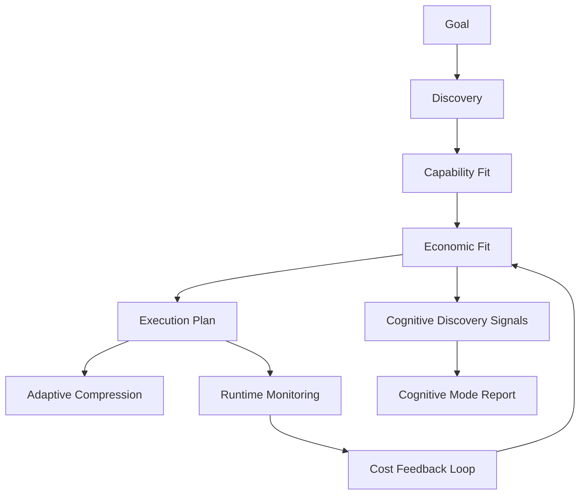

# Tool Runtime Signal & Economics Integration

## Status

draft

## Summary

把 `tools/` 從 document / routing index layer 升級為 runtime-readable signal source，並補上 execution economics layer，讓 runtime 能機械使用 tool cost、risk、activation、compression、recursion、latency、retry 與 context expansion signals。

核心原則：

- `tools/` 提供 tool catalog / usage-pattern docs，不直接決定 runtime。
- `runtime/economics/` 或等效 executable contract 層負責「值不值得這樣思考 / 這樣執行」。
- Cognitive Mode 不直接依賴 tool catalog，只消費 economics / tool-derived signals。
- Cognitive Mode core 仍由 `runtime/cognitive-modes*.yaml` 管理。

## Decision Rationale

### Problem & Why Now

目前 `tools/README.md`、`tools/metadata/README.md`、`tools/routing/README.md` 已描述 tool cost、activation、compression、explosion detection，但它們主要是人讀文件。

`knowledge/runtime/routing-registry.yaml` 透過 `route.tools.metadata-routing` 以 `index-only` 方式索引 `tools/README.md`，代表 runtime 目前只知道入口，不具備 executable contract 可用來做 tool routing、compression、tool explosion 或 economic fit 判斷。

原本的 plan 只把 `tools/` 升級成 tool-routing signal，仍缺一層更核心的 decision layer：

```text
Economic Decision Layer
```

也就是在 goal → discovery → execution 之間，正式判斷：

- 值不值得展開更多 context？
- 值不值得用高成本 tool？
- 何時該壓縮、停止、降級、升級、recover？
- 目前 reasoning depth / tool recursion / retry 是否超出合理成本？

這些問題本質上不是 workflow 問題，而是 runtime economics 問題。

### Decision

把原 plan 從 `Tool Runtime Integration` 升級成：

```text
Tool Runtime Signal & Economics Integration
```

分三層處理：

1. `tools/`：human-readable tool catalog、metadata docs、usage patterns。
2. `runtime/economics/` 或等效 runtime executable contracts：token / tool / reasoning / recursion / compression / escalation cost policy。
3. Cognitive Mode discovery：只消費 derived signals，不直接擁有 tool catalog 或 economics model。

第一版不做完整 telemetry database，但要設計 feedback loop 的 contract boundary，讓未來可從 static heuristics 升級到 evidence-adaptive runtime。

### Alternatives Considered

- A. 維持原 plan，只做 `runtime/tool-routing.yaml`：reject。可以解決 routing，但無法建模 execution economics。
- B. 把 economics 直接塞進 Cognitive Mode core：reject。會讓 Cognitive Mode 變成 tool preset / cost table，而不是 cognitive strategy。
- C. 建立獨立 `economics/` top-level layer：defer。概念清楚，但會新增一個 repo owner layer；先評估 runtime ownership 是否足夠。
- D. 建立 `runtime/economics/` 或等效 runtime executable contracts：accept as draft direction。它最接近 runtime decision layer，但 Phase 0 必須檢查目前 `runtime/README.md` 對 runtime YAML source 的限制。

### Why Not an ADR Yet

此決策會影響 runtime layer boundary、Cognitive Mode signal source、tool routing、compression、token budget 與 future telemetry。Schema、owner path、projection strategy 尚未驗證，先保持 plan，不升級 ADR。

### ADR Promotion Criteria

- [ ] economics contract 真實投影到 `runtime.db generated_surfaces`
- [ ] tool-derived / economics-derived signals 被 Cognitive Mode discovery 使用
- [ ] runtime validate / scenario tests 能驗證 contract
- [ ] hook 或 CLI validator 真實使用該 contract
- [ ] feedback loop 有最小 evidence path，而非只停在 static docs
- [ ] Open Questions 全部解決

### Consequences

#### 正面

- 把「思考成本」正式當成 architecture，而不是口頭約束
- tool routing、compression、token budget、recursion guard 可共用同一 economics layer
- Cognitive Mode 報告可反映 tool usage / context expansion / retry pressure，但核心 contract 維持乾淨
- 為 adaptive runtime cognition system 打基礎

#### 負面

- 新增 economics abstraction，維護成本提高
- runtime layer boundary 需要更嚴格定義
- 若太早接 telemetry，scope 會迅速變大

#### 風險

- `runtime/economics/` 若沒有 source-of-truth 規則，可能違反 `runtime/README.md` 的 runtime YAML boundary
- economics schema 若過細，會變成 premature execution VM
- 若只做 static YAML，仍然只是 contract system，不會形成 feedback loop

## Runtime Execution Path

### Runtime owner

Draft owner candidates:

- Preferred: `runtime/economics/*.yaml` for executable economics contracts, if Phase 0 confirms runtime owner-layer rule allows subdirectory contracts.
- Fallback: `runtime/tool-routing.yaml` + `runtime/economics-feedback.yaml` at runtime root, following existing B-class executable YAML pattern.
- Alternative: top-level `economics/` owner layer with `runtime_projection.enabled: true`, if `runtime/` ownership should stay narrow.

### Trigger flow

1. Agent receives goal or task intent.
2. Runtime discovery identifies capability fit.
3. Runtime economics evaluates economic fit:
   - token burn estimate
   - tool cost / side-effect risk
   - reasoning depth
   - recursion risk
   - retry pressure
   - compression pressure
   - latency / output amplification
4. Runtime creates execution hints:
   - shallow discovery
   - source-backed expansion
   - compression required
   - validation checkpoint required
   - recovery / escalation
5. Cognitive Mode discovery consumes economics-derived signals.
6. Final Cognitive Mode report cites signal source without embedding tool catalog details.

### Proposed flow



### Generated surfaces

Candidate keys:

```text
runtime.tool_routing.contract
runtime.economics.token_costs
runtime.economics.tool_cost_model
runtime.economics.cognitive_budget_policy
runtime.economics.execution_feedback
```

### Validation scenarios

- `tool-routing-contract-projected-v1`
- `economics-contract-projected-v1`
- `tool-derived-cognitive-signal-valid-v1`
- `economics-derived-cognitive-signal-valid-v1`
- `execution-feedback-loop-static-contract-v1`

## Target Architecture

### Runtime economics layer

Candidate structure:

```text
runtime/
  economics/
    token-costs.yaml
    reasoning-depth.yaml
    compression-thresholds.yaml
    recursion-budget.yaml
    tool-cost-model.yaml
    escalation-costs.yaml
    cognitive-budget-policy.yaml
    execution-feedback.yaml
```

Phase 0 must validate whether this structure is allowed. If not, use runtime-root executable YAML files or create top-level `economics/` as owner layer.

### Tools layer

Candidate structure:

```text
tools/
  catalog/
  docs/
  metadata/
  usage-patterns/
```

`tools/` should describe what tools are and how they behave. Runtime economics decides whether their use is worthwhile.

### Tool behavioral patterns

Static metadata is not enough. Add behavioral patterns as runtime heuristics:

```yaml
tool_patterns:
  recursive_search:
    recursion_risk: high
    compression_pressure: high
    recommended_context:
      - source-backed
      - shallow-discovery

  code_mutation:
    side_effect_risk: critical
    require:
      - validation
      - rollback
      - evidence_checkpoint
```

These patterns are not tool presets. They are runtime cognition heuristics.

## Phase 0: Pre-Build Interrogation

- [ ] Confirm scope: static economics contracts + signal wiring first; no full telemetry DB in v1.
- [ ] Confirm source-of-truth: `runtime/economics/`, runtime-root YAML, or top-level `economics/`.
- [ ] Confirm compatibility with `runtime/README.md` B-class executable YAML rules.
- [ ] Confirm whether `runtime/**/*.yaml` under subdirectories is allowed by compiler / validators.
- [ ] Confirm linked updates: `tools/README.md`, `tools/metadata/README.md`, `tools/routing/README.md`, `runtime/README.md`, routing registry / generated reports if needed.
- [ ] Confirm validation targets: runtime refresh/validate, generated surface query, scenario tests.
- [ ] Confirm non-goal: do not rewrite Cognitive Mode core or implement full telemetry DB in v1.

## Phase 1: Define Runtime Economics Boundary

- [ ] Decide owner path: `runtime/economics/`, runtime-root YAML, or top-level `economics/`
- [ ] Define economics contract inventory
- [ ] Define generated surface keys
- [ ] Define relationship to `runtime/cognitive-modes-token-budget.yaml`
- [ ] Define relationship to `tools/metadata/README.md`

完成條件：

- [ ] Plan records owner path decision and source-of-truth boundary

## Phase 2: Create Tool Routing / Tool Cost Contract

- [ ] Add executable tool routing / tool cost contract
- [ ] Define tool id / category / avg token cost / side-effect risk / recursive risk
- [ ] Define activation strategy: `preload`, `lazy`, `on_demand`
- [ ] Define default compression level
- [ ] Define explosion signals
- [ ] Add `runtime_projection.enabled: true`

完成條件：

- [ ] Tool routing / cost contract appears in generated surfaces after runtime refresh

## Phase 3: Create Economics Policy Contracts

- [ ] Add token cost policy
- [ ] Add reasoning depth policy
- [ ] Add compression threshold policy
- [ ] Add recursion budget policy
- [ ] Add escalation cost policy
- [ ] Add cognitive budget policy

完成條件：

- [ ] Economics contracts define when to expand, compress, stop, recover, or escalate

## Phase 4: Add Tool Behavioral Patterns

- [ ] Add recursive search pattern
- [ ] Add code mutation pattern
- [ ] Add high-output amplification pattern
- [ ] Add retry explosion pattern
- [ ] Add context expansion pattern

完成條件：

- [ ] Tool behavior is modeled as runtime heuristics, not tool presets

## Phase 5: Wire Economics-Derived Cognitive Signals

- [ ] Update `runtime/cognitive-modes-discovery.yaml`
- [ ] Add `tool_usage_recursive_search`
- [ ] Add `tool_usage_high_risk_mutation`
- [ ] Add `tool_output_large`
- [ ] Add `tool_loop_detected`
- [ ] Add `economic_pressure_high`
- [ ] Add `context_expansion_rate_high`
- [ ] Add `retry_cost_exceeded`

完成條件：

- [ ] Cognitive discovery consumes economics-derived signals only as input
- [ ] Cognitive Mode core remains strategy-oriented, not tool-catalog-oriented

## Phase 6: Add Minimal Runtime Cost Feedback Loop

- [ ] Define `execution-feedback` static contract
- [ ] Model average token burn
- [ ] Model recursive depth
- [ ] Model retry explosion
- [ ] Model context expansion rate
- [ ] Model tool output amplification
- [ ] Model compression effectiveness

完成條件：

- [ ] Feedback loop is defined as contract boundary even if first implementation remains static

## Phase 7: Document Tools Layer Boundary

- [ ] Update `tools/README.md`
- [ ] Update `tools/metadata/README.md`
- [ ] Update `tools/routing/README.md`
- [ ] Clarify `tools/` is human-readable catalog / usage-pattern layer
- [ ] Clarify runtime executable source lives in economics / tool-routing contracts

完成條件：

- [ ] Docs no longer imply `tools/README.md` itself is runtime executable source

## Phase 8: Validation and Closure

- [ ] Add or update validation scenarios
- [ ] Run `ai-skill runtime refresh --repo . --json`
- [ ] Run `ai-skill runtime validate --repo . --json`
- [ ] Run `go test ./...` if CLI validators change
- [ ] Query generated surfaces for economics / tool-routing keys
- [ ] Execute Plan Completion Closure if all phases complete

## Open Questions

- Should economics live under `runtime/economics/`, runtime-root YAML files, or a new top-level `economics/` owner layer?
- Should v1 include only static cost heuristics, or also hook-observed telemetry counters?
- Should compression defaults stay in tool routing v1, or be split into a dedicated economics / compression contract from the start?
- Should `execution-feedback` be static contract first, or should it define a future mutable `runtime-state.db` table?
- What is the minimum useful evidence for “economic fit” without overbuilding an execution VM?

## Stakeholder 同意項目

- [ ] `tools/` remains documentation / human navigation / usage-pattern layer
- [ ] Runtime economics becomes the decision layer for cost / risk / compression / recursion
- [ ] Cognitive Mode only consumes derived signals
- [ ] No full telemetry database in v1
- [ ] Owner path is chosen after Phase 0 compatibility check

## 與其他 plans 的關係

- Builds on `plans/archived/2026-05-25-2100-runtime-cognitive-contract-v2.md`
- Related to `plans/archived/2026-05-22-1629-runtime-cognitive-modes-system.md`
- Related to `plans/archived/2026-05-22-0855-executable-yaml-contract-migration.md`
- Related to `plans/archived/2026-05-20-1802-model-aware-execution-routing.md`

## 完成條件

- [ ] Economics owner path chosen and documented
- [ ] Tool routing / cost contract exists and is projected
- [ ] Economics contracts exist and are projected
- [ ] `tools/` docs point to runtime executable source
- [ ] Cognitive discovery has tool-derived and economics-derived signals
- [ ] Validation scenarios pass
- [ ] Runtime refresh/validate pass
- [ ] Plan Completion Closure executed
