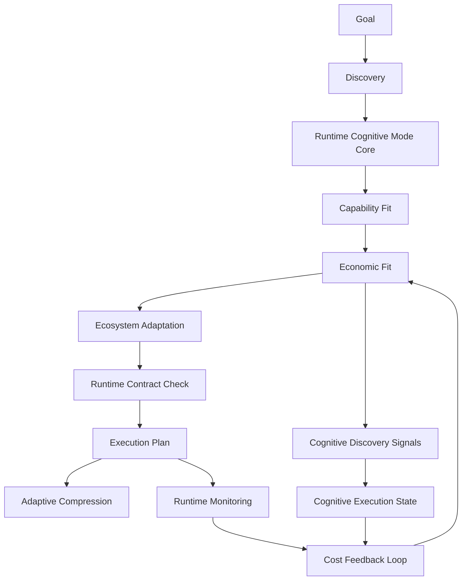

# Tool Runtime Signal & Economics Integration

## Status

draft

## Summary

把 `tools/` 從 document / routing index layer 升級為 runtime-readable signal source，並補上 execution economics layer，讓 runtime 能機械使用 tool cost、risk、activation、compression、recursion、latency、retry 與 context expansion signals。

核心原則：

- `tools/` 提供 tool catalog / usage-pattern docs，不直接決定 runtime。
- `runtime/economics/` 或等效 executable contract 層負責「值不值得這樣思考 / 這樣執行」。
- Cognitive Mode 報告升級為 runtime introspection surface：不只是 status report，而是 Runtime Cognitive State / Cognitive Execution State snapshot。
- Cognitive Mode 不直接依賴 tool catalog，只消費 economics / tool-derived signals，並回報可推導、可驗證、可影響 runtime 的 state。
- Cognitive Mode core 仍由 `runtime/cognitive-modes*.yaml` 管理。
- Runtime Cognitive Mode core 是 deterministic control plane：定義 mode contract、allowed depth、validation requirement、discovery policy、escalation policy；不得整個搬到 ecosystem。
- Ecosystem cognition layer 承載 adaptation / economics / pressure / telemetry：決定「什麼情況值得選 DEEP / SOURCE_BACKED / STRICT / compression / escalation」。
- 需要引入 ecosystem interaction layer 的概念：`models/`、`tools/`、`memory/`、`workflow/` 保留 source-of-truth；新層只處理 cross-layer resource interaction、pressure、economics、adaptation、feedback。

## Decision Rationale

### Problem & Why Now

目前 `tools/README.md`、`tools/metadata/README.md`、`tools/routing/README.md` 已描述 tool cost、activation、compression、explosion detection，但它們主要是人讀文件。

`knowledge/runtime/routing-registry.yaml` 透過 `route.tools.metadata-routing` 以 `index-only` 方式索引 `tools/README.md`，代表 runtime 目前只知道入口，不具備 executable contract 可用來做 tool routing、compression、tool explosion 或 economic fit 判斷。

原本的 plan 只把 `tools/` 升級成 tool-routing signal，仍缺一層更核心的 decision layer：

```text
Economic Decision Layer
```

也就是在 goal → discovery → execution 之間，正式判斷：

- 值不值得展開更多 context？
- 值不值得用高成本 tool？
- 何時該壓縮、停止、降級、升級、recover？
- 目前 reasoning depth / tool recursion / retry 是否超出合理成本？

這些問題本質上不是 workflow 問題，而是 runtime economics 問題。

同時，現有 Cognitive Mode 報告已經具備 runtime introspection 的雛形：

- `execution_mode`
- `context_mode`
- `governance_mode`
- `memory_mode`
- `validation_mode`
- `cognitive_cost`

這組欄位已接近 Runtime Cognitive State Vector，但目前仍偏 status report，尚未完整接上 runtime economics、discovery、execution contracts 與 feedback loop。

更大的缺口是 cross-layer runtime phenomena 尚未正式建模。現在已經出現：

- model capability fit + context window + reasoning depth
- tool side-effect risk + token amplification + recursion risk
- memory recall depth + staleness risk + retrieval overhead
- workflow execution depth + validation burden + governance pressure

這些交互形成 actual cognitive cost，不屬於單一 layer。它們需要一個 ecosystem interaction layer 或 runtime ecology layer 來承載。

同時必須避免把兩種責任混在一起：

- 系統規則：例如 `STRICT` 必須啟動 validation / gate set。這是 runtime control plane。
- 系統判斷：例如這次值不值得 `STRICT`、為什麼不 `DEEP`、為什麼用 compression。這是 ecosystem adaptation / economics。

若不拆開，`runtime/cognitive-modes.yaml` 會同時承載 orchestration、adaptation、economics、observability、reasoning policy，最後變得難測試、難維護、難演進。

### Decision

把原 plan 從 `Tool Runtime Integration` 升級成：

```text
Tool Runtime Signal & Economics Integration
```

分三層處理：

1. Source-of-truth layers：`models/`、`tools/`、`memory/`、`workflow/` 保持各自 canonical responsibilities。
2. Runtime control plane：`runtime/cognitive-modes*.yaml` 保留 deterministic mode contracts、gate activation、validation、recovery、phase integration。
3. Ecosystem interaction layer：建模 resource interaction、economic pressure、cross-layer behavior、adaptation、feedback。
4. Runtime orchestration layer：負責 discovery、activation、validation、recovery、execution。
5. Cognitive Mode discovery：只消費 derived signals，不直接擁有 tool catalog、model catalog、memory semantics 或 economics model。
6. Cognitive Mode report：拆成 runtime state + ecosystem state + adaptation rationale，避免把 economics 塞回 runtime core。

第一版不做完整 telemetry database，但要設計 feedback loop 的 contract boundary，讓未來可從 static heuristics 升級到 evidence-adaptive runtime。

### Alternatives Considered

- A. 維持原 plan，只做 `runtime/tool-routing.yaml`：reject。可以解決 routing，但無法建模 execution economics。
- B. 把 economics 直接塞進 Cognitive Mode core：reject。會讓 Cognitive Mode 變成 tool preset / cost table，而不是 cognitive strategy。
- C. 建立獨立 `economics/` top-level layer：defer。概念清楚，但會新增一個 repo owner layer；先評估 runtime ownership 是否足夠。
- D. 建立 `runtime/economics/` 或等效 runtime executable contracts：accept as draft direction。它最接近 runtime decision layer，但 Phase 0 必須檢查目前 `runtime/README.md` 對 runtime YAML source 的限制。
- E. 只保留現有 Cognitive Mode 報告：reject。會讓 report 成為 ritualized verbosity，無法支撐 runtime economics 或 scenario validation。
- F. 把 Cognitive Mode 報告升級為 Cognitive Execution State：accept。保留現有 6 維 state vector，同時增加 economics / runtime / adaptation surfaces。
- G. 新增 top-level `ecosystem/`：defer but keep as candidate。概念最準，適合承載 interaction ecology，但可能過早新增 owner layer；Phase 0 需先判斷是否比 `runtime/economics/` 更合適。
- H. 把 Cognitive Mode core 整個搬到 ecosystem：reject。runtime phase machine、execution orchestration、validation gates、recovery flow 仍依賴 deterministic mode contract。
- I. 拆成 runtime Cognitive Mode Core + ecosystem Cognitive Adaptation/Economics：accept。runtime 管「可以做什麼」，ecosystem 管「什麼情況值得這樣做」。

### Why Not an ADR Yet

此決策會影響 runtime layer boundary、Cognitive Mode signal source、tool routing、compression、token budget 與 future telemetry。Schema、owner path、projection strategy 尚未驗證，先保持 plan，不升級 ADR。

### ADR Promotion Criteria

- [ ] economics contract 真實投影到 `runtime.db generated_surfaces`
- [ ] tool-derived / economics-derived signals 被 Cognitive Mode discovery 使用
- [ ] runtime validate / scenario tests 能驗證 contract
- [ ] hook 或 CLI validator 真實使用該 contract
- [ ] feedback loop 有最小 evidence path，而非只停在 static docs
- [ ] Cognitive Mode 報告可映射到 economics tuple / split costs / adaptation rationale
- [ ] Cognitive state output 可被 scenario 測試，不只是漂亮 log
- [ ] Open Questions 全部解決

### Consequences

#### 正面

- 把「思考成本」正式當成 architecture，而不是口頭約束
- tool routing、compression、token budget、recursion guard 可共用同一 economics layer
- Cognitive Mode 報告可反映 tool usage / context expansion / retry pressure，但核心 contract 維持乾淨
- Cognitive Mode 報告從 status report 升級成 runtime introspection / self-governance evidence
- `runtime/cognitive-modes.yaml` 不會因 adaptation / telemetry / economics 持續膨脹
- models / tools / memory / workflow 的交互成本有地方承載，不再散落在各 layer 說明文件
- 為 adaptive runtime cognition system 打基礎

#### 負面

- 新增 economics abstraction，維護成本提高
- runtime layer boundary 需要更嚴格定義
- 若太早接 telemetry，scope 會迅速變大

#### 風險

- `runtime/economics/` 若沒有 source-of-truth 規則，可能違反 `runtime/README.md` 的 runtime YAML boundary
- `ecosystem/` 若太早建立，可能變成第二個 runtime 或 dumping ground
- 若 runtime control plane 與 ecosystem adaptation 邊界不清，Cognitive Mode core 仍會肥大化
- economics schema 若過細，會變成 premature execution VM
- 若只做 static YAML，仍然只是 contract system，不會形成 feedback loop
- 若 Cognitive report 不可推導、不可驗證、不可影響 runtime，會變成 fake observability

## Runtime Execution Path

### Runtime owner

Draft owner candidates:

- Runtime control plane remains in `runtime/cognitive-modes*.yaml`.
- Preferred: `runtime/economics/*.yaml` for executable economics contracts, if Phase 0 confirms runtime owner-layer rule allows subdirectory contracts.
- Fallback: `runtime/tool-routing.yaml` + `runtime/economics-feedback.yaml` at runtime root, following existing B-class executable YAML pattern.
- Alternative: top-level `economics/` owner layer with `runtime_projection.enabled: true`, if `runtime/` ownership should stay narrow.
- Alternative: top-level `ecosystem/` owner layer with `runtime_projection.enabled: true`, if interaction ecology should be separate from runtime orchestration.

### Trigger flow

1. Agent receives goal or task intent.
2. Runtime control plane exposes allowed modes / validation / escalation contracts.
3. Runtime discovery identifies capability fit.
4. Ecosystem / economics layer evaluates economic fit:
   - token burn estimate
   - model capability / latency / context-window fit
   - tool cost / side-effect risk
   - memory loading / staleness / retrieval overhead
   - workflow depth / validation burden / governance pressure
   - reasoning depth
   - recursion risk
   - retry pressure
   - compression pressure
   - latency / output amplification
5. Ecosystem adaptation recommends mode / context / compression / escalation.
6. Runtime validates recommendation against deterministic mode contract.
7. Runtime creates execution hints:
   - shallow discovery
   - source-backed expansion
   - compression required
   - validation checkpoint required
   - recovery / escalation
8. Cognitive Mode discovery consumes economics-derived signals.
9. Runtime Cognitive State / Cognitive Execution State report separates runtime state, ecosystem state, and adaptation rationale.
10. Runtime scenarios can compare expected vs actual cognitive state to detect governance drift, reasoning drift, execution mismatch, or economic overrun.

### Proposed flow



### Generated surfaces

Candidate keys:

```text
runtime.tool_routing.contract
runtime.economics.token_costs
runtime.economics.tool_cost_model
runtime.economics.cognitive_budget_policy
runtime.economics.execution_feedback
runtime.cognitive_state.telemetry_contract
ecosystem.resource_interactions.contract
ecosystem.pressure_models.contract
ecosystem.adaptation.contract
ecosystem.cognitive_adaptation.contract
```

### Validation scenarios

- `tool-routing-contract-projected-v1`
- `economics-contract-projected-v1`
- `tool-derived-cognitive-signal-valid-v1`
- `economics-derived-cognitive-signal-valid-v1`
- `execution-feedback-loop-static-contract-v1`
- `cognitive-state-economics-fields-valid-v1`
- `cognitive-state-adaptation-rationale-valid-v1`
- `ecosystem-resource-interaction-contract-v1`
- `ecosystem-pressure-models-contract-v1`
- `cognitive-core-control-plane-boundary-v1`
- `cognitive-adaptation-ecosystem-boundary-v1`

## Target Architecture

### Source-of-truth layers

These layers keep ownership of their own truths:

```text
models/    -> model capability, latency, context window, reasoning depth, compression tolerance
tools/     -> tool metadata, side-effect risk, token amplification, recursion risk, activation cost
memory/    -> memory semantics, recall depth, staleness risk, retrieval overhead
workflow/  -> execution depth, validation burden, governance pressure
```

The ecosystem / economics layer must not duplicate these truths. It models their interactions.

### Cognitive Mode Core（runtime control plane）

`runtime/cognitive-modes.yaml` and related integration contracts remain in runtime. They define deterministic execution control:

```yaml
modes:
  execution_mode:
    values: [FAST, NORMAL, DEEP, FORENSIC, RECOVERY]
  context_mode:
    values: [INDEX_ONLY, SUMMARY_FIRST, CHECKLIST_FIRST, SOURCE_BACKED, GRAPH_ASSISTED]
  governance_mode:
    values: [LIGHT, STANDARD, STRICT, LOCKDOWN]
  memory_mode:
    values: [NONE, EPISODIC, DECISION_REPLAY, FAILURE_REPLAY, PROJECT_CONTEXT]

contracts:
  allowed_depth: runtime-owned
  validation_requirement: runtime-owned
  discovery_policy: runtime-owned
  escalation_policy: runtime-owned
  gate_activation: runtime-owned
```

Runtime answers:

```text
What is allowed?
What gates activate?
What validation is required?
What recovery/escalation contract applies?
```

### Cognitive Economics / Adaptation（ecosystem candidate）

Ecosystem answers:

```text
When is DEEP worth it?
When is SOURCE_BACKED worth it?
When should compression be aggressive?
When should discovery stay shallow?
When should governance escalate?
```

Candidate structure:

```text
ecosystem/
  cognition/
    economics.yaml
    adaptation.yaml
    pressure-models.yaml
    telemetry.yaml
```

This layer may recommend a mode, but runtime validates that recommendation against `runtime/cognitive-modes*.yaml`.

### Ecosystem interaction layer

Candidate structure if Phase 0 accepts a new owner layer:

```text
ecosystem/
  economics/
  cognitive-state/
  pressure-models/
  adaptation/
  telemetry/
  ecology-rules/
  feedback/
```

This layer handles cross-layer behavior:

- resource interaction
- adaptive economics
- runtime pressure
- feedback
- cross-layer amplification

It is not the source of truth for models, tools, memory, or workflow.

### Runtime economics layer

Candidate structure:

```text
runtime/
  economics/
    token-costs.yaml
    reasoning-depth.yaml
    compression-thresholds.yaml
    recursion-budget.yaml
    tool-cost-model.yaml
    escalation-costs.yaml
    cognitive-budget-policy.yaml
    execution-feedback.yaml
```

Phase 0 must validate whether this structure is allowed. If not, use runtime-root executable YAML files or create top-level `economics/` as owner layer.

If `ecosystem/` is accepted as the owner layer, `runtime/economics/` should stay orchestration-facing or be skipped to avoid duplicate ownership.

### Tools layer

Candidate structure:

```text
tools/
  catalog/
  docs/
  metadata/
  usage-patterns/
```

`tools/` should describe what tools are and how they behave. Runtime economics decides whether their use is worthwhile.

### Tool behavioral patterns

Static metadata is not enough. Add behavioral patterns as runtime heuristics:

```yaml
tool_patterns:
  recursive_search:
    recursion_risk: high
    compression_pressure: high
    recommended_context:
      - source-backed
      - shallow-discovery

  code_mutation:
    side_effect_risk: critical
    require:
      - validation
      - rollback
      - evidence_checkpoint
```

These patterns are not tool presets. They are runtime cognition heuristics.

### Ecosystem pressure models

Examples of cross-layer pressure this plan should model:

```yaml
pressure_models:
  context_explosion:
    inputs:
      - small_model
      - source_backed_context
      - deep_workflow
    pressure: high
    adaptation:
      compression: aggressive
      discovery: shallow
      memory: summary_only

  memory_amplification:
    inputs:
      - recursive_tool_discovery
      - decision_replay
    pressure: high
    adaptation:
      memory: summary_only
      tool_search: bounded

  governance_overhead:
    inputs:
      - strict_governance
      - deep_validation
    latency: very_high
    adaptation:
      validation: checkpointed
      reporting: compact_until_final
```

These are interaction rules. The source facts remain in `models/`, `tools/`, `memory/`, and `workflow/`.

### Architecture stack

```text
Source-of-Truth Layers
  -> Runtime Resource Layers
  -> Ecosystem Interaction Layer
  -> Runtime Orchestration Layer
  -> Cognitive Execution State
```

This stack prevents `ecosystem/` from becoming a dumping ground while still giving cross-layer phenomena a home.

### Runtime Cognitive State surface

The existing Cognitive Mode 報告 should become a structured introspection surface:

```yaml
runtime_state:
  execution_mode: NORMAL
  validation_mode: CHECKLIST
  governance_contract: STANDARD

ecosystem_state:
  selected_context_mode: SOURCE_BACKED
  selected_memory_mode: PROJECT_CONTEXT
  context_pressure: MEDIUM
  governance_pressure: HIGH
  token_budget_pressure: LOW
  recursion_risk: LOW

economics:
  thinking_cost: MEDIUM
  context_cost: HIGH
  execution_cost: LOW
  estimated_token_cost: MEDIUM
  estimated_latency: LOW
  recursion_risk: LOW
  compression_pressure: MEDIUM
  evidence_depth: SOURCE_BACKED

runtime:
  triggered_by:
    - file_diff_runtime_schema
  discovery_signals:
    - tool_usage_high_risk_mutation
  activated_routes:
    - route.runtime.cognitive-modes
  deferred_routes:
    - route.tools.metadata-routing
  blocked_routes: []

adaptation:
  selected_context_mode: SOURCE_BACKED
  why_not_deeper:
    - task bounded
    - no architecture mutation
  why_not_shallower:
    - source-backed answer required
  why_not_parallel:
    - single-source plan update
  escalation_reason: null
```

This is not meant to make every chat response verbose. The output can remain compact, but the runtime contract should make the state derivable and testable.

### Split cost model

`cognitive_cost` currently compresses multiple costs into one class. Economics integration should split it internally:

- `thinking_cost`: reasoning depth, recursive analysis, validation chain
- `context_cost`: source-backed reads, graph traversal, memory loading, routing lookup
- `execution_cost`: tool calls, mutation, validation, runtime refresh, tests

The existing `cognitive_cost` can remain as a public summary / compatibility field, derived from split costs.

## Phase 0: Pre-Build Interrogation

- [ ] Confirm scope: static economics contracts + signal wiring first; no full telemetry DB in v1.
- [ ] Confirm source-of-truth: `runtime/economics/`, runtime-root YAML, top-level `economics/`, or top-level `ecosystem/`.
- [ ] Confirm whether models/tools/memory/workflow should remain source-of-truth layers while ecosystem only owns interaction.
- [ ] Confirm Cognitive Mode Core remains in runtime as deterministic control plane.
- [ ] Confirm Cognitive Adaptation / Economics / Telemetry belongs in ecosystem or equivalent interaction layer.
- [ ] Confirm compatibility with `runtime/README.md` B-class executable YAML rules.
- [ ] Confirm whether `runtime/**/*.yaml` under subdirectories is allowed by compiler / validators.
- [ ] Confirm linked updates: `models/README.md`, `tools/README.md`, `memory/README.md`, `workflow/`, `runtime/README.md`, routing registry / generated reports if needed.
- [ ] Confirm validation targets: runtime refresh/validate, generated surface query, scenario tests.
- [ ] Confirm non-goal: do not rewrite Cognitive Mode core or implement full telemetry DB in v1.
- [ ] Confirm Cognitive Mode report naming: keep public name or introduce `Runtime Cognitive State` / `Cognitive Execution State` as internal contract.
- [ ] Confirm anti-verbosity rule: expanded cognitive telemetry must be derivable/testable without forcing every response into a huge report.

## Phase 1: Define Runtime Economics Boundary

- [ ] Decide owner path: `runtime/economics/`, runtime-root YAML, top-level `economics/`, or top-level `ecosystem/`
- [ ] Define economics contract inventory
- [ ] Define generated surface keys
- [ ] Define relationship to `runtime/cognitive-modes-token-budget.yaml`
- [ ] Define relationship to `tools/metadata/README.md`
- [ ] Define relationship to `models/`, `memory/`, and `workflow/`
- [ ] Define relationship to current `runtime/cognitive-modes-cost-class.yaml`
- [ ] Define compatibility path from `cognitive_cost` to split economics costs
- [ ] Define runtime control plane vs ecosystem adaptation boundary

完成條件：

- [ ] Plan records owner path decision and source-of-truth boundary

## Phase 2: Define Cognitive Core vs Ecosystem Adaptation Boundary

- [ ] Define what stays in `runtime/cognitive-modes*.yaml`
- [ ] Define what moves to ecosystem / economics / adaptation contracts
- [ ] Define deterministic runtime fields: mode contracts, validation requirement, discovery policy, escalation policy, gate activation
- [ ] Define adaptive ecosystem fields: economics, pressure, telemetry, why/why-not rationale
- [ ] Define report split: runtime_state, ecosystem_state, adaptation

完成條件：

- [ ] Cognitive Mode core remains runtime control plane
- [ ] Cognitive adaptation / economics / telemetry has a separate owner

## Phase 3: Define Ecosystem Interaction Boundary

- [ ] Define source-of-truth layers: models / tools / memory / workflow
- [ ] Define ecosystem-owned concepts: interaction, economics, pressure, adaptation, feedback
- [ ] Define what ecosystem must not own
- [ ] Decide whether `ecosystem/` is created now or deferred behind runtime/economics contracts
- [ ] Define generated surface naming if `ecosystem/` is accepted

完成條件：

- [ ] Cross-layer phenomena have an owner without duplicating source truths

## Phase 4: Create Tool Routing / Tool Cost Contract

- [ ] Add executable tool routing / tool cost contract
- [ ] Define tool id / category / avg token cost / side-effect risk / recursive risk
- [ ] Define activation strategy: `preload`, `lazy`, `on_demand`
- [ ] Define default compression level
- [ ] Define explosion signals
- [ ] Add `runtime_projection.enabled: true`

完成條件：

- [ ] Tool routing / cost contract appears in generated surfaces after runtime refresh

## Phase 5: Create Economics Policy Contracts

- [ ] Add token cost policy
- [ ] Add reasoning depth policy
- [ ] Add compression threshold policy
- [ ] Add recursion budget policy
- [ ] Add escalation cost policy
- [ ] Add cognitive budget policy
- [ ] Add model capability fit cost
- [ ] Add memory loading / staleness cost
- [ ] Add workflow validation burden cost

完成條件：

- [ ] Economics contracts define when to expand, compress, stop, recover, or escalate

## Phase 6: Add Ecosystem Pressure Models and Tool Behavioral Patterns

- [ ] Add recursive search pattern
- [ ] Add code mutation pattern
- [ ] Add high-output amplification pattern
- [ ] Add retry explosion pattern
- [ ] Add context expansion pattern
- [ ] Add context explosion pressure model
- [ ] Add memory amplification pressure model
- [ ] Add governance overhead pressure model
- [ ] Add validation fatigue pressure model

完成條件：

- [ ] Tool behavior is modeled as runtime heuristics, not tool presets
- [ ] Cross-layer pressure is modeled as interaction, not duplicated source truth

## Phase 7: Wire Economics/Ecosystem-Derived Cognitive Signals

- [ ] Update `runtime/cognitive-modes-discovery.yaml`
- [ ] Add `tool_usage_recursive_search`
- [ ] Add `tool_usage_high_risk_mutation`
- [ ] Add `tool_output_large`
- [ ] Add `tool_loop_detected`
- [ ] Add `economic_pressure_high`
- [ ] Add `context_expansion_rate_high`
- [ ] Add `retry_cost_exceeded`
- [ ] Add `compression_pressure_high`
- [ ] Add `evidence_depth_mismatch`
- [ ] Add `model_capability_mismatch`
- [ ] Add `memory_amplification_high`
- [ ] Add `governance_overhead_high`
- [ ] Add `ecosystem_recommends_deep`
- [ ] Add `ecosystem_recommends_shallow_discovery`

完成條件：

- [ ] Cognitive discovery consumes economics-derived signals only as input
- [ ] Cognitive Mode core remains strategy-oriented, not tool-catalog-oriented

## Phase 8: Define Runtime Cognitive State / Cognitive Execution State

- [ ] Define runtime_state fields from runtime control plane
- [ ] Define ecosystem_state fields from economics / pressure / adaptation layer
- [ ] Define economics fields: estimated token cost, estimated latency, recursion risk, compression pressure, evidence depth
- [ ] Define split costs: thinking cost, context cost, execution cost
- [ ] Define resource ecology fields: model pressure, tool pressure, memory pressure, workflow pressure
- [ ] Define runtime route fields: triggered_by, discovery_signals, activated_routes, deferred_routes, blocked_routes
- [ ] Define adaptation rationale: why_not_deeper, why_not_shallower, why_not_parallel, escalation_reason
- [ ] Keep public report compact unless high-risk / non-default / scenario requires full state

完成條件：

- [ ] Cognitive report becomes derivable from runtime contracts
- [ ] Scenario can validate expected vs actual cognitive state
- [ ] Report remains useful, not ritualized verbosity

## Phase 9: Add Minimal Runtime Cost Feedback Loop

- [ ] Define `execution-feedback` static contract
- [ ] Model average token burn
- [ ] Model recursive depth
- [ ] Model retry explosion
- [ ] Model context expansion rate
- [ ] Model tool output amplification
- [ ] Model compression effectiveness
- [ ] Model model/tool/memory/workflow pressure deltas

完成條件：

- [ ] Feedback loop is defined as contract boundary even if first implementation remains static

## Phase 10: Document Source Layer and Ecosystem Boundaries

- [ ] Update `runtime/README.md` or related contract docs with Cognitive Core vs Ecosystem Adaptation boundary if accepted
- [ ] Update `models/README.md` if ecosystem references model capability fit
- [ ] Update `tools/README.md`
- [ ] Update `tools/metadata/README.md`
- [ ] Update `tools/routing/README.md`
- [ ] Update `memory/README.md` if ecosystem references memory loading / staleness cost
- [ ] Clarify `tools/` is human-readable catalog / usage-pattern layer
- [ ] Clarify source layers own truths; ecosystem / economics owns interaction

完成條件：

- [ ] Docs no longer imply `tools/README.md` itself is runtime executable source
- [ ] Docs do not imply ecosystem owns model/tool/memory/workflow truths

## Phase 11: Validation and Closure

- [ ] Add or update validation scenarios
- [ ] Run `ai-skill runtime refresh --repo . --json`
- [ ] Run `ai-skill runtime validate --repo . --json`
- [ ] Run `go test ./...` if CLI validators change
- [ ] Query generated surfaces for economics / ecosystem / tool-routing keys
- [ ] Execute Plan Completion Closure if all phases complete

## Open Questions

- Should economics live under `runtime/economics/`, runtime-root YAML files, a new top-level `economics/`, or a broader top-level `ecosystem/` owner layer?
- Should v1 include only static cost heuristics, or also hook-observed telemetry counters?
- Should compression defaults stay in tool routing v1, or be split into a dedicated economics / compression contract from the start?
- Should `execution-feedback` be static contract first, or should it define a future mutable `runtime-state.db` table?
- What is the minimum useful evidence for “economic fit” without overbuilding an execution VM?
- Should `Cognitive Mode 報告` remain the user-facing term while `Runtime Cognitive State` becomes the internal contract name?
- How much adaptation rationale should appear in normal final responses vs only high-risk / non-default reports?
- Should `cognitive_cost` remain a single derived summary after split costs are introduced?
- Should `ecosystem/` be created in this plan, or kept as a conceptual target until runtime/economics validates the need?
- Should Cognitive Adaptation live under `ecosystem/cognition/` while Cognitive Core remains under `runtime/`?
- Should `context_mode` remain part of runtime core, or should selected context strategy be reported as ecosystem adaptation while runtime only defines allowed context modes?

## Stakeholder 同意項目

- [ ] `tools/` remains documentation / human navigation / usage-pattern layer
- [ ] `models/`, `tools/`, `memory/`, and `workflow/` remain source-of-truth layers for their own domains
- [ ] Runtime economics becomes the decision layer for cost / risk / compression / recursion
- [ ] Ecosystem interaction layer, if created, owns only cross-layer pressure / adaptation / feedback
- [ ] Runtime Cognitive Mode Core remains deterministic control plane
- [ ] Cognitive Adaptation / Economics / Telemetry moves to ecosystem or equivalent interaction layer
- [ ] Cognitive Mode only consumes derived signals
- [ ] Cognitive Mode report evolves into Runtime Cognitive State / Cognitive Execution State without becoming verbose ritual
- [ ] No full telemetry database in v1
- [ ] Owner path is chosen after Phase 0 compatibility check

## 與其他 plans 的關係

- Builds on `plans/archived/2026-05-25-2100-runtime-cognitive-contract-v2.md`
- Related to `plans/archived/2026-05-22-1629-runtime-cognitive-modes-system.md`
- Related to `plans/archived/2026-05-22-0855-executable-yaml-contract-migration.md`
- Related to `plans/archived/2026-05-20-1802-model-aware-execution-routing.md`

## 完成條件

- [ ] Economics owner path chosen and documented
- [ ] Ecosystem interaction boundary chosen and documented
- [ ] Cognitive Core vs Cognitive Adaptation boundary chosen and documented
- [ ] Tool routing / cost contract exists and is projected
- [ ] Economics contracts exist and are projected
- [ ] Runtime Cognitive State / Cognitive Execution State contract is defined
- [ ] Split costs feed the existing `cognitive_cost` summary
- [ ] `models/`, `tools/`, `memory/`, and `workflow/` docs state their relationship to economics / ecosystem contracts
- [ ] Cognitive discovery has tool-derived, model-derived, memory-derived, workflow-derived, and economics-derived signals
- [ ] Validation scenarios pass
- [ ] Runtime refresh/validate pass
- [ ] Plan Completion Closure executed
