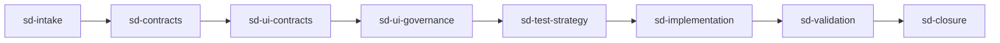

# UI Governance Workflow Integration

**Status**: `draft`
Owner: framework maintainer (linyihong)
**世代**：Gen 3 software-delivery workflow hardening
**建立日期**：2026-06-08
**最後更新**：2026-06-08（v1 draft）
**Priority**：**P2**

本 plan 將 UI/UX 風格治理納入 `workflow/software-delivery/`，新增 `sd-ui-governance` cognitive slice，讓現有 `sd-ui-contracts` 產出的 UI contract、screen state、ViewModel、Accessibility expectation 能進一步被 deterministic validator、visual regression evidence、以及 scoped AI visual review 消費。

---

## Decision Rationale

### Problem & Why Now

現有 `sd-ui-contracts` 已能定義 Screen Mapping、Consumer Contract、UI Behavior Contract、Screen Contract、Frontend ViewModel Contract、Accessibility Contract 與 Screen Traceability。這已經回答「畫面與 consumer 行為應該長什麼樣」。

缺口是：workflow 還沒有一個獨立 surface 回答「哪些 UI contract / design-system / behavior pattern / visual evidence 可以被 validator 檢查、何時 warn、何時 block」。因此 UI contract 能被寫出來，但缺少與 runtime enforcement 同模型的治理層：

```text
UI contract exists
  -> but validator class / severity / evidence target not declared
  -> agent can still ship missing state, hard-coded style, missing loading/error feedback,
     destructive action without confirmation, or subjective visual claim without baseline
```

這與現有 Ai-skill 模型一致：Architecture Governance、Process Governance、Documentation Governance、Runtime Governance 已有 rule / contract / validator / fail-warn 分層；UI Governance 是同一治理模型延伸到 user-visible behavior 與 experience。

### Industry Landscape

業界已經有多個成熟或半成熟做法能作為本 plan 的參考，但大多停在局部治理：

| 類別 | 代表做法 / 工具 | 目前成熟度 | 與本 plan 的關係 |
|---|---|---|---|
| Design System Governance | Material Design、Carbon、Polaris、Fluent、ESLint、Stylelint | 成熟 | 驗證 component / token / style usage，但通常不涵蓋 requirements → closure 全流程 |
| Design Token Governance | color / spacing / radius token、CI token validator | 成熟 | 對應本 plan 的 Design Token Validator，是最適合先 mechanical 化的 validator class |
| Storybook-driven Development | Storybook、Chromatic component states | 成熟 | 對應 Screen / Component state completeness，可支援 UI Contract Validator |
| Accessibility Governance | axe、Lighthouse、Pa11y | 成熟 | 對應 Accessibility Validator，已有明確 objective checks，可作 blocking candidate |
| Visual Regression Testing | Percy、Applitools、Chromatic | 中高 | 對應 Visual Regression Validator；有 baseline 時可 blocking，無 deterministic baseline 時不應過度宣稱 |
| UX Heuristic Review | Nielsen Heuristics、Cognitive Walkthrough、UX Audit | 多為人工 | 可提供 review lens，但不宜直接 mechanical blocking |
| AI Native UI Review | Playwright screenshot + vision model review | 新興 | 對應 AI Visual Validator；高價值但需 scoped criteria，預設 warning / research |

因此本 plan 不把自己定位為新的 frontend framework，而是把既有 UI validator 類型納入 software-delivery governance：從 requirement、contract、implementation、behavior、validation 到 closure 都能留下 validator-facing evidence。

### Decision

新增 `sd-ui-governance`，放在 `sd-ui-contracts` 之後、`sd-test-strategy` 之前：



`sd-ui-contracts` 保持 contract-first responsibility：

- 定義 Screen Mapping、Consumer needs、Screen states、ViewModel derivation、Accessibility expectation。
- 不承擔 design token enforcement、visual regression、AI screenshot review 或 validator severity policy。

`sd-ui-governance` 承擔 enforcement-oriented responsibility：

- UI Contract Validator：必備 screen states、labels、actions、loading/error/success、traceability。
- Design Token Validator：typography、color、spacing、raw CSS/style ban、component primitive usage。
- Accessibility Validator：keyboard、focus、semantics、labels、contrast/motion、assistive feedback。
- UI Behavior Pattern Validator：submit loading、destructive confirmation、retry/end-of-list/offline/permission denied。
- Visual Regression Validator：screenshot diff / golden baseline / deterministic render baseline。
- AI Visual Validator：hierarchy、alignment、spacing consistency、visual dominance 等主觀或半主觀訊號，預設 warning / research，不直接 blocking。

Validator maturity ladder:

| 層級 | Validator | Default severity | Promotion condition |
|---|---|---|---|
| L1 | Requirement / Screen Contract Validator | warn → block | Contract schema and required states are explicit |
| L2 | ViewModel / Consumer Contract Validator | warn → block | Source fixture → expected view model fixture exists |
| L3 | Design Token Validator | block candidate | Project design token policy is configured and deterministic |
| L4 | Accessibility Validator | block candidate | axe / Lighthouse / Pa11y or equivalent objective checks exist |
| L5 | UI Behavior Pattern Validator | warn → block | Pattern trigger and required state are objective |
| L6 | Visual Regression Validator | warn → block | Golden baseline and deterministic screenshot capture exist |
| L7 | AI Visual Validator | warn / research | Objective rubric, scoped criteria, and human review policy exist |
| L8 | Closure Validator | block candidate | UI governance evidence is linked in DoD / review report |

### Alternatives Considered

- **A. 直接擴張 `ui-contracts.md`** — reject because `ui-contracts.md` 已是 contract definition surface；把 validator severity、design token policy、screenshot/AI visual review 放進同檔會混合 contract 與 enforcement，增加 token cost 並模糊 owner responsibility。
- **B. 新增 cross-cutting enforcement rule** — reject for first phase because UI governance 目前仍需跟 software-delivery execution order、artifact gates、templates、review checklist 對齊；先落在 workflow layer 較符合 cognitive slice taxonomy。未來 deterministic validator mature 後可 promotion 到 enforcement registry。
- **C. 把 AI screenshot validator 做成 hard gate** — reject because visual taste 沒有穩定 objective oracle。AI visual review 可提供高價值 warning，但除非 project 宣告 objective rules、baseline 與 deterministic capture，否則不應 block。
- **D. 只採用既有前端工具鏈（Storybook / axe / Percy / token lint）** — reject as incomplete because those tools各自驗 style、accessibility、screenshot 或 component state，但不提供 requirements → contracts → implementation → validation → closure 的統一 governance path。
- **E. 新增 `sd-ui-governance`（accept）** — 保持 `sd-ui-contracts` contract-focused，同時建立 validator-facing governance surface，允許 deterministic 與 AI-assisted validation 分級演進。

### Why Not an ADR Yet

- `sd-ui-governance` 先是 software-delivery workflow extension，不是全系統不可逆架構決定。
- Validator severity defaults、project-local design-token schema、AI screenshot review 的 objective criteria 尚需實作與實際使用驗證。
- 是否 promotion 成 mechanical enforcement registry rule_class，需待 Phase 5 validation scenarios 與至少一輪 implementation evidence 後決定。

### ADR Promotion Criteria（completed 時驗證）

- [ ] `sd-ui-governance` 在 software-delivery workflow 中被真實任務使用，且能改善 UI contract drift。
- [ ] 至少 deterministic validator classes 的 severity 與 evidence target 穩定。
- [ ] AI visual validator 的 warning / research boundary 沒有造成 false blocking 或 aesthetic overreach。
- [ ] Runtime/routing/generated surfaces 沒有 orphan consumer。
- [ ] Open Questions 全解，且沒有更輕 promotion target 適用。

### Consequences

**正面**：

- 讓 UI/UX 風格治理接上 Ai-skill 既有 `governance -> runtime -> validator -> fail/warn` 模型。
- 保護 user-visible behavior，不只保護 code style 或 API shape。
- 將 deterministic UI checks 與 subjective visual taste 明確分層，避免 AI visual review 過早 blocking。

**負面**：

- software-delivery workflow 多一個 slice，routing/loading surface 需要同步更新。
- 若過早做 generic design-token schema，可能把 project-local design system 差異硬塞進全域規則。
- Screenshot / visual validation 有工具、環境、flake、baseline 維護成本。

**風險**：

- Validator class 太多導致 `sd-ui-governance` 變成 checklist dump。
- Design token validator 若無 project-local configuration，容易誤判不同 framework / design system。
- AI Visual Validator 若沒有 scoped criteria，容易把審美偏好偽裝成 governance failure。

**Glossary Impact**: yes
- Candidate terms: `sd-ui-governance`, `UI Governance`, `UI Contract Validator`, `Design Token Validator`, `UI Behavior Pattern Validator`, `AI Visual Validator`.
- Phase 0 決定是否需要寫入 [`knowledge/glossary/ai-skill.md`](../../knowledge/glossary/ai-skill.md)；若只作 workflow-local terms，可先不 promotion。

**Watch-Out List citation**: [`architecture/ai-native-cognitive-ecosystem-system.md`](../../architecture/ai-native-cognitive-ecosystem-system.md) §Watch-Out List — 對應 risks：validator overreach、subjective AI judgment becoming blocking gate、runtime surface without consumer、per-turn cost expansion。

---

## Runtime Execution Path

### Intended Flow

```text
UI / consumer surface change requested
  -> route.workflow.software-delivery
  -> execution-flow.md thin index
  -> sd-ui-contracts when screen/consumer contract is needed
  -> sd-ui-governance when contract needs enforcement evidence
  -> sd-test-strategy chooses proof target
  -> sd-implementation
  -> sd-validation verifies deterministic / visual / AI-assisted evidence
```

### Trigger Flow

- **Event**: UI/consumer surface change, AI-generated UI, design system rule, accessibility expectation, destructive/loading/retry pattern, screenshot/visual validation claim.
- **Detector / route / query**: `route.workflow.software-delivery` via user signals (`UI`, `design`, `screen`, `frontend`, `accessibility`, `visual`, `style`) and file/change context when available.
- **Loaded contract/source**: `workflow/software-delivery/execution-flow.md` → `workflow/software-delivery/ui-contracts.md` → new `workflow/software-delivery/ui-governance.md`.
- **Runtime action / blocker**: first landing should be workflow loading + validation scenarios; mechanical blocking validator only after deterministic rules have named executor / consumer.
- **Evidence**: validation scenarios, generated surface readback, route dependency sync, review checklist evidence.

### Per-surface Consumer 表

| Generated surface key / source | Named consumer(s) | Consumer type |
|---|---|---|
| `workflow/software-delivery/ui-governance.md` | `route.workflow.software-delivery`, `workflow/software-delivery/execution-flow.md` thin index | routable workflow source |
| `workflow.software_delivery.execution_flow.contract` | `ai-skill runtime refresh/validate`, workflow primary-source gate, generated surface lookup | executable YAML contract |
| `workflow.software_delivery.artifact_gates.contract` | artifact gate validation, software-delivery review surfaces | executable YAML contract |
| Optional future `rule_class: ui_governance` | enforcement coverage report, future commit-msg/runtime validator | enforcement registry rule_class |

### Deferred Runtime Projection

No new standalone `runtime/*.yaml` is planned in the first landing. The initial runtime-facing changes should go through existing workflow executable YAML contracts and routing registry dependencies.

If later phases add a dedicated `runtime/ui-governance*.yaml`, that phase must declare `runtime_projection.enabled: true` or explicitly document deferred projection reason, target phase, named consumer, and graduation condition.

---

## Architecture Compatibility Preflight

### Phase 0.0 — Open Questions 核對（公版，必填）

逐條核對本 plan §Open Questions，標記處置並回寫：

- [ ] 已讀本 plan §Open Questions 全部條目
- [ ] 對每條標記 `resolved`（附 Phase 0 證據）/ `still-open` / `deferred`（附原因）
- [ ] `resolved` 的條目已同步勾選 / 附註於 §Open Questions
- [ ] 若盤點新發現問題，已加入 §Open Questions

| Open Question | 處置 | 證據 / 原因 |
|---|---|---|
| First landing scope | pending | Phase 0 decide doc-only + scenarios vs first mechanical rule_class |
| Design token policy location | pending | Phase 0 inspect template / project-local config options |
| AI screenshot severity | pending | Phase 0 decide global warn default + project opt-in conditions |

### Candidate Files

| Path | Role |
|---|---|
| `workflow/software-delivery/ui-governance.md` | New canonical workflow slice |
| `workflow/software-delivery/execution-flow.md` | Thin index; insert `sd-ui-governance` after `sd-ui-contracts` |
| `workflow/software-delivery/README.md` | Entry flow and scope update |
| `workflow/software-delivery/execution-flow.yaml` | Executable contract loading surface / gates / evidence |
| `workflow/software-delivery/artifact-gates.md` | Artifact guidance for UI governance evidence |
| `workflow/software-delivery/artifact-gates.yaml` | Executable artifact contract update |
| `workflow/software-delivery/templates/contract-template.md` | Add or link UI governance evidence section |
| `workflow/software-delivery/review-checklist.md` | Compact UI Governance Review checklist |
| `governance/ai-runtime-governance/software-delivery-governance.md` | Runtime gate and runtime-lite candidate signals |
| `governance/cognitive-slice-taxonomy.md` | Add `sd-ui-governance` to software-delivery slice inventory |
| `knowledge/runtime/routing-registry.yaml` | Route dependencies / user signals if needed |
| `validation/scenarios/software-delivery/*.yaml` | Test-first scenarios |
| `enforcement/enforcement-registry.yaml` | Only if mechanical rule_class enters scope |

### Preflight Checks

| Field | Required check |
|---|---|
| Source-of-truth | Workflow slice source is `workflow/software-delivery/ui-governance.md`; executable projection flows through `execution-flow.yaml`. |
| Layer responsibility | UI governance ordering/gates stay in workflow; generic rule/executor binding only enters enforcement registry after deterministic validator design exists. |
| Compiler / generated surface | `execution-flow.yaml` and `artifact-gates.yaml` changes require runtime refresh / validate and generated surface readback. |
| Linked updates | Update thin index, README, YAML contract, governance doc, taxonomy, routing registry, templates/checklist, validation scenarios as applicable. |
| Runtime trigger wiring | Any new generated surface or route dependency must have named consumer or explicit manual activation annotation. |
| Document sizing | Keep `ui-governance.md` focused; if templates/checklist growth becomes mixed-topic, add focused child template instead of bloating generic template. |

---

## Open Questions

- [ ] Should first landing be doc-only workflow governance plus validation scenarios, or should it include the first mechanical `ui_governance` rule_class immediately?
- [ ] Should `Design Token Validator` live as project-local configurable policy first, or should Ai-skill define a generic token-policy schema now?
- [ ] Should AI screenshot validation default to global `warn`, with project opt-in to `block` only when rules are objective and screenshot capture is deterministic?
- [ ] Should UI governance evidence be added to `contract-template.md`, or should we create a focused `ui-governance-template.md` to avoid template bloat?
- [ ] Which candidate terms deserve glossary promotion versus remaining workflow-local wording?

---

## Phase 1 — Add `sd-ui-governance` Slice

- [ ] Create `workflow/software-delivery/ui-governance.md`.
- [ ] Add cognitive slice metadata: `id`, `purpose`, `type`, `tags`, `load_when`, `do_not_load_when`, `owner_layer`, `layer_justification`, `dependencies`, `dependency_budget`, `validation_signal`.
- [ ] Define validator taxonomy and severity boundary:
  - [ ] UI Contract Validator.
  - [ ] Design Token Validator.
  - [ ] Accessibility Validator.
  - [ ] UI Behavior Pattern Validator.
  - [ ] Visual Regression Validator.
  - [ ] AI Visual Validator.
- [ ] State deterministic vs subjective validator policy explicitly.

### Phase 1 Acceptance

- [ ] `sd-ui-governance` passes workflow membership test.
- [ ] `sd-ui-contracts` remains contract-focused and is not duplicated.
- [ ] AI visual validation is scoped as warning/research unless objective criteria exist.

---

## Phase 2 — Wire Software-delivery Loading Surfaces

- [ ] Update `workflow/software-delivery/execution-flow.md` thin index.
- [ ] Update `workflow/software-delivery/README.md` entry flow and scope.
- [ ] Update `workflow/software-delivery/execution-flow.yaml`:
  - [ ] Add `workflow/software-delivery/ui-governance.md` to `required_sources`.
  - [ ] Add `loading_surfaces.ui_governance`.
  - [ ] Add or extend a workflow step between UI contracts and test strategy.
  - [ ] Add gates such as `gate.software_delivery.ui_governance_complete` and `gate.software_delivery.ui_visual_validation_scoped`.
  - [ ] Add required evidence for severity, token scope, accessibility scope, behavior pattern coverage, visual baseline status.

### Phase 2 Acceptance

- [ ] Route consumers can discover the new slice through the software-delivery primary source.
- [ ] Executable YAML contract names the new loading surface and evidence.
- [ ] Runtime refresh / validate passes after YAML changes.

---

## Phase 3 — Update Artifacts, Templates, and Review Gates

- [ ] Update `workflow/software-delivery/artifact-gates.md` with UI governance evidence.
- [ ] Update `workflow/software-delivery/artifact-gates.yaml` required evidence / gates.
- [ ] Update `workflow/software-delivery/templates/contract-template.md` or create a focused UI governance template.
- [ ] Update `workflow/software-delivery/review-checklist.md` with a compact UI Governance Review section.
- [ ] Check document sizing and split if needed.

### Phase 3 Acceptance

- [ ] UI governance artifacts have clear shape and owner layer.
- [ ] Templates/checklists do not become mixed-topic dumping grounds.
- [ ] Artifact gate contract includes UI governance evidence without duplicating `ui-contracts.md`.

---

## Phase 4 — Governance, Routing, and Registry Integration

- [ ] Update `governance/ai-runtime-governance/software-delivery-governance.md` with UI Governance runtime gate.
- [ ] Add runtime-lite candidate signals:
  - [ ] `missing_ui_contract_state`
  - [ ] `raw_design_token_detected`
  - [ ] `destructive_action_missing_confirmation`
  - [ ] `visual_claim_without_baseline`
  - [ ] `ai_visual_validator_without_scope`
- [ ] Update `governance/cognitive-slice-taxonomy.md` software-delivery slice inventory.
- [ ] Update `knowledge/runtime/routing-registry.yaml` dependencies and triggers if Phase 0 decides it is needed.
- [ ] If mechanical enforcement enters scope, add or update `enforcement/enforcement-registry.yaml` with a `pending_implementation` rule_class and child plan.

### Phase 4 Acceptance

- [ ] Runtime path names event → detector / route / query → loaded source → runtime action / blocker → evidence.
- [ ] No generated surface or rule_class is left without named consumer.
- [ ] Registry updates, if any, obey enforcement registry transition rules.

---

## Phase 5 — Test-first Validation Scenarios

- [ ] Add scenarios under `validation/scenarios/software-delivery/` before implementation of runtime/governance wiring.
- [ ] Scenario: UI change with screen contract but missing loading/error state should load `sd-ui-governance` and block or warn according to severity.
- [ ] Scenario: hard-coded color/font/spacing should surface design token validator evidence.
- [ ] Scenario: delete action without confirmation should fail behavior pattern validation.
- [ ] Scenario: visual quality claim without screenshot baseline should warn or block based on configured severity.
- [ ] Scenario: AI visual validator finding without scoped criteria remains warning/research, not hard block.
- [ ] Run runtime validation/refresh and review generated surfaces.

### Phase 5 Acceptance

- [ ] Scenarios fail by absence before source wiring when applicable.
- [ ] Scenarios pass after source wiring.
- [ ] Evidence distinguishes deterministic validators from AI-assisted visual warnings.

---

## 完成條件

- [ ] `sd-ui-governance` exists and is discoverable from software-delivery workflow.
- [ ] `sd-ui-contracts` remains a contract definition surface, not an enforcement/checklist dump.
- [ ] Markdown + YAML executable contracts + governance + taxonomy + routing + artifact gates + templates/checklists are synchronized or explicitly marked not applicable.
- [ ] Validation scenarios cover loading, deterministic validator classes, and AI visual warning boundary.
- [ ] Runtime refresh / validate passes.
- [ ] Linked updates are reviewed and documented.
- [ ] Plan Completion Closure executed when all phases are done.

---

## Stakeholder 同意項目

- [ ] Accept `sd-ui-governance` as a separate workflow slice after `sd-ui-contracts`.
- [ ] Accept deterministic validators as blocking candidates and AI visual validator as warning/research by default.
- [ ] Decide whether first landing includes mechanical rule_class or stays workflow + scenario first.
- [ ] Decide whether design token policy starts project-local or generic schema.

---

## 與其他 plans 的關係

- Related: [`2026-06-06-1700-workflow-activation-discovery-bridge.md`](2026-06-06-1700-workflow-activation-discovery-bridge.md) — workflow activation and advisory loading behavior may affect how `sd-ui-governance` is discovered.
- Related: [`2026-06-06-1800-sanitization-mechanical-enforcement.md`](2026-06-06-1800-sanitization-mechanical-enforcement.md) — same broader theme of moving behavioral rules toward mechanical enforcement without duplicating source-of-truth.
- Related: [`../archived/2026-05-31-2100-mechanical-enforcement-registry.md`](../archived/2026-05-31-2100-mechanical-enforcement-registry.md) — if UI governance becomes a rule_class, registry transition and coverage rules apply.

