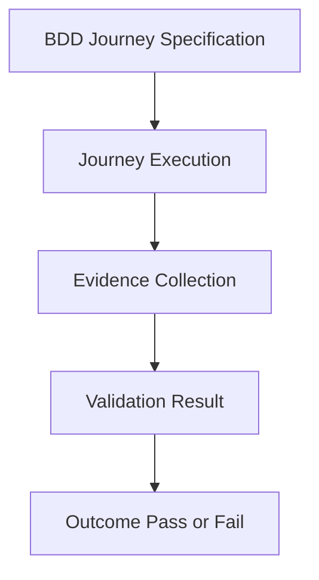

# User Journey Validation Integration

**Status**: `draft`
Owner: framework maintainer (linyihong)
**建立日期**：2026-06-10
**Priority**：**P1**（validation-layer workflow capability；以 evidence-backed outcome validation 補足 Experience Validation Pipeline）

## Why this plan exists

`Experience Validation Pipeline Evolution` 已把 UI validation 從單一 screen / responsive evidence 推進到 State Coverage + Context Coverage + Evidence Coverage 的 watch-list。下一個有真實案例壓力的能力不是再擴大 context taxonomy，而是把 critical user journey 納入 Coverage Model，驗證 critical user action 是否真的產生可觀察的產品結果。

Vidoe-Test 類型的產品流程顯示，單一 API 或單一畫面通過不足以代表 journey 成立：

```text
Create Order
  -> Payment Event
  -> Membership Updated
  -> Profile Readback
  -> Playback Access
```

若 `POST /membership/success` 回 200，但 Profile Page 未更新、Membership Badge 未出現、受保護影片仍不可播放，則 API Validation 可以是 PASS，但 User Journey Validation 必須 FAIL。

本 plan 的目的，是把 Journey Specification 交給 BDD 擁有，把 Journey Validation 納入 `workflow/software-delivery/` 的 validation layer，而不是塞進 UI Governance、塞進 `validation_domain`，或發展成新的巨型 taxonomy。

| Layer | Question | Owner |
|---|---|---|
| UI Validation | 畫面有沒有壞 | `ui-governance` |
| Journey Validation | 使用者流程能不能走完 | `validation` |
| BDD | 業務行為是不是符合需求 | `tests/bdd` |

## Decision Rationale

### Problem & Why Now

目前 validation model 已能描述 UI contract、browser evidence、responsive render context、capture metadata 與 coverage watch-list。但它仍缺少 Outcome Validation：使用者完成一個重要 action 後，系統狀態與使用者可見結果是否真的串起來。

這個缺口會出現在多種 workflow：

- membership purchase：order created / payment recorded / membership updated / playback allowed
- identity-coupled private state：user A 的狀態變更不能誤投射到 user B
- entitlement readback：backend 寫入成功後，profile / badge / protected route 必須可觀察

若 framework 只檢查 API response 或單頁 UI，會漏掉 side-effect chain 中間斷裂的錯誤。

### Decision

暫以 Journey Coverage 作為 Coverage Model 的候選方向，並定義 invariant：

```text
User Journey Validation validates that a user action produces the expected observable state transition chain.
```

Validation Domain 保持描述品質屬性或治理面向；Journey 不作為 domain。第一版候選模型把 Journey 放進 Coverage Model，但 Phase 0 必須驗證它是否其實應該是 `validation_scope`，由 scope 消費 state / context / evidence coverage：

```yaml
validation_domain:
  - contract
  - behavior
  - accessibility
  - responsive

coverage_model:
  state_coverage: {}
  context_coverage: {}
  journey_coverage:
    critical_journeys: project_defined
  evidence_coverage: {}
```

Alternative shape under investigation:

```yaml
validation_target:
  - contract
  - behavior
  - outcome

validation_scope:
  journey:
    name: membership_purchase
    criticality: critical
    consumes:
      - state_coverage
      - context_coverage
      - evidence_coverage
```

BDD owns Journey Specification. Validation workflow owns Journey Execution and evidence-backed validation:

```gherkin
Feature: Membership Purchase

Scenario: User purchases membership successfully
  Given user has logged in
  When user purchases premium membership
  Then an order should be created
  And payment event should be recorded
  And membership entitlement should be updated
  And profile page should show premium membership
```

第一版 provisional shape mirrors that split:

```yaml
journey_specification:
  source: tests/bdd
  journey:
    name: membership_purchase
    criticality: critical
    action: create_membership_order
    side_effect_chain:
      - order_created
      - payment_event_recorded
      - membership_updated
      - playback_entitlement_granted
    expected_outcomes:
      - membership_active
      - playback_allowed
    observable_evidence:
      - profile_membership_badge
      - protected_video_playback

validation:
  state_coverage:
    required:
      - order_created
      - membership_updated
      - entitlement_active
  context_coverage:
    required:
      - authenticated_user
    project_defined: true
  journey_coverage:
    required:
      - membership_purchase
  evidence_coverage:
    required:
      - api_response
      - db_readback
      - observable_evidence
      - playback_attempt
```

Journey Selection must be explicit before implementation. `critical_journeys: project_defined` does not mean every project journey is critical:

```yaml
journey_criticality:
  critical:
    - revenue
    - identity
    - entitlement
    - security
    - irreversible_action
  optional:
    - convenience
    - cosmetic
    - informational
```

Journey is not a validation domain. The remaining open decision is whether it is best modeled as `journey_coverage` or as a `validation_scope` that consumes state / context / evidence coverage. Either way, it must support combinations such as `Accessibility x Mobile x Login Journey` or `Behavior x Desktop x Membership Purchase Journey` without turning every journey into a new quality attribute.

### Alternatives Considered

- A. 把 journeys 寫成 framework canonical list：reject。`login` / `registration` / `checkout` / `payment` 是電商偏見，不適合作為通用 framework taxonomy。
- B. 把 User Journey Validation 放進 UI Governance：reject。Journey failure 可能來自 API、DB、identity、entitlement、runtime integration 或 user-visible readback，不是 UI compliance domain。
- C. 把 Journey 加進 `validation_domain`：reject。Journey 不是 quality attribute；它是 validation scope / coverage candidate，可與 Behavior / Accessibility / Responsive 等 domain 組合。
- D. 用 BDD 定義 Journey Specification、Validation Workflow 執行 Journey Validation：accept。它能表達 API PASS / Journey FAIL 的重要 distinction，同時保持 project-defined journey naming。

### Why Not an ADR Yet

這仍是 workflow integration plan，不是 accepted architecture decision。需要先驗證：

- `journey_coverage` 是否真的是 stable coverage dimension，或 Journey 應改為 `validation_scope`。
- `expected_outcomes` / `observable_evidence` 是否能穩定分離真實狀態與證據。
- critical journey selection criteria 是否足以避免 matrix explosion。
- BDD-owned Journey Specification 與 validation-owned Journey Execution 是否能穩定分工。

### ADR Promotion Criteria（completed 時驗證）

- [ ] 至少 2 個 project-defined critical journeys 使用同一 provisional shape。
- [ ] 至少 1 個 scenario 證明 API validation pass 但 user journey validation fail。
- [ ] Critical journey selection criteria 能區分 critical / optional journeys，且不鼓勵全流程都標 critical。
- [ ] workflow docs、artifact gates、validation scenarios 對 BDD specification / validation execution 的責任邊界一致。
- [ ] Journey 沒有被 UI Governance 或 `validation_domain` 吸收，也沒有變成 framework canonical journey list。
- [ ] 若 promotion，優先評估是否進入 shared Validation Reasoning，而不是直接寫 ADR。

### Consequences（預期）

#### 正面

- 補上 Outcome Validation，讓 validation 不停在 API success 或 screen pass。
- 把 Identity-Coupled Side Effect Validation 與 Evidence-Oriented Validation 串到同一條演化路線。
- 讓 project 可以宣告自己的 critical journeys，而不被 framework 預設業務型態限制。

#### 負面

- 需要更多 evidence discipline；journey evidence 會跨 UI、API、DB、runtime 或 product readback。
- 若沒有 guardrail，容易膨脹成全站流程 taxonomy。
- 需要先定義 Journey Selection，否則 `critical_journeys: project_defined` 可能被濫用成「所有 journeys 都 critical」。

#### 風險

- Journey Matrix 可能被誤用成所有 page navigation 組合。
- `observable_readback` as a catch-all would mix expected state with evidence artifacts; provisional shape uses `expected_outcomes` + `observable_evidence`, and keeps Capture Envelope / Evidence Envelope promotion conservative.
- `journey_coverage` / `validation_scope` 需避免與 `behavior` domain 邊界模糊；Behavior answers what quality is validated, Journey answers which user path is covered.

Glossary Impact: yes — candidate terms `journey_specification`, `journey_validation`, `journey_coverage`, `validation_scope`, `expected_outcomes`, `observable_evidence`, `side_effect_chain`, `outcome_validation`; Phase 2 decides whether to register them in `knowledge/glossary/ai-skill.md` or keep them plan-local.

Watch-Out List citation: Gen 4 forward scope must avoid autonomous taxonomy expansion; keep project-defined journeys and explicit promotion gates before shared taxonomy extraction. See [`architecture/ai-native-cognitive-ecosystem-system.md`](../../architecture/ai-native-cognitive-ecosystem-system.md) §Watch-Out List.

## Runtime Execution Path

Runtime owner: `workflow/software-delivery/` validation layer.

Planned trigger flow:

```text
change affects project-defined critical journey
  -> BDD Journey Specification defines expected business behavior
  -> workflow/software-delivery validation executes the journey
  -> evidence collection gathers screenshots / API responses / DB state / event records
  -> validation result distinguishes pass / fail
  -> runtime refresh indexes updated workflow/scenario sources
  -> commit-time/runtime validation confirms sources are consistent
```

Potential runtime surfaces:

| Surface | Intended consumer | Notes |
|---|---|---|
| `workflow/software-delivery/validation.md` | software-delivery validation workflow | Canonical prose contract for User Journey Validation |
| `workflow/software-delivery/execution-flow.yaml` | workflow gate loader / runtime index | Adds `journey_validation_complete` gate if Phase 2 confirms shape |
| `workflow/software-delivery/artifact-gates.yaml` | artifact completeness checks | Adds evidence expectations for critical journey claims |
| `tests/bdd` guidance | project BDD suites | Owns Journey Specification in downstream projects |
| `validation/scenarios/software-delivery/*.yaml` | runtime scenario validation | Covers missing evidence, API-pass/readback-fail, and passing journey examples |

Per-surface consumer table will be finalized before implementation. This plan does not add new `runtime/*.yaml` source and does not use deferred runtime projection.

## Open Questions

- [ ] Is `journey_coverage` a stable coverage dimension, or should Journey become a `validation_scope` that consumes state/context/evidence coverage?
- [ ] What criteria promote a project-defined journey into a critical journey?
- [ ] What is the minimum evidence for `observable_evidence` across UI/API/DB/runtime outcomes?
- [ ] Are `expected_outcomes` and `observable_evidence` sufficient to avoid mixing real state with evidence artifacts?
- [ ] Should `side_effect_chain` stay plan-local vocabulary, or graduate into shared Validation Reasoning after multiple workflow domains consume it?
- [ ] How should the workflow distinguish `behavior` domain failures from Journey scope / coverage failures?
- [ ] Should Journey Validation be documented in the Experience Validation Pipeline plan as Outcome Validation, or remain only cross-linked?

## Phase 0 — Open Questions Check + Architecture Compatibility Preflight

### Phase 0.0 — Open Questions 核對（公版，必填）

逐條核對本 plan §Open Questions，標記處置並回寫：

- [ ] 已讀本 plan §Open Questions 全部條目
- [ ] 對每條標記 `resolved`（附 Phase 0 證據）/ `still-open` / `deferred`（附原因）
- [ ] `resolved` 的條目已同步勾選 / 附註於 §Open Questions
- [ ] 若盤點新發現問題，已加入 §Open Questions

| Open Question | 處置 | 證據 / 原因 |
|---|---|---|
| `journey_coverage` vs `validation_scope` | pending | Phase 0 inventory needed |
| critical journey selection criteria | pending | Phase 0 inventory needed |
| minimum `observable_evidence` evidence | pending | Phase 0 inventory needed |
| `expected_outcomes` / `observable_evidence` split | pending | Phase 0 inventory needed |
| `side_effect_chain` vocabulary graduation | pending | Phase 0 inventory needed |
| `behavior` vs Journey boundary | pending | Phase 0 inventory needed |
| Experience Validation Pipeline placement | pending | Phase 0 inventory needed |

### Phase 0.1 — Preflight

- [ ] Read current `workflow/software-delivery/validation.md`, `execution-flow.yaml`, `artifact-gates.yaml`, `artifact-gates.md`, and `review-checklist.md`.
- [ ] Verify `ui-governance.md` remains out of scope except for explicit cross-reference if needed.
- [ ] Inventory Vidoe-Test examples as evidence only; do not copy project-specific paths or private evidence into shared framework docs.
- [ ] Inventory existing BDD guidance / `tests/bdd` conventions to decide where Journey Specification should be documented.
- [ ] Confirm whether `responsive` / `render_context` references in executable sources remain consistent after prior UI governance narrowing.
- [ ] Decide whether this plan should be a sibling plan to Experience Validation Pipeline or a sub-plan; default is sibling unless Phase 0 finds shared completion dependency.

## Phase 1 — Validation Contract Draft

- [ ] Update `workflow/software-delivery/validation.md` with a `Journey Validation` section.
- [ ] Include the invariant: user action -> expected observable state transition chain.
- [ ] Define Journey Specification as BDD-owned and project-defined.
- [ ] Define provisional shape for `journey_specification`, `side_effect_chain`, `expected_outcomes`, `observable_evidence`, and `validation.{state_coverage,context_coverage,journey_coverage,evidence_coverage}`.
- [ ] Add Journey Selection criteria so projects do not mark every journey as critical.
- [ ] Explicitly state that page navigation alone is insufficient evidence.

## Phase 2 — Workflow Gates + Artifact Expectations

- [ ] Update `workflow/software-delivery/execution-flow.yaml` with `journey_validation_complete` only if Phase 1 shape is stable enough.
- [ ] Update `workflow/software-delivery/artifact-gates.yaml` and `artifact-gates.md` with evidence expectations for critical journey claims.
- [ ] Keep Journey out of `validation_domain` and `ui-governance.md` as a UI governance domain.
- [ ] Add or cross-link BDD guidance so `tests/bdd` owns Journey Specification.
- [ ] Add glossary entries only if Phase 1–2 introduce stable framework vocabulary.

## Phase 3 — Validation Scenarios

- [ ] Add scenario: UI/responsive passes but membership purchase or playback access journey fails -> expected `journey_validation_fail`.
- [ ] Add scenario: critical journey claim lacks live integration evidence -> expected `missing_journey_evidence`.
- [ ] Add scenario: API success has no observable evidence for expected outcomes -> expected `journey_validation_fail` even when API validation passes.
- [ ] Add scenario: project-defined membership purchase path proves order + membership + payment event + profile readback + playback access -> expected pass.

## Phase 4 — Experience Pipeline Cross-Link

- [ ] Update `plans/active/2026-06-09-1040-experience-validation-pipeline-evolution.md` to reference User Journey Validation as evidence-backed Outcome Validation pressure.
- [ ] Keep typed Context Taxonomy deferred; this work should not require new context families.
- [ ] Record whether Journey should remain Coverage Model watch-list work or move to `validation_scope` while consuming State / Context / Evidence coverage.

## Phase 5 — Validation + Runtime Refresh

- [ ] Run lints / format checks for changed docs and scenarios.
- [ ] Run `ai-skill runtime refresh`.
- [ ] Run `ai-skill runtime validate`.
- [ ] Run `git diff --check`.
- [ ] Confirm `git status --short --branch` is clean after commit/push if implementation proceeds.

## 完成條件

- [ ] Journey Validation is documented in the validation layer.
- [ ] Critical journeys are project-defined; no framework canonical journey list is introduced.
- [ ] Critical journey selection criteria distinguish critical journeys from optional journeys.
- [ ] Journey Specification is BDD-owned; Journey Execution / Validation is validation-owned.
- [ ] Journey is not modeled as `validation_domain`; Phase 0 records whether it remains `journey_coverage` or becomes `validation_scope`.
- [ ] Expected outcomes are separated from observable evidence.
- [ ] At least 3 validation scenarios exercise pass/fail distinctions, including API success without observable evidence.
- [ ] Artifact gates and executable workflow references are consistent.
- [ ] Experience Validation Pipeline plan is cross-linked without absorbing this plan into taxonomy work.

## Stakeholder 同意項目

- [ ] Journey is not `validation_domain`.
- [ ] BDD owns Journey Specification; validation owns Journey Execution.
- [ ] Critical journeys are project-defined.
- [ ] Criticality has selection criteria to prevent matrix explosion.
- [ ] Journey validates observable state transition chains, not page navigation alone.
- [ ] Phase 0 decides whether Journey is `journey_coverage` or `validation_scope`.
- [ ] Expected outcomes and observable evidence stay separate.
- [ ] API PASS / Journey FAIL is a first-class distinction.

## Per-surface consumer 表

| Generated surface key | Named consumer(s) | Consumer 類型 |
|---|---|---|
| n/a | n/a | No new generated surface planned in draft; Phase 2 must update if runtime projection is added |

## 與其他 plans 的關係

- Related to [`2026-06-09-1040-experience-validation-pipeline-evolution`](2026-06-09-1040-experience-validation-pipeline-evolution.md): Journey Validation supplies Outcome Validation pressure while preserving Context Taxonomy as a watch-list.
- Builds on [`archived/2026-06-08-1544-evidence-acquisition-layer`](../archived/2026-06-08-1544-evidence-acquisition-layer.md): journey evidence depends on acquisition discipline and evidence class clarity.
- Must not conflict with the prior decision to keep generic Evidence Envelope and Typed Context Taxonomy unpromoted until more scenarios exist.

## Mermaid Overview


