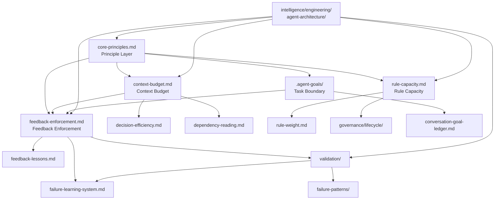

# Cognitive Boundary System 整合計畫

> **Status**: `draft` — 等待用戶審閱後調整

## 背景

目前系統中有兩個相關但尚未整合的部分：

1. **`.agent-goals/`** — 現有的 temporary conversation goal ledger，用於追蹤 active goals、priority、owner、lock state。定位是「短期工作記憶」，完成後刪除。

2. **`intelligence/engineering/agent-architecture/`** — 剛建立的 6 個 atoms，記錄 AI agent 自身的認知行為模式（context collapse、rule overload、task routing、attention budgeting、failure recovery、cognitive boundaries）。

用戶提出的核心問題是：**Context Saturation Collapse** — 當 AI 同時處理太多檔案、規則、目標、歷史修正後，高層原則開始失效，局部修正變強，全域一致性崩壞。

用戶建議建立 **Cognitive Boundary System**，包含三層邊界：
- **Principle Layer**（最上層）：極小、不可被 context 淹沒的核心原則
- **Task Boundary Layer**：bounded context loading，一次只吃一個 bounded task
- **Dynamic Context Budget**：根據任務 complexity 動態限制讀取量

---

## 現狀分析

### 已存在的對應

| 用戶提出的概念 | 系統中已存在的對應 | 缺口 |
|---|---|---|
| Principle Layer | `CORE_BOOTSTRAP.md`（3 條必讀規則） | 沒有獨立的 `core-principles.md`，原則混在規則中 |
| Task Boundary | `.agent-goals/` + `conversation-goal-ledger.md` | 沒有 bounded context 的定義，goal 沒有 context scope |
| Context Budget | `decision-efficiency.md` 的 Context Loading | 沒有明確的 max_files_per_task、force_task_split_if |
| Context Collapse | `agent-architecture/context-collapse.md` | 只有 intelligence atom，沒有對應的執行規則 |
| Rule Overload | `agent-architecture/rule-overload.md` + `rule-weight.md` | Rule weight 存在但沒有「規則數量上限」 |
| Task Routing | `agent-architecture/task-routing.md` + `primary_entrypoint` | 沒有 forbidden_routes 的執行機制 |
| Attention Budget | `agent-architecture/attention-budgeting.md` | 沒有動態預算分配的執行規則 |
| Failure Recovery | `agent-architecture/failure-recovery.md` + `failure-patterns/` | 恢復策略沒有整合到 bootstrap |
| Cognitive Boundaries | `agent-architecture/cognitive-boundaries.md` + `validation/` | 沒有 external gate 的系統化設計 |

### 核心問題

1. **`.agent-goals/` 只有 goal tracking，沒有 context boundary enforcement** — 它告訴 agent「做什麼」，但沒有告訴 agent「不要讀什麼」
2. **`agent-architecture/` atoms 是 intelligence（為什麼），不是 rules（怎麼做）** — 它們解釋現象，但不提供執行指令
3. **沒有「規則數量上限」的機制** — 規則可以無限增加，直到 rule overload 發生
4. **沒有 dynamic context budget** — agent 總是讀取所有可讀的檔案，沒有根據任務複雜度限制

---

## 整合方案

### 核心架構

```
Cognitive Boundary System
├── Principle Layer（core-principles.md）
│   ├── 極小集合（10-20 條），永遠在 context 中
│   ├── 不可被 lazy-load rules 覆蓋
│   └── 每個 session 開始時載入
│
├── Task Boundary Layer（.agent-goals/ + context-scope）
│   ├── 每個 goal 定義 allowed_context 和 forbidden_context
│   ├── Agent 只能在 bounded context 內操作
│   └── 跨 domain 工作必須拆成多個 sequential tasks
│
├── Context Budget Layer（context-budget.md）
│   ├── 根據 task complexity 設定 max_files、max_reads
│   ├── 超過預算時必須 split task
│   └── 動態調整：小問題 3-5 files，中型 10-15，大型 30
│
├── Feedback Enforcement Layer（feedback-enforcement.md）
│   ├── 每個 task 的完成定義中強制包含 feedback/failure 回饋
│   ├── 不是「可選的附加步驟」，而是 task completion gate
│   └── 根據 task type 決定回饋目標（feedback_history / failure-patterns / validation scenarios）
│
└── Validation Layer（validation/）
    ├── 驗證 agent 是否遵守 boundary
    ├── 檢測 context collapse、rule overload
    └── 提供 stateless 的 pass/fail 判斷
```

---

## Feedback Enforcement Layer（新增）

用戶指出一個實際的痛點：**agent 在分析過程中一直忘記把 feedback、技巧、錯誤經驗回饋給系統**。

### 根本原因分析

現有機制（`feedback-lessons.md`、`failure-learning-system.md`）已經定義了「怎麼寫回饋」，但問題在於：

1. **回饋被視為「可選的附加步驟」** — `feedback-lessons.md` 第 11 條說「若否，最終回覆可簡短說明本輪沒有新增泛化 lesson」— 這給了 agent 跳過的藉口
2. **回饋不在 task completion gate 中** — Agent 的「完成定義」只包含檔案修改，不包含「是否已將過程中的技巧/錯誤寫回系統」
3. **回饋需要額外的 context budget** — 寫 feedback 需要讀取模板、確定分類、建立檔案，這在 context 快耗盡時被優先犧牲
4. **沒有 task type → feedback target 的對應表** — Agent 不知道「這種任務完成後應該回饋到哪裡」

### 解決方案：Feedback Enforcement Layer

#### 核心原則

**Feedback 不是 task 完成後的選項，而是 task completion gate 的一部分。**

每個 task 的完成定義中，必須包含「將本任務中發現的可重用技巧/錯誤模式/驗證規則寫回系統」。

#### Task Type → Feedback Target 對應表

| Task Type | 範例 | 必須回饋到 | 時機 |
|-----------|------|-----------|------|
| **分析任務** | APK 分析、流量分析、Hook 分析 | `feedback_history/<category>/` + 若發現新 signal 則更新 `intelligence/<domain>/signals/` | 分析結束、產出報告前 |
| **規則/架構更新** | shared-rules 重構、新 layer 建立 | `failure-patterns/`（如果過程中犯了錯誤）+ `intelligence/engineering/agent-architecture/`（如果發現新的 agent 行為模式） | commit 前 |
| **Debug 任務** | 修復錯誤、排除故障 | `failure-patterns/`（如果錯誤可泛化）+ `feedback_history/`（如果學到新技巧） | 修復完成、驗證通過後 |
| **Intelligence Extraction** | technique → workflow + intelligence | `intelligence-extraction-pipeline.md` Step 7a（shared-rules 同步檢查） | extraction 完成、索引更新前 |
| **跨 domain promotion** | domain atom → cross-domain atom | `intelligence/engineering/heuristics/` + Knowledge Graph 更新 | promotion 完成、commit 前 |
| **一般開發任務** | 檔案修改、功能實作 | `feedback_history/common/`（如果學到可重用技巧） | task 完成、宣告完成前 |

#### 強制機制

1. **在 `.agent-goals/` 的 goal 中加入 feedback_target 欄位**

```yaml
Goal:
  title: 分析某 APK 的網路請求
  feedback_targets:
    - type: feedback_history
      category: http-api
      condition: 發現新的請求模式或繞過技巧
    - type: failure_pattern
      condition: 過程中犯了 routing 或工具使用錯誤
    - type: validation_scenario
      condition: 發現可 stateless 重現的 routing 錯誤
```

2. **在 `core-principles.md` 中加入 feedback 原則**

```
11. 每個 task 完成前，必須檢查是否有可回饋的技巧/錯誤/驗證規則
12. Feedback 不是可選步驟，是 task completion gate 的一部分
```

3. **在 `context-budget.md` 中為 feedback 保留預算**

```yaml
feedback_budget:
  small_task: 2-3 次 tool call（建立一個 feedback_history 條目）
  medium_task: 3-5 次 tool call（建立 feedback + 可能更新 intelligence）
  large_task: 5-8 次 tool call（建立 feedback + failure pattern + validation scenario）
```

4. **在 Bootstrap Flow 中加入 feedback check**

```
8. 開始執行
9. 每個 sub-task 完成時：
   a. 檢查 goal 的 feedback_targets
   b. 判斷本輪是否有符合條件的可回饋內容
   c. 有 → 在 context budget 內完成回饋
   d. 無 → 記錄「本輪無新增泛化內容」
10. 最終完成前：執行 feedback completion gate
```

### 與現有機制的關係

- `feedback-lessons.md` — 保持不變，繼續定義「怎麼寫」
- `failure-learning-system.md` — 保持不變，繼續定義「怎麼分類 failure」
- **本層新增的是「什麼時候必須寫」的強制機制**

---

## 詳細設計

### Phase 1：建立 `core-principles.md`

**位置**：`shared-rules/core-principles.md`

**內容**：10-15 條不可被 context 淹沒的最高層原則

```
1. Source of Truth 不可被工具同步取代
2. 刪除前必須有明確確認
3. 連動更新必須完整
4. 驗證必須是 stateless 的
5. 一個 session 只做一個 bounded task
6. 規則數量有上限，超過必須合併或刪除
7. 高層原則永遠優先於 lazy-load 規則
8. 失敗必須記錄，重複失敗必須改變策略
9. Context 預算有限，超過必須拆分任務
10. Agent 無法可靠檢測自身邊界，需要外部閘門
```

**連動更新**：
- `CORE_BOOTSTRAP.md` — 加入 core-principles.md 為第 0 條必讀
- `rule-weight.md` — 確認 P0 包含 core-principles
- `shared-rules/README.md` — 加入 core-principles 到 always-apply 集合

### Phase 2：擴充 `.agent-goals/` 加入 Context Scope

**修改**：`.agent-goals/README.md` 的 goal 表格加入新欄位

```yaml
Goal:
  title: ...
  allowed_context:     # 允許讀取的目錄/檔案
    - workflow/apk-analysis/
    - intelligence/engineering/apk-analysis/
  forbidden_context:   # 禁止讀取的目錄/檔案
    - workflow/app-development-guidance/
    - analysis/repo/
  max_files: 15        # 此 goal 的檔案讀取上限
  max_tool_calls: 40   # 此 goal 的 tool call 上限
```

**修改**：`conversation-goal-ledger.md` — 加入 context scope 欄位說明

**新增**：`scripts/agent-goals.sh` 的 `validate-boundary` 命令，檢查 agent 是否超出 allowed_context

### Phase 3：建立 `context-budget.md`

**位置**：`shared-rules/context-budget.md`

**內容**：

```yaml
# Context Budget Rules

## 預算表
complexity | max_files | max_reads | max_tool_calls | force_split_if
-----------|-----------|-----------|----------------|----------------
small      | 5         | 10        | 20             | multiple_domains
medium     | 15        | 30        | 40             | unrelated_contexts
large      | 30        | 60        | 80             | context_conflict

## 判斷任務複雜度
- small: 單一檔案修改、單一規則更新、單一 atom 建立
- medium: 跨 2-3 個檔案的連動更新、單一 domain 的 intelligence extraction
- large: 跨多個 domain 的重構、新 layer 建立、pipeline 設計

## 超過預算時
1. 停止當前操作
2. 分析哪些 context 是不必要的
3. 拆分任務為多個 sequential sub-tasks
4. 每個 sub-task 獨立 commit
5. 更新 .agent-goals/ 的 goal 狀態
```

**連動更新**：
- `decision-efficiency.md` — 加入 context budget 作為 Context Loading 的第 0 步
- `dependency-reading.md` — 加入 context budget 邊界
- `CORE_BOOTSTRAP.md` — 加入 context-budget 到 lazy-load 規則

### Phase 4：建立 `rule-capacity.md`

**位置**：`shared-rules/rule-capacity.md`

**內容**：定義規則數量上限與管理機制

```yaml
# Rule Capacity Management

## 上限
- always-apply rules: 最多 10 條（目前 3 條，安全）
- lazy-load rules per domain: 最多 7 條
- total shared-rules: 最多 25 條（目前 ~18 條，安全）
- failure-patterns: 無上限，但每個 session 只載入相關的

## 超過上限時
1. 標記冗餘規則為 deprecated
2. 合併相關規則
3. 將 domain-specific 規則移到對應 layer 的 README
4. 記錄在 governance/lifecycle/

## 定期審計
- 每次新增規則時檢查總數
- 每季檢查是否有重複或矛盾的規則
- 使用 validation/scenarios/ 測試規則衝突
```

**連動更新**：
- `rule-weight.md` — 加入 rule capacity 的權重說明
- `shared-rules/README.md` — 加入 rule capacity 到索引
- `governance/lifecycle/README.md` — 加入規則生命週期管理

### Phase 5：整合 `agent-architecture/` atoms 到執行規則

將 6 個 intelligence atoms 的原理轉化為具體的執行規則：

| Atom | 轉化為 | 目標檔案 |
|------|--------|---------|
| context-collapse.md | 預防 context collapse 的執行步驟 | `core-principles.md` 原則 5、`context-budget.md` |
| rule-overload.md | 規則數量上限 + 規則優先級檢查 | `rule-capacity.md`、`rule-weight.md` |
| task-routing.md | forbidden_context + routing validation | `.agent-goals/` context scope、`validation/` |
| attention-budgeting.md | 注意力預算分配表 | `context-budget.md`、`decision-efficiency.md` |
| failure-recovery.md | 恢復策略流程圖 | `core-principles.md` 原則 8、`failure-learning-system.md` |
| cognitive-boundaries.md | external gate 設計原則 | `core-principles.md` 原則 10、`validation/README.md` |

### Phase 6：建立 Validation Scenarios

新增 validation scenarios 測試 Cognitive Boundary System：

| Scenario | 測試目標 |
|----------|---------|
| `context-boundary-enforcement-v1.yaml` | Agent 是否遵守 allowed_context / forbidden_context |
| `rule-capacity-limit-v1.yaml` | Agent 是否在規則超過上限時提出合併建議 |
| `context-budget-split-v1.yaml` | Agent 是否在 context 超過預算時拆分任務 |
| `principle-layer-priority-v1.yaml` | Agent 是否在規則衝突時選擇 core-principles |

### Phase 7：更新 Bootstrap Flow

修改 `CORE_BOOTSTRAP.md` 的啟動流程：

```
1. 讀取 CORE_BOOTSTRAP.md（本檔）
2. 讀取 core-principles.md（10-15 條最高層原則）
3. 讀取 README.md（超短入口）
4. 依任務 intent 查詢 skills-index.yaml
5. 檢查 .agent-goals/ 是否有 active goal 及其 context scope
6. 根據 task complexity 設定 context budget
7. 在 budget 內載入必要檔案
8. 開始執行，並在關鍵點檢查 boundary
```

---

## 執行計畫

### Phase 1：core-principles.md
- 建立 `shared-rules/core-principles.md`
- 加入 feedback 原則（原則 11-12）
- 更新 `CORE_BOOTSTRAP.md` 加入第 0 條必讀
- 更新 `rule-weight.md` 確認 P0 包含 core-principles
- 更新 `shared-rules/README.md` 索引

### Phase 2：Context Scope for .agent-goals/
- 修改 `.agent-goals/README.md` 加入 allowed_context / forbidden_context / max_files / max_tool_calls / feedback_targets
- 修改 `conversation-goal-ledger.md` 加入 context scope 和 feedback_targets 欄位
- 新增 `scripts/agent-goals.sh validate-boundary` 命令

### Phase 3：context-budget.md
- 建立 `shared-rules/context-budget.md`
- 加入 feedback_budget 表格（small/medium/large 的 feedback tool call 預算）
- 更新 `decision-efficiency.md` 加入 context budget
- 更新 `dependency-reading.md` 加入 budget 邊界
- 更新 `CORE_BOOTSTRAP.md` lazy-load 規則

### Phase 4：rule-capacity.md
- 建立 `shared-rules/rule-capacity.md`
- 更新 `rule-weight.md`
- 更新 `shared-rules/README.md`
- 更新 `governance/lifecycle/README.md`

### Phase 5：feedback-enforcement.md
- 建立 `shared-rules/feedback-enforcement.md`
- 內容：Task Type → Feedback Target 對應表、強制機制、completion gate 定義
- 更新 `feedback-lessons.md` 加入 feedback-enforcement 引用
- 更新 `failure-learning-system.md` 加入 feedback-enforcement 引用

### Phase 6：agent-architecture → rules 轉化
- 更新 `core-principles.md` 加入 6 條對應原則
- 更新 `context-budget.md` 加入注意力預算分配
- 更新 `failure-learning-system.md` 加入恢復策略
- 更新 `validation/README.md` 加入 external gate 設計

### Phase 7：Validation Scenarios
- 建立 5 個新的 validation scenarios（含 feedback enforcement）
- 更新 `validation/README.md` 索引

### Phase 8：Bootstrap Flow 更新
- 修改 `CORE_BOOTSTRAP.md` 啟動流程（加入 feedback check 步驟）
- 更新 `dependency-reading.md` Default Bootstrap Boundary
- 建立 `shared-rules/core-principles.md`
- 更新 `CORE_BOOTSTRAP.md` 加入第 0 條必讀
- 更新 `rule-weight.md` 確認 P0 包含 core-principles
- 更新 `shared-rules/README.md` 索引

---

## 與既有架構的關係



---

## 風險與注意事項

1. **不要增加規則總量** — Cognitive Boundary System 的目的是減少規則競爭，不是增加。新增的檔案必須取代或合併現有規則。
2. **`.agent-goals/` 是 temporary** — Context scope 資訊在 goal 完成後刪除，不寫入 durable 文件。
3. **Principle Layer 必須保持極小** — 超過 20 條就失去意義。每新增一條原則，必須刪除或合併一條。
4. **Context Budget 是 guidance，不是硬限制** — 特殊情況可以超過，但必須說明原因。
5. **Validation Scenarios 必須 stateless** — 不依賴 agent 記憶，只依賴檔案內容和命令輸出。

---

## 驗證方式

1. **啟動流程測試**：新 session 啟動時，確認 core-principles.md 被載入
2. **Boundary 測試**：Agent 在 allowed_context 外操作時，應被阻止
3. **Budget 測試**：Agent 讀取超過 max_files 時，應自動拆分任務
4. **Rule Capacity 測試**：規則超過上限時，Agent 應提出合併建議
5. **Regression 測試**：現有 validation scenarios 仍然通過

---

## 與用戶建議的對應

| 用戶建議 | 本計畫的對應 |
|----------|-------------|
| Principle Layer（最上層，極小） | Phase 1: `core-principles.md` |
| Task Boundary Layer（bounded context） | Phase 2: `.agent-goals/` context scope |
| Dynamic Context Budget | Phase 3: `context-budget.md` |
| 規則數量上限 | Phase 4: `rule-capacity.md` |
| Feedback 一直被忘記 | Phase 5: `feedback-enforcement.md` + Task Type → Feedback Target 對應表 |
| agent-architecture atoms 整合 | Phase 6: atoms → rules 轉化 |
| Validation | Phase 7: validation scenarios |
| Bootstrap 流程更新 | Phase 8: CORE_BOOTSTRAP.md 更新 |
