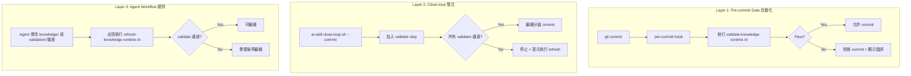
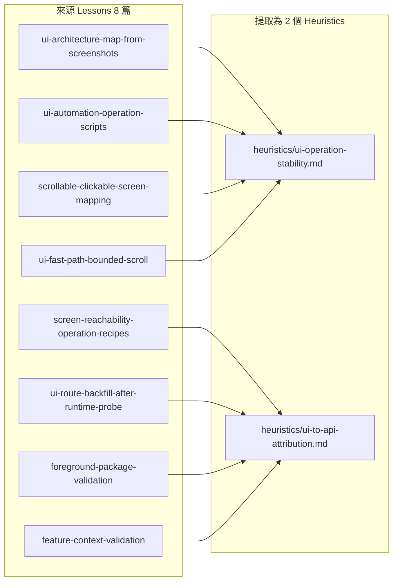

# Knowledge Runtime Validation Gate + UI Operation Intelligence Extraction

## Part 1: Knowledge Runtime Validation Gate

### 問題

`validate-knowledge-runtime.rb` 雖然存在，但未被整合到開發流程中，導致 20 項驗證錯誤累積未被發現：

| 錯誤類型 | 數量 | 根因 |
|---------|------|------|
| 檔案搬移後未更新引用 | 1 | 無自動化 path validation |
| Graph YAML 缺少必要欄位 | 18 | 早期檔案未回溯補 schema |
| Markdown link 指向不存在檔案 | 1 | 建立時筆誤，無 link check |

### 解決方案

在三個層級加入 prevention gate：



### 具體實作項目

#### 1. 新增 pre-commit hook

在 `scripts/git-hooks/pre-commit` 新增：

```bash
#!/usr/bin/env bash
# 檢查被修改的檔案是否涉及 knowledge runtime surfaces
CHANGED=$(git diff --cached --name-only)
if echo "$CHANGED" | grep -qE '^(knowledge/|validation/|scripts/validate-)'; then
  ruby scripts/validate-knowledge-runtime.rb || {
    echo "ERROR: Knowledge runtime validation failed."
    echo "Run 'ruby scripts/refresh-knowledge-runtime.rb' to diagnose and fix."
    exit 1
  }
fi
```

**觸發條件**：只有當 staged changes 包含 `knowledge/`、`validation/` 或 `scripts/validate-` 路徑時才執行，避免每次 commit 都跑。

#### 2. 修改 `ai-skill-close-loop.sh`

在 close-loop 的 dry-run 階段加入 validation check：

```bash
# 在分組 commit 之前
if [ -n "$(git diff --name-only)" ] || [ -n "$(git diff --cached --name-only)" ]; then
  echo "Running knowledge runtime validation..."
  ruby scripts/validate-knowledge-runtime.rb || {
    echo "ERROR: Knowledge runtime validation failed."
    echo "Run 'ruby scripts/refresh-knowledge-runtime.rb' to regenerate and fix."
    exit 1
  }
fi
```

#### 3. 更新 `shared-rules/linked-updates.md`

在「常見連動關係」表格中新增一列：

```
| 修改 `knowledge/` 或 `validation/` 下的檔案 | 執行 `ruby scripts/refresh-knowledge-runtime.rb` 確認所有 validator 通過 |
```

#### 4. 更新 `scripts/README.md`

在 `Knowledge runtime validation` 章節加入提醒：

> **重要**：修改 `knowledge/` 或 `validation/` 下的檔案後，**必須**執行 `ruby scripts/refresh-knowledge-runtime.rb` 確認所有 validator 通過，再提交。

### 不實作的項目（說明原因）

| 項目 | 不實作原因 |
|------|-----------|
| CI pipeline（GitHub Actions 等） | 此 repo 目前無 CI 基礎設施，且主要操作者是 AI agent 而非多人協作，pre-commit hook 已足夠 |
| 自動修復 validator 錯誤 | Validator 錯誤需要人工判斷修復方式（例如 path 要指向哪個新位置），自動修復可能造成錯誤 |
| 每次 commit 都跑完整 refresh | refresh 包含 generate 步驟（寫入檔案），pre-commit 階段不應修改檔案；只跑 validate 即可 |

---

## Part 2: UI Operation Intelligence Extraction (P3)

### 動機

APK 分析中關於 UI 操作的經驗（UI architecture map、scrollable screen mapping、operation scripts、foreground package validation 等）目前分散在 3 個層級：

- `feedback/history/apk-analysis/http-api/` — 8 篇 lesson
- `workflow/apk-analysis/artifact-gates.md` — 操作流程規範
- `analysis/apk/tools-and-failures.md` — 工具與失敗判讀

這些經驗尚未被抽象化為獨立的 intelligence engineering heuristic，導致：
1. Agent 需要讀取多個檔案才能獲得完整的 UI 操作決策邏輯
2. 新的分析情境無法快速套用過去的經驗
3. 經驗停留在「怎麼做」的層級，缺少「何時該怎麼做」的決策框架

### 提取計畫



### 新增檔案

#### 1. `intelligence/engineering/apk-analysis/heuristics/ui-operation-stability.md`

**目的**：決定何時該用哪種 UI 操作策略來穩定 capture API。

**內容包含**：

| 情境 | 建議策略 | 原理 |
|------|---------|------|
| 需要區分 initial load vs pagination vs tap-triggered API | Bounded scroll top/mid/bottom + 操作時間窗 | 避免無限制滑動混入背景請求 |
| 同一 feature 需要反覆 capture | 固化為可重放 operation script | 減少每輪重新推理 UI 操作 |
| 操作腳本結果不穩 | 每個 script 只做一個 flow + 輸出 timestamp | 避免多 action 混雜 attribution |
| 已有 API boundary 可保留 session/signing | API-first replay 取代長 UI scroll | 更快取得證據，UI 只留 attribution |
| UI behavior 本身就是問題 | UI capture + bounded gesture + package/feature context guard | 無法用 API replay 取代 |

**來源 lessons**：
- `ui-architecture-map-from-screenshots.md`
- `ui-automation-operation-scripts-for-api-capture.md`
- `scrollable-clickable-screen-mapping.md`
- `ui-fast-path-bounded-scroll.md`

#### 2. `intelligence/engineering/apk-analysis/heuristics/ui-to-api-attribution.md`

**目的**：確保 UI 操作能正確對應到 API 請求，避免 attribution 錯誤。

**內容包含**：

| 情境 | 建議策略 | 原理 |
|------|---------|------|
| 前景 package 不是目標 App | 不取 UI 證據，檢查 replay 是否跳離目標 | 截圖/XML 不屬於目標 App |
| UI 操作跳到非目標 feature | 記錄觸發點與外部目的地類型 | 避免 API 對齊到錯誤 feature |
| 抓到 API 但不知道是哪個操作觸發 | 補 screenshot/UI hierarchy + operation id | 建立操作時間窗對齊 capture |
| 截圖 tab 與 API timing 對不上 | 標 trigger confidence low/medium | tab 預載、快取、背景同步可能干擾 |
| Runtime probe 發現新 UI route | 回填到 UI 架構地圖 | 保留可重用的 route recipe |

**來源 lessons**：
- `screen-reachability-operation-recipes.md`
- `ui-route-backfill-after-runtime-probe.md`
- `foreground-package-validation.md`
- `feature-context-validation.md`

### 不提取的項目

| 項目 | 原因 |
|------|------|
| `checkpoint-replay-runner.md` 的 replay script 固化經驗 | 已存在 `workflow/apk-analysis/artifact-gates.md` 和 `analysis/apk/tools-and-failures.md` 中 |
| `api-first-pagination-replay.md` 的 API-first replay 經驗 | 與 `highest-leverage-analysis-path.md` 重疊 |
| `state-reset-baseline-feature-capture.md` 的 reset baseline 經驗 | 已存在 `workflow/apk-analysis/execution-flow.md` 中 |

### 提取後需同步更新的檔案

| 檔案 | 更新內容 |
|------|---------|
| `intelligence/engineering/apk-analysis/heuristics/README.md` | 加入新 heuristic 的索引 |
| `intelligence/engineering/apk-analysis/README.md` | 更新 atom 列表 |
| `knowledge/graphs/intelligence-apk-analysis-atoms.yaml` | 加入新 edge |
| `knowledge/summaries/apk-analysis-pilot.md` | 更新 summary table |
| `knowledge/runtime/routing-registry.yaml` | 確認 routing 涵蓋新 atom |
| `feedback/extraction/apk-analysis-index.md` | 更新 lessons 的 promotion target |

---

## 執行順序

### Phase A: Validation Gate（✅ 已完成）

1. ✅ 建立 `scripts/git-hooks/pre-commit`
2. ✅ 修改 `scripts/ai-skill-close-loop.sh` 加入 validation gate
3. ✅ 更新 `shared-rules/linked-updates.md` 加入對應連動規則
4. ✅ 更新 `scripts/README.md` 加入提醒
5. ✅ 設定 `git config core.hooksPath scripts/git-hooks` 啟用 hook
6. ✅ 測試：故意引入一個錯誤，確認 hook 阻擋 commit
7. ✅ 修改 `scripts/validate-knowledge-runtime.rb` 新增 `validate_directory_structure` 方法
   - 檢查 `intelligence/engineering/<domain>/` 每個子類別目錄有 README.md 列出所有 .md 檔案
   - 檢查 `analysis/<domain>/workflows/` 有 README.md 列出所有 .md 檔案
   - 檢查 `workflow/<domain>/` 有 README.md 列出所有 .md 檔案
8. ✅ 修復 validator 發現的 4 個既有問題：
   - `workflow/apk-analysis/README.md` 改用正確 markdown link
   - `workflow/app-development-guidance/README.md` 修正檔名 typo
   - `knowledge/indexes/README.md` 修正壞掉的 link（`../../validation/rules/heuristics/README.md` → `../../validation/rules/heuristics/`）
9. ✅ 建立 `validation/scenarios/cross-domain/new-category-registration-v1.yaml`
10. ✅ 更新 `validation/README.md` 加入新 scenario 到首批 Scenario 表格
11. ✅ 測試：故意新增 `workflow/test-new-domain/test-file.md` → validator 正確阻擋（missing README.md）
12. ✅ 測試：故意新增 `workflow/apk-analysis/unlisted-test-file.md` → validator 正確阻擋（not listed in README）

### Phase B: UI Operation Intelligence Extraction（✅ 已完成）

1. ✅ 建立 `intelligence/engineering/apk-analysis/heuristics/ui-operation-stability.md`
2. ✅ 建立 `intelligence/engineering/apk-analysis/heuristics/ui-to-api-attribution.md`
3. ✅ 更新 `intelligence/engineering/apk-analysis/heuristics/README.md`
4. ✅ 更新 `intelligence/engineering/apk-analysis/README.md`
5. ✅ 更新 `knowledge/graphs/intelligence-apk-analysis-atoms.yaml`
6. ✅ 更新 `knowledge/summaries/apk-analysis-pilot.md`
7. ✅ 更新 `knowledge/runtime/routing-registry.yaml`
8. ✅ 更新 `feedback/extraction/apk-analysis-index.md`
9. ✅ 執行 `ruby scripts/refresh-knowledge-runtime.rb` — 所有 validator 通過（registry_records=22, summaries=14, graphs=29）
